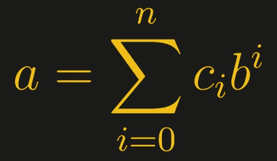

# 学会以六进制计数，比其他人高一级

> 原文：<https://hackaday.com/2018/07/20/learn-to-count-in-seximal-its-a-position-above-the-rest/>

信不信由你，数数并不特别。多年来，相当多的动物已经明白了这一点。小蜜蜂比较什么是少什么是多，它们的大脑比小指甲还小。[他们甚至理解零](https://www.newscientist.com/article/2142884-bees-are-first-insects-shown-to-understand-the-concept-of-zero/)的概念，任何教过幼儿的人都知道，这个概念很难理解。不，数数并不特别，重要的是我们如何数数。

我并不想自吹自擂，但是人类创造了无数的数字系统，每一个都以自己的方式专门化了。问几乎任何人，他们至少会听说过二进制。Hackaday 的读者对计数系统有更深的了解，我们大多数人都使用过二进制、八进制和十六进制，通常是结合使用，但这些只是完美的标准位置系统。

如果你想开始变得奇怪，有平衡的三进制和二进制，我们甚至还没有离开位置系统。外面有一大堆系统，每一个都有自己的优点和缺点。我碰巧认为 seximal 是最好的。要知道为什么，我们必须探索不同时代出现的不同创造。自从我们有了羊，人类就一直在试图数它们，由此产生的系统非常有创造性，尽管效率很低。

## 简单分组系统

| 标志 | 我 | V | X | L | C | D | M |
| 价值 | one | five | Ten | Fifty | One hundred | Five hundred | One thousand |

很久以前，有人认为分数不够。从那次挫败中，简单的分组系统诞生了^([1](#note1))。

顾名思义，很简单。随便挑一个你喜欢的整数；现在，决定 b 的幂的符号:`1, b, b²`，以此类推。那么任何整数都可以表示为这些符号的组合，只需将它们相加即可。如果你有一个等于`1 + 1 + 1 + b + b + b + b²`的数字，并想把它写下来，你所需要做的就是去掉加号，然后把符号混在一起(`111bbbb²`)，让你系统中任意两个数字的相加变得非常直观。如果你喜欢，你甚至可以重新排列它们。`b²bbb111`代表相同的数字，因为你无论如何都要把它们加在一起。

这种系统的一个常见例子出现在罗马数字中，它将`b`取为 10。如果你想要更有规律一点的东西，下面显示的古老的[埃及数字](https://en.wikipedia.org/wiki/Egyptian_numerals)，同样取 b 为 10，非常适合这个要求。

| 标志 | ？？？？ | ？？？？ | ？？？？ | ？？？？ | ？？？？ | ？？？？ | ？？？？ |
| 价值 | one | Ten | One hundred | One thousand | Ten thousand | One hundred thousand | One million |

不幸的是，这种系统的缺点是显而易见的。首先，为了表示一个大数字，你需要大量的符号。`b`的每一个力量都需要你去挖掘一个新的。罗马人通过为 10 的幂的每一半增加另一个符号来混合这一点。另一个大的缺点是它的许多符号的使用是多么的低效。99 一共需要十八个埃及数字: **`????????????????????????????????????????????????????????????????????????`** 。在罗马体系中，99 ( `XCIX`)需要四个数字——但前提是你要订阅[减法符号](https://en.wikipedia.org/wiki/Subtractive_notation)，这是一个相对现代的发明。如果你更喜欢老式的数字，那么 99 就是总共十个字符的`LXXXXVIIII`。无论你如何分割，简单的分组系统只是将太多的符号分组。

## 简单分组的乘法兄弟

乘法分组系统 ^([ [1](#note1) ]) 消除了其中的一些低效。通过为每一个小于基数`b`的正整数添加符号，它避开了表示像 99 这样的数字所需的绝对数量。为了演示，让我们滚动我们自己的(因为标准示例有一些太多的符号，不容易拍照)。为了便于比较，将`b`设置为 10。那么`9b9`在我们的新系统中将代表 99，从现代罗马系统中减去一个字符，从埃及系统中减去整整 15 个字符。就像简单的分组系统一样，`99b`可以代表同一个数字，但是你必须将`b`乘以 9，然后将它们相加。

现在我们在做饭！通过牺牲一些加法的直觉，并为所有小于`b`的整数添加符号，乘法分组系统使得物理上书写数字更快一点。事实上，正因为如此，它今天仍然在中国数字中使用[，也是将`b`设置为 10(我感觉到了一种模式)。不幸的是，这个系统仍然受到符号过剩的困扰，这些符号需要用来表示任何特别大而笨拙的东西。`b`的每一个额外的力量都增加了一个符号。因此，十进制的 22222 在中文系统中需要整整九个字符，几乎是标准十进制的两倍。](https://en.wikipedia.org/wiki/Chinese_numerals)

## 权力地位

## 

为了进一步缩小数字的表示，你必须去掉分组系统的一个优点。在前面的两个系统中，你不必真的关心符号在哪里；只要分组正确，一切都会迎刃而解。然而，在位置系统中，我们将基数`b`的幂(在位置系统中也称为基数)替换为它们所占据的位置。

例如，以我们以 10 为基数的乘法系统中的数字`7b98b³`为例。从我们所学的乘法系统来看，`7b98b³ = 7b + 9 + 8b³ = 8b³ + 7b + 9`。如果我们去掉公认的有趣的移动符号的能力，并从右到左按降序固定`b`的能力(反过来也一样)，只剩下`8b³ + 7b + 9`，留下一些与我们在图片中的漂亮等式非常相似的东西，当`n = 4`。去掉加号和空格，我们又回到了乘法系统`8b³7b9`。

继续这个想法，当我们剥去`b`本身时会发生什么？简单地将符号弹出，留下`879`，在考虑数字`8b²7b9`时会引起一些混乱，这也会减少到`879`。为了解决这个问题，我们加强了我们的限制。现在，`b`的任何未被使用且小于整数的幂都被视为乘以 0，从而允许该等式发挥作用。`8b³7b9`其实就是`8b³ + 0b² + 7b + 9`，去掉除了小于`b`的整数之外的一切后，再浓缩成`8079`。`8b²7b9`出来到`879`，严格区别于`8b³7b9`。每个整数，甚至是`8b³7b9`中看不见的 0，都成为方程中各自的系数。由于`b`的每个异能都固定在一个点上，不能移动，现在弹出它们不会丢失任何信息。

令人惊讶的是，这种情况迫使位置系统比以前的任何系统需要更多的字符来表示`b`的幂。不仅仅是一个符号，它需要`k + 1`多个，其中`k`是我们试图代表的`b`的幂的指数。然而，通过将`b`的权力限制在某个特定的位置，并要求他们在任何时候都有代表，职位制度消除了过去的许多低效率。任何时候都只需要唯一的符号，这是乘法系统的最大缺点。编写任何整数只需要`n`个符号，其中`n`是大于整数的`b`的最小幂的指数，巧妙地跳过了用埃及数字表示所需的数量惊人的符号值 99。此外，小数点和[基点的发明一般](https://en.wikipedia.org/wiki/Radix_point)允许位置系统容易地扩展到`b`的负幂，简化了分数的使用，并极大地限制了其他系统中所需的符号数量。

这样，我们又回到了熟悉的领域。虽然不同的数字系统可能看起来很自然地产生于彼此，为谁最有效而争斗，但它们在历史上的不同时期共存。即使是现在，我们至少在每年二月都会看到罗马数字。各有各的优缺点。简单的分组系统使加法变得直观，但它们是符号的饕餮盛宴。乘法分组系统牺牲了一点这种直觉，以获得每个数字更多的字符。位置系统去掉了以前系统中有趣混乱的少量符号，在这个过程中需要更多的字符来表示`b`的幂。如果你按照你需要多少信息来破译某个系统中的任何一个给定的数字，那么位置系统就可以得到其余的信息，只需要小于 b 的正整数和知道把它们放在哪里。显然，随着十进制和二进制的出现，位置系统成了赢家。

虽然它们看起来很容易是最一致有效的，但是位置系统也有最有创造性的数字系统的有争议的位置。你可以使用的基数实际上是不可数的，因为实数可以用作基数。我们的[黑客成员喜欢基于平衡三进制](https://hackaday.com/2017/12/18/there-are-10-kinds-of-computers-in-the-world/)构建计算机。如果你真的想的话，你甚至可以[混合基地](https://en.wikipedia.org/wiki/Factorial_number_system)。然而，你见过数字六吗？我介绍十进制。

## Seximal，上帝给人类的礼物

 整数产生有理数。有理数产生实数。从实数出来的是复数。因此，我们如何表示我们的整数最好是漂亮的。这就是 seximal 的用武之地。

[六进制](https://www.seximal.net/)，或者官方称之为[六进制](https://en.wikipedia.org/wiki/Senary)，是以 6 为基数的位置系统，它击败了所有其他系统。六当然是一个特殊的数字。这是一个[完全数](https://en.wikipedia.org/wiki/Perfect_number):它的真约数`1 + 2 + 3`之和。这是第一个[无平方的](https://en.wikipedia.org/wiki/Square-free_integer)合数，是无素数平方的乘积。这是一个 [*高级的高度合数*](https://en.wikipedia.org/wiki/Superior_highly_composite_number) ，意味着六比任何更小的正整数有更多的约数，即使对于它的小尺寸来说这也是有意义的。六基本上是个位数的数字——至少在十进制中是这样。

当然，Seximal 不仅仅有很酷的特性。你的十六进制乘法表只有 36 个成员，因此很容易记忆。与十进制的 100 和十二进制的 144 相比，你会开始看到纯粹由于懒惰而产生的关于六进制的争论。此外，手指计数在性方面更有意义。

算上你的双手，你可以数到 35 再伸出脚趾。当然，二进制可以让你达到 1023，但你每只手都有五个手指，自然会把自己借给六进制(一只手数到五，每数到六，你另一只手就会移动一个数字)。如前所述，6 比任何更小的正整数有更多的约数，这使得除法变得轻而易举。它有问题的第一个素数是 11。正如康朗评论家在他的视频中提到的那样，其他一切都很顺利。

 [https://www.youtube.com/embed/qID2B4MK7Y0?version=3&rel=1&showsearch=0&showinfo=1&iv_load_policy=1&fs=1&hl=en-US&autohide=2&wmode=transparent](https://www.youtube.com/embed/qID2B4MK7Y0?version=3&rel=1&showsearch=0&showinfo=1&iv_load_policy=1&fs=1&hl=en-US&autohide=2&wmode=transparent)

我不会说 seximal 是最有创造力的系统。我不会说这是最有效的系统。两者都是谎言；但是，我可以保证它会让卖羊的柜台保持清醒。每个系统都有其用途。

## 资源:

1.  伊夫斯，霍华德*第一章数学史介绍*