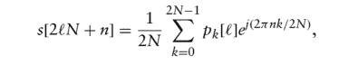

# 免费电子书:面向工程师的软件无线电

> 原文：<https://hackaday.com/2018/06/29/free-e-book-software-defined-radio-for-engineers/>

我们真的很喜欢当一个供应商找到一本关于某个主题的好书——可能是他们关心的书——并且免费提供。ADI 公司经常这样做，您或许应该看看[面向工程师的软件定义无线电](http://www.analog.com/en/education/education-library/software-defined-radio-for-engineers.html)。这本书在亚马逊上售价 100 美元左右，尽管电子版有优点也有缺点，但很难超过 0 美元的价格。

由[Travis F. Collins]、[Robin Getz]、[Di Pu]和[Alexander M. Wyglinski]撰写的这本书在 11 章中涵盖了一系列主题。还有一个[网站](https://sdrforengineers.github.io/)提供更多信息，包括视频讲座和即将到来的项目，似乎使用了[冥王星 SDR](http://www.analog.com/en/design-center/evaluation-hardware-and-software/evaluation-boards-kits/adalm-pluto.html) 。我们有一个冥王星，一直想写更多关于它的东西，包括[黑客，让它认为它在](https://wiki.analog.com/university/tools/pluto/users/customizing)里有一个更好的射频芯片。这种攻击可能不会满足所有设备规格，但它确实增加了频率范围和带宽。然而，这本书并不局限于某个特定的硬件。

毫无疑问，这本书是为工程师准备的大学水平的教科书，所以在数学上不会太容易。因此，如果下面的等式让你感到困扰，这可能不是你开始阅读的书:

[Di Pu]和[Alexander Wyglinksi]有一本更老的类似的书，看起来演讲视频是基于那本书(见下面的视频)。网站上的项目部分似乎还没有任何实际的项目，尽管有一些占位符。

我们过去很喜欢 ADI 公司的书籍选择，包括经典的[《科学家和工程师数字信号处理指南》](http://www.analog.com/en/education/education-library/scientist_engineers_guide.html)。如果你去他们的[图书馆](http://www.analog.com/en/education/education-library.html)，你会发现很多书，还有课程和视频。

如果你想要不那么学术的东西，总有[[OSS Mann 的]视频。或者，如果你宁愿只使用特别提款权，有很多便宜的选项供你选择(T2)。](https://hackaday.com/2016/03/23/michael-ossmann-makes-you-an-rf-design-hero/)

 [https://www.youtube.com/embed/K8FeT7kv11U?version=3&rel=1&showsearch=0&showinfo=1&iv_load_policy=1&fs=1&hl=en-US&autohide=2&wmode=transparent](https://www.youtube.com/embed/K8FeT7kv11U?version=3&rel=1&showsearch=0&showinfo=1&iv_load_policy=1&fs=1&hl=en-US&autohide=2&wmode=transparent)

