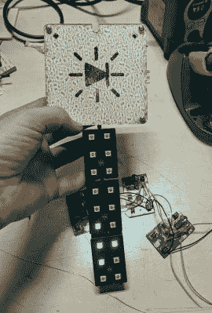

# 今年，徽章获得区块链

> 原文：<https://hackaday.com/2018/06/28/this-year-badges-get-blockchains/>

今年电子领域最热门的新进展来自可穿戴徽章。你不可能没有注意到另一项越来越热门的技术。这是区块链。什么是区块链？这是一个链表，其中列表中的每一项都包含列表中前一项的加密哈希。英语中的区块链*是什么？这是最具革命性的技术，将会以某种方式解决这个星球上的所有问题。这是加密的基础(不，不是那个，[另一个](https://hackaday.com/2018/04/23/what-does-crypto-actually-mean/))。区块链是你如何添加更多的兰博基尼到你的兰博基尼帐户。尽管我们仍在试图找出它是如何解决一个问题的，但有一点是肯定的:区块链解决了所有问题。我们生来探索地球太晚，生来探索宇宙太早，却正好赶上区块链。*

独立徽章总是关注最新的技术，[也许这是不可避免的](https://hackaday.io/project/159176-mr-blinky-bling-defcon-26-indie-badge)。这是一个建在区块链上的徽章。这是一个可穿戴的采矿运动鞋。这是一个合作证明工作的游戏。

【Blinky Bling 先生】的区块链徽章是今年 Defcon 的一个独立徽章，像大多数独立徽章一样，它装载了 RGB LEDs、微控制器和制作精美的 FR4。使这个徽章与众不同的是通过 1/8”唱机插孔连接到主徽章的附加部件或“块”。这些方块形成了社交游戏的基础，其中两个徽章持有者交换方块一段时间，允许他们的徽章在每个方块上执行工作证明，最后，每个方块被散列，分数增加。是的，这是一个区块链，但它更像是一个积木树，而且它运行在 sneakernet 而不是互联网上。

是的，这听起来的确像是一个笑话。但是，不要搞错:这是真实的。这是一个基于区块链技术的硬件游戏，一些幸运的徽章持有者将在今年的 Defcon 上玩。里面充满了布林基和区块链。太牛逼了。

Blinky Bling 先生]已经在 hackaday . io 上开始了这个徽章的项目[，现在他们正在](https://hackaday.io/project/159176-mr-blinky-bling-defcon-26-indie-badge)[为这个徽章进行 Kickstarter 活动](https://www.kickstarter.com/projects/666360536/mr-blinky-bling-defcon-26-indie-badge/)，并在 Defcon 上交付。这是今年在展会上比较有趣的徽章之一，而且*有区块链。这真的不容错过。*