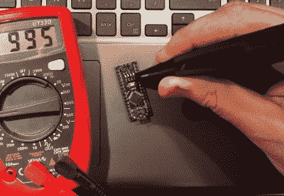

# 审查:SMD 镊子米或镊子探针为您的万用表？

> 原文：<https://hackaday.com/2018/07/16/review-smd-tweezer-meter-or-tweezer-probes-for-your-multimeter/>

电子产品已经变得如此之小，这是非常了不起的。天知道一个从电子管开始经历的老前辈会怎么想，在一生中从焊接标签到 SMD 是一段旅程。甚至从分立晶体管开始的一代也经历了难以置信的转变。但这是真的，SMD 元件*很小*，除了焊接时你将面临的挑战之外，这也是一个挑战。用一对标准测试探针来识别和测量太小而不能在上面书写的芯片元件的值变得几乎不可能。

令人高兴的是，测试设备制造商已经接受了挑战，并生产了各种为 SMD 工作设计的仪表，这些仪表用一对镊子代替测试探针。当我在找一个的时候，我做了我通常做的事情。我看了看市场的预算，买了一个便宜的中国型号，大约 16 英镑(21 美元)。由于我正在浏览镊子，我忍不住又在订单上加了一笔。我为我的万用表找到了一对镊子式测试探针，只花了我一英镑多一点(1.30 美元)，可以提供有用的比较。为了在原位处理 SMD 元件*，你甚至需要特殊的仪表吗？*

## 一包镊子来了

Clipping these tweezers onto SMD devices is easy enough.

就这样，我从深圳寄来的包裹如期而至，我买了什么呢？镊子测试探针的来源不明，但血糖仪装在一个泡罩包装中，上面有制造商的名称和型号。这似乎是一个中文软件包，但谷歌翻译工作显示它是一个[深圳滨江 BM8910](http://www.cnbjyb.com/index.php?m=content&c=index&a=show&catid=36&id=87) ( [翻译](https://translate.google.com/translate?sl=auto&tl=en&js=y&prev=_t&hl=en&ie=UTF-8&u=http%3A%2F%2Fwww.cnbjyb.com%2Findex.php%3Fm%3Dcontent%26c%3Dindex%26a%3Dshow%26catid%3D36%26id%3D87&edit-text=&act=url))。打开包装，里面是一块 CR2032 电池，外加一张中文保修卡和一套折叠的英文说明书。安装电池后，电表立即通电，进入扫描模式，试图识别终端上的内容。

从说明书的质量可以看出像这样的进口产品的质量。那些为 BM8910 设计的是一个惊喜，大部分是得体的英语和精心展示的图表。该装置本身大约有一支粗短的记号笔大小，黄色塑料，液晶显示屏，几个按钮，根据谷歌翻译的中文意思是“芯片电阻/二极管/电容智能测试仪”。它从中间分开，一端滑开，露出镊子本身，镊子是绝缘弹簧钢，末端附有尖头探针。说明书声称这些是镀金的，我不得不说它看起来不是很金。除此之外，它的整体质量和建设的感觉是好的，这可能没有花费太多，但它不觉得太便宜。

通过按下“func”按钮打开它，它进入自动模式，在这种模式下，它试图识别镊子中的元件是电阻器、电容器还是二极管，并给出读数。重复按下“func ”,在各个自动量程电阻、连续性、二极管测试器和电容模式之间逐步切换，按住按钮将其关闭。另一个按钮是“保持”按钮，便于保留读数。

因此，在研究了 BM8910 之后，我开始在工作台上使用各种 SMD 板和模块。抓住一个零件是很容易的，虽然 0201 需要一点小心，正如你所料。并且在大多数情况下，仪器正确地识别了它们的功能和价值。这成为确定制造质量的一种快速方法，因为您很快就能通过值的变化看到使用了哪些公差成分。值得注意的是，连续性功能没有您可能会想到的蜂鸣器。

一般来说，大多数元件的测量似乎不受它们在电路中的位置的影响。举例来说，Arduino 上的 LED 串联电阻的读数应该与它应有的读数完全一样。但是，如果 RC 网络影响元件的感知值，正如你所料，它返回的读数不能作为该元件的值。一般来说，它似乎更喜欢识别它看到的任何电路的电阻，如果电路中包含电感，它默认为该元件的 DC 电阻。

我想说，如果你在市场上寻找一个不太贵的 SMD 镊子测试仪，SZBJ BM8910 是一个不错的选择。但是这个评论还没有结束，因为我还为我的万用表买了那些 SMD 镊子测试探针。如果你是一个真正节俭的工程师，他们如何对抗专用仪器？

## 但是基本选项呢？

You pay not a lot for the tweezer test probes, and to be fair, you get not a lot. But what you get isn’t bad.

因为钱不多，所以对质量不抱太大期望是合理的。这 1 个奇迹是功能性镊子，有一个塑料手柄和一个大约 50 厘米(1'6 英寸)长的单条电线，分成两根电线，带有 4 毫米插头，用于仪表终端。镊子的尖端没有 BM8910 上的那么好，只是镊子本身的电镀弹簧钢。操作很简单:把它插入仪表，你就可以开始了。

抓住 SMD 器件相当容易，识别电阻值也相当简单。元件网络也存在同样的问题，当然，您的电表所能测量的内容也是有限的。我的没有电容范围，所以我只能在电阻和二极管测试上比较两者，在这方面它比较有利。然而，能够在设备通电的情况下测量电路中的电压是非常有用的，我怀疑这就是这些探针最终会被使用的原因。

Yet again, these tweezers are easy enough to use.

廉价的 SMD 镊子探针不是你工作台上最高质量的工具，但它们非常便宜，很容易成为你的选择。它们确实不如测量 SMD 元件值的专用仪器方便，但它们确实发挥了电表的所有功能，能够非常方便地测量电压。买一套，你会发现它们很有用。

这篇评论首先对测量 PCB 上 SMD 器件的两种方法进行了比较，最后建议如果你有要求的话，既要购买像样的选择*也要购买便宜的选择*。

经常阅读的读者会偶尔关注这里一系列关于廉价进口工具和测试设备的评论，并且会知道有时目录中最便宜的也可能是非常糟糕的。在这种情况下，非常便宜的探针很有用，这是一个令人惊喜的事情，但也许成功的廉价工具的关键在于极其简单。