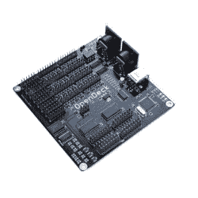

# OpenDeck 使旋转你自己的 MIDI 控制器变得容易

> 原文：<https://hackaday.com/2018/07/02/opendeck-makes-spinning-your-own-midi-controller-easy/>

如今，MIDI 控制器简直太酷了。市面上有上百万台这样的设备，它们都穿着闪亮的 led 灯和运动装备，比如 USB MIDI 接口和滑块，感觉很棒*。*随着我们的斜体预算用完，我应该说重点了——[你可以自己制作，OpenDeck 平台让这变得很容易。](https://shanteacontrols.com/)

The OpenDeck board. Readily apparent is the fact that it has tons of IO.

在其最精致的形式中，开放式甲板是一种覆盖有针头的板。对此，你可以连接一卡车的按钮、编码器、滑块和发光二极管。OpenDeck 处理所有的输入和输出，而您可以尽情地将各种小发明附加到您正在制作的控制表面/键盘/生日蛋糕上。就读取开关和电位计而言，它可以节省您重新发明轮子的时间，让您专注于项目的创造性方面。所有配置都通过一个简单的 web 界面来处理。

Tindie 上有开发板，但也有可能获取代码并在各种 Arduinos 和类似产品上运行，[因为它是极好的开源产品。](https://github.com/paradajz/OpenDeck)一旦你准备好了，这给了你将事情推向更高层次的力量。

[我们已经看到了一个相当酷的露天平台](https://hackaday.com/2015/03/02/the-hard-drive-midi-controller/)，如果你有更多，[你知道在哪里可以找到我们。](https://hackaday.com/submit-a-tip/)