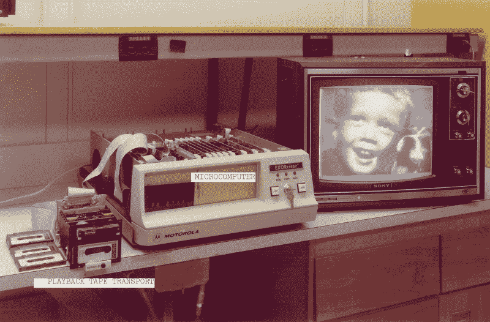
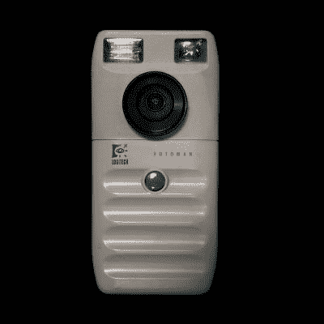

# 第一台数码相机的诞生

> 原文：<https://hackaday.com/2018/08/13/dawn-of-the-first-digital-camera/>

技术消失了。它要么成功并变得无处不在，要么失败。例如，曾经有一段时间，网络和多媒体是计算机的流行语。现在它们只是计算机的工作方式。另一方面，您上一次想到使用 CueCat 条形码阅读器扫描广告是什么时候？还有一些东西有时间，也会消失，比如传呼机。很难决定数码相机属于哪一类。对于大多数消费者来说，它们正在被我们的手机所吸收，并作为一个独立的类别而消失。但是你有没有想过第一台数码相机？这个故事不是你可能会猜到的。

我拥有的第一台数码相机是一台带软盘的索尼相机。那肯定是第一次，对吗？事实证明，没有。有一些非常早期的尝试，并没有真正的技术让他们工作。喷气推进实验室早在 1961 年就使用模拟电子成像(他们一直在月球上冲洗胶片，但肯定需要更好的方法)。一位 TI 工程师甚至在 1972 年为电子相机的[基本轮廓申请了专利，但它并不是严格意义上的数码相机。这些都没有任何实际成果，尤其是相对于数字技术而言。伊士曼·柯达公司创造了便携式数码相机，尽管他们不是第一个将这项技术商业化的人。](https://patents.google.com/patent/US4057830A/en)

## 柯达 1975

为柯达工作的 Steven Sasson 于 1974 年从飞兆半导体公司获得了一个早期的 CCD 图像传感器。顺便说一句，大约一年前推出的时候，它们的现行价格是 965 美元。柯达有一篇关于 2007 年 Sasson 进入消费电子名人堂的相机的有趣博客文章，尽管它似乎已经消失了。幸运的是，[你仍然可以在互联网档案馆](https://web.archive.org/web/20100529062439/http://pluggedin.kodak.com/post/?ID=687843)上读到它(本文中柯达设备的静态图像来源于存档的柯达网站)。

就像包里的手机看起来不太像手机一样，Sasson 的 8 磅重的相机看起来也不太像今天的数码相机——你可以在下面的视频中很好地看到它。盒子里有一个来自 Super 8 电影摄像机的镜头、16 节镍镉电池和一台盒式录音机，盒子里有大约 6 块电路板，其中包括一个用于数字电压表的 A/D 转换器设计。即使这样，也要花 23 秒才能把 30 张照片中的一张录到磁带上(尽管 30 张的限制似乎是随意的，以模仿一卷胶片上的拍摄张数，通常是 24 或 36 张)。

尽管如此，相机的分辨率还是 100×100 4 位灰度像素。回放使用了一个[摩托罗拉驱魔器](http://exorciser.net/excorciser1_en.htm)在电视屏幕上显示图像——这两个设备的重量都超过了 8 磅，而且明显不便携。这台相机并不打算实用，但实际上是一个研究项目。当然，Sasson 并不是一个人，他很快就相信了其他团队成员。甚至还有一项技术的[专利。](https://patents.google.com/patent/US4131919A/en)

[https://player.vimeo.com/video/22180298](https://player.vimeo.com/video/22180298)

## 商业成功

第一台真正的便携式数码相机是在 1988 年制造的，它将图像记录为计算机化的文件。1988 年的[富士 DS-1P](http://www.fujifilm.com/innovation/achievements/ds-1p/) ，它记录到一个电池供电的 2 MB SRAM 存储卡上，可以保存 5 到 10 张照片。像 12 年前的柯达相机一样，富士相机实际上从未售出。

Logitech Fotoman by [Rama](https://commons.wikimedia.org/wiki/File:Logitech_FotoMan-P4191195-black.jpg) CC-BY-SA 3.0

第一台商业销售的数码相机可能是 1987 年的 [MegaVision Tessera](http://www.digicammuseum.com/en/cameras/item/tessera) ,但除了它很贵(超过 50，000 美元)并且与电脑相连之外，关于它的信息很少。第一台商用便携式数码相机于 1989 年底在日本销售。富士的 [DS-1X 是一款改良的 DS-1P，也作为东芝 IMC-100 出售。](http://www.digicammuseum.com/en/cameras/item/fujix-ds-x)

第一台商用便携式数码相机于 1990 年末抵达美国。Dycam Model 1 售价 1000 美元，黑白图像分辨率低，卖得不好。这个设备最终变成了[罗技照相手机](http://www.digicammuseum.com/en/cameras/item/fotoman)(右图)。柯达也制作了一些早期的[数码单反](https://hackaday.com/2014/06/25/retrotechtacular-kodak-built-worlds-first-dslr-using-a-nikon-camera-body/)，尽管它们不是很容易辨认。

当你想到这一点时，很多技术必须结合在一起才能使柯达的第一台相机变得实用。图像传感器是一个明显的问题，但你必须解决存储、电池容量以及查看、共享和打印图像的能力等问题。闪存、更好的电池技术、个人电脑、家庭高带宽网络和彩色桌面打印机在 20 世纪 70 年代几乎都是科幻小说。

## 铁的

从 2003 年开始，数码相机的销量已经超过了胶片相机。柯达在 2004 年宣布，他们将不再在大多数市场销售胶片相机。到 2012 年，他们申请破产，不得不进行重大重组。

普遍的看法是，柯达因为没有预见到数码相机革命而遭受了巨大的损失。根据《哈佛商业评论》,这有点过于简单化了。真正的问题是柯达无法放弃其传统业务。当数码开始兴起时，他们认为这是让人们印刷更多图片的一种方式，而不是最终取代大多数印刷图片的一种方式。

不管怎样，你必须意识到这里错过了某种机会。至于我最初的思考，我想我已经决定独立数码相机肯定会消失。但是它正在消失——至少从消费市场上消失。虽然相机本身正在消失，但内部的图像传感器正在迁移到手机上，这种设备正在消耗许多人的许多其他设备。独立 GPS 仍有一个边缘市场，但已经不像过去那样了。媒体播放器也一样。随着通常被称为移动优先的新一代的崛起，这些设备甚至正在侵蚀传统 PC 的销售。数码相机不会完全消失，因为数码单反仍然是严肃摄影的黄金标准。

我认为这里要吸取的教训是双重的:首先，当面对一项新技术时，你必须想象除了你现有的技术之外它会做什么。不要把数字成像想象成另一种打印方式。把它想象成一种新的媒介。但另一个教训几乎是相反的。一定要考虑它如何适应你现有的技术——即使是那些不明显的技术。

诚然，在 1975 年，很少有人会预测到，几乎每个人都会随身携带一台联网电脑。但到了 2000 年，当夏普推出第一款拍照手机时，如果你不太分心思考你的历史核心业务或技术，你就可以实现这一逻辑飞跃。

围绕着整个数码相机的事情有相当多的历史。早在柯达之前就有数码相机了，但它们不便携，而且用于并不预示数码相机市场前景的系统中。有一个非常有趣的网站，上面有非常详细的事件时间表，从 1760 年的一部小说开始，小说中的人物使用一面在黑暗中固化的镜子来显示它反射的最后一个东西的图像。这个列表记录了从摄影到现代数码相机的各种成就。