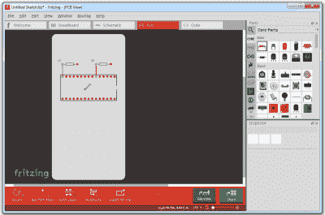

# 如何在烧结中设计定制的异形板

> 原文：<https://hackaday.com/2018/07/04/how-to-design-custom-shaped-boards-in-fritzing/>

如果你想开始设计一些 PCB，你可以使用众多软件包中的一个，它可以让你快速、简单、轻松地制作 PCB。你也可以使用 Fritzing。

Fritzing 是可怕的，你不应该使用它，但这并不意味着你仍然不能滥用 Fritzing 让它做你想做的事情。[【Arduino Enigma】最近贴出了一篇关于如何为 Fritzing](https://hackaday.io/project/91895-sinclair-scientific-calculator-emulator/log/144392-how-to-design-a-custom-pcb-shape-for-fritzing-no-more-sharp-corners) 设计定制 PCB 形状的教程。是的，烧结不再局限于带有尖角的矩形 PCB。只要你花几个小时在 Inkscape 上瞎逛，你就可以用 Fritzing 制作任何形状的 PCB。

该项目的目标是为[Arduino Enigma]的[Sinclair 科学计算器模拟器](https://hackaday.io/project/91895-sinclair-scientific-calculator-emulator)创建一个没有任何尖角的矩形板。Fritzing 可以做一个长方形的板，事实上，这就是它所能做的，但是[Arduino Enigma]想要一个圆角的长方形。工作几个小时后，我们有如何做的记录。

The imported board, with 3mm radiused corners.

创建定制形状电路板的过程很简单，在本例中，是一个四角半径为 3 毫米的矩形。首先，绘制所需形状的矩形，然后绘制更多的矩形作为当前层的子层。Fritzing 要求将图层 ID 命名为“board”、“silkscreen”和“silkscreen0”，但这不能在 Inkscape 本身中更改，您需要用文本编辑器编辑该文件。创建三层后，每层都包含您想要的形状，只需将页面的大小修剪为纸板的大小。保存文件，在文本编辑器中编辑文件，然后单击保存。启动 Fritzing，加载一个图像文件，并选择您正在处理的 SVG。只需 20 或 30 个快速步骤，你也可以将你能想象到的任何形状输入到 Fritzing 中。

这个过程有一个痛点。用文本编辑器手动编辑图层名称将这种无聊的工作从巴洛克式的工作区推向了让我们都质疑开源标准的状态。不幸的是，这是必需的，因为 Inkscape 不使用图层名称作为 SVG 文件中的 ID。不，这说不通，但事情就是这样。

对于任何其他 PCB 设计工具，创建定制形状的电路板只是简单地画几条线。然而，烧结是不同的。顶部的铜层表示为橙色，底部的铜层表示为黄色，这是一个没有意义的 UI 决定，即使你不是色盲。在烧结板上放置两层以上的铜是不可能的。对于 PCB 布局，烧结是一种应该避免的工具。也就是说，[Arduino Enigma]想出了如何在 Fritzing 中做一些你不应该做的事情，这很酷。