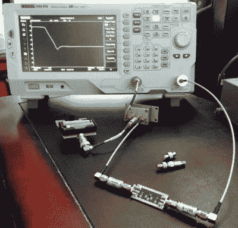

# Hackaday Journal 完成了第一轮审核流程，寻求更多投稿

> 原文：<https://hackaday.com/2018/07/05/hackaday-journal-completes-first-review-process-seeks-more-submissions/>

祝贺并感谢 Theodore Yapo 为 [Hackaday Journal](https://journal.hackaday.io/) 撰写了第一篇完成同行评审流程的论文。你可以[在这里阅读独立论文](https://drive.google.com/file/d/132w56treJsABD6a_0f7Oilfb4Dvm1751/view?usp=sharing)；它将被收录到今年晚些时候正式发布的《黑客日报》的第一卷中。

Hackaday Journal 是一份开放访问、同行评审的期刊，旨在确保来之不易的领域知识得到保护，并为所有人的利益而提供。在进入 Ted 的主题之前，请花一点时间考虑为杂志提交你自己的论文。

## 征稿

我们现在还有其他的投稿，但是我们还需要更多的论文来完成《黑客日报》的第一卷。请考虑就 Hackaday 社区感兴趣的领域中的任何创造性研究、工程或娱乐性发现撰写一篇论文。我们杂志的全名是《你所不知道的黑客日报》——这将是一本对任何寻求在工程领域拓宽思维的人有着无限吸引力的书。但为了实现这一点，我们需要你分享你的知识。

我们正处于一个个人和小团队有空前机会做出有趣发现的时代。你不需要为了发表你的发现而攻读学位，但是当然鼓励学生和教师提交他们的论文。不要犹豫，就你想写的话题与我们联系。

## 西奥多·亚波的标量网络分析仪泄漏校正

Low-pass filter being tested by a Rigol DSA-815 using the phase shifting correction technique

Ted 的论文的标题很拗口，主题材料津津有味地涉及射频知识。我们为他和同行评审员在出版过程中对细节的关注而鼓掌。

在工作中，Ted 发现了一个有趣的机会，即利用相对便宜的用于表征 RF 元件的实验设备获得更高的性能。这项任务通常是为矢量网络分析仪(VNA)保留的，但由于价格昂贵，这些工具并不是每个人都可以使用的。带跟踪发生器(SA/TG)的频谱分析仪已经上市，但特别是早期版本，存在导致不准确的泄漏问题。特德发现了一种简单的技术，可以纠正泄漏。

该解决方案基于测量的相移。从一台经过适当校准的机器开始，ted 使用他制作的一个小电路板，在泄漏是一个问题的地方，电子地改变跟踪发生器的相位。首先测量信号，然后以 180 度的相移再次测量。这有效地消除了误差，同时保留了被测信号。

本文深入探讨了 RF 领域的大量技术细节。值得注意的是，Hackaday 期刊对多个主题和复杂程度的发现是开放的。不要让你认为简单、有用的想法不被发表。我们对各种简单的、晦涩的和令人恐惧的技术感兴趣，只要这些想法新颖且有充分的支持。

## 这是你的日记

你，是的，你现在正在读这篇文章，体现了一场有创造力和好奇心的人的运动，他们在正式的学术结构内外工作。这是我们为人类的知识基础做贡献的时候了。给自己倒一杯提神饮料，戴上耳机，打开指关节，开始写作。让我们知道我们所不知道的。[现在提交论文](https://journal.hackaday.io/submissions)。