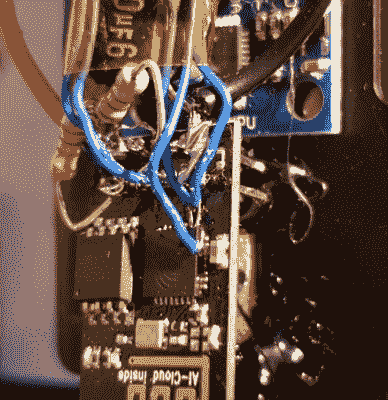

# 带 ESP8266 的垃圾箱自平衡机器人

> 原文：<https://hackaday.com/2018/07/05/junk-bin-self-balancing-bot-with-esp8266/>

众所周知，有时我们计划的项目根本无法实现。你有一个想法，甚至可能买一些你需要的零件，然后…什么都没有。也许你改变了主意，或者也许这个主意从一开始就没那么好。无论如何，时间在前进，零件在堆积，想法来来去去。这就是黑客的生活。

 【安德留斯·米科尼斯】写信告诉我们，他的废弃项目墓地最终如何提供了他开展一个他多年来一直着迷的项目所需的东西:[两轮自平衡机器人](http://itohi.com/blog/building-esp-1-balancing-robot/)。他从原本打算作为漫游者一部分的电机和车轮组开始，添加了一个加速度计，并用他身边的 ESP-01 将整个事情捆绑在一起。最终的结果看起来确实如此，并且表明项目并不总是需要 1000 小时的爱的劳动来完成他们的目标。

这个小机器人的构造非常简单。一块胶合板构成了主要结构，轮子粘在底部，电子设备位于顶部。它由两个从旧笔记本电脑中回收的锂电池供电，带有 DC-DC 降压转换器，为 ESP-01 和 MPU6050 加速度计提供稳定的 3.3 VDC。为了控制马达本身，[安德留斯]正在使用他在易贝找到的廉价 L293 控制器。

对于交互控制，[Andrius]正在利用 ESP 的 Wi-Fi 提供一个基于网络的界面。这让你可以从任何有浏览器的设备上控制机器人，而不必使用专用的硬件传输器。

各种[复杂程度](https://hackaday.com/2015/02/24/eddieplus-the-edison-based-balancing-robot/)的自平衡机器人在黑客世界中是一个相对常见的项目。它们奔跑的方式有种魔力，[似乎在对抗地心引力](https://hackaday.com/2012/07/20/self-balancing-robot-uses-cascading-pid-algorithms/)。