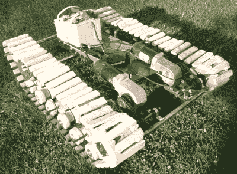

# 在正确的轨道上:电动轮椅内脏找到新的生活作为坦克

> 原文：<https://hackaday.com/2018/07/09/on-the-right-tracks-electric-wheelchair-guts-find-new-life-as-tank/>

每个黑客都梦想在某个时候建造自己的坦克。或者这只是我们。[Peter Sripol]和[Sam foskull]已经建造了一个足够大到可以骑的，但又足够小以至于邻居不会担心的。

电动轮椅是该建筑的核心。在拆除其内部结构后，两个带变速箱的电机直接连接到两个轨道上，允许差动转向。坚固的焊接钢架将所有部件连接在一起，这对于多年可靠的焊接至关重要。

轨道本身是简单的木条，手工切割并组装到尼龙带上。与此同时，履带轮和驱动组件由 CAD 设计，并用 CNC 刳刨机从一些胶合板切割而成，这是为最具机械挑战性的部分增加一些精度的绝佳选择。和往常一样，在[Peter]的视频中，很大一部分是专门用于测试的——在这种情况下，使用了相当多的焰火。考虑到他的其他加强版武器，我们当然不想出现在他的坏书里。

一辆小型的，被黑的，新奇的电动车？听起来它会在 EMF 夏令营找到一些好朋友，尤其是在 Hacky Racers 活动上。

 [https://www.youtube.com/embed/6rxYuIM6tH8?version=3&rel=1&showsearch=0&showinfo=1&iv_load_policy=1&fs=1&hl=en-US&autohide=2&wmode=transparent](https://www.youtube.com/embed/6rxYuIM6tH8?version=3&rel=1&showsearch=0&showinfo=1&iv_load_policy=1&fs=1&hl=en-US&autohide=2&wmode=transparent)

