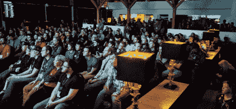
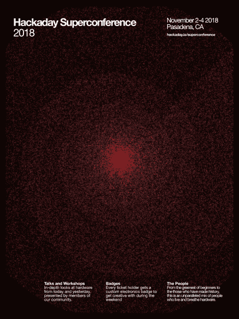

# 黑客日超级会议:门票和提案

> 原文：<https://hackaday.com/2018/07/09/hackaday-superconference-tickets-and-proposals-2/>

[立即购买 2018 年 Hackaday 超级大会](https://www.eventbrite.com/e/hackaday-superconference-2018-tickets-47386813234?aff=0709com)的门票。11 月 2 日至 4 日在加州帕萨迪纳加入我们！

这是一场终极硬件大会。来自世界各地的黑客、设计师和工程师汇聚一堂——从最环保的初学者到用他们的设计创造历史的人。这是黑客社区，这些是你的人，你需要在这里。super co 让你有机会体验所有与硬件创造有关的事情——周末充满了无与伦比的讲座和研讨会——但 super co 的体验超越了有组织的活动。我们称之为会议，但它实际上是一个黑客村，有黑客名人出席。

## 征集建议

我们想让你在今年的超级电脑展上做一次演讲(或研讨会)!请[使用此表格](https://goo.gl/forms/apl8Es0Xsj8uoJsT2)提交您的提案。

我们得到的关于 CFP 的第一个问题是“我对 X 很感兴趣，我应该提交一份建议书吗？”答案是肯定的。不要自我淘汰——如果你有一个演讲的想法，我们希望从你那里听到。Supercon 是一个平面会议，你的提议将根据你的想法和你计划如何陈述来评判，而不是根据你获得了多少其他令人惊叹的发言机会。

为了帮助你转移话题，我们建议你考虑你的演讲可能适合的主题列表:工程英雄，原型，研究，产品开发，全栈制造，当然还有通配符。

## 门票！在这里买票！

你是一个真正的信徒吗？我们今天刚刚开始征集提案，所以我们不能告诉你谁会发言，或者会举办什么研讨会。然而，我们怀疑你们中的许多人现在已经准备好冒险了。前 96 名真正的信徒获得了 128 美元的超低票价。

Standing room only during a 2017 Hackaday Supercon talk

即使是全价，入场费也是令人难以置信的价值([自己看](https://hackaday.com/2017/11/16/the-hacker-village-of-supercon/))。每张门票都附带三天的入场券、一个定制的硬件徽章、周五启动派对和周六 Hackaday 奖励派对的入场券、整个会议期间的食物和饮料等等。

这是我们举办黑客日超级大会的第四年。你可以查看去年的所有演讲视频，有[关于该事件的大量文章](https://hackaday.com/tag/2017-hackaday-superconference/)，当然还有[贯穿](https://hackaday.com/2017/11/17/what-actually-happens-at-a-hardware-hacking-con/)的令人难以置信的硬件黑客场景。在很大程度上，拥挤和愉快的社区氛围是我们将周五增加为全天研讨会和徽章黑客活动的原因！

获取您的机票并预订您的旅行。我们期待着与 Supercon 的大量 Hackaday 社区一起玩！

