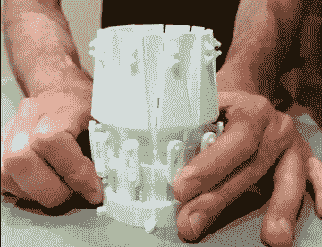
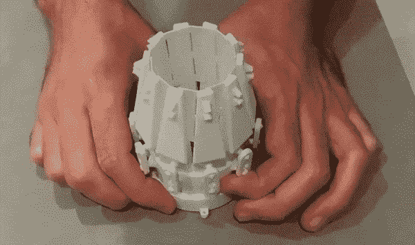

# 3D 打印可变面积喷嘴

> 原文：<https://hackaday.com/2018/07/14/3d-printed-variable-area-jet-nozzle/>

如果你见过军用喷气式飞机的尾部，你可能见过可变面积喷嘴。它们用于在超音速飞行期间以及加力燃烧室工作时调节喷气发动机后部的废气流量。除了协和式飞机之外，商用飞机不需要如此花哨的硬件，因为静态排气喷嘴对于它们将要进行的飞行类型来说已经足够好了。出于同样的原因，遥控飞机也不需要可变面积喷嘴，但这并不妨碍建造者想要它们。

 这就把我们带到了[这个由【马可·科鲁奇】](https://www.thingiverse.com/thing:2991269)设计的极其华丽的设计。这种可变面积喷嘴由 23 个独立的 PETG 部件组成，只需转动旋转环，就能将其直径缩小 50%。当与业余爱好伺服配对时，这种机制将允许操作员通过其 RC 发射器上的额外通道来调整喷嘴孔径。喷嘴还没有飞行，但正在计划用 40 毫米的电动管道风扇(EDF)马达进行试运行。但由于参数化设计，将其扩大到更大的电机应该不成问题。

但最大的问题是:这对 EDF 的表现有影响吗？答案当然是否定的。这实际上并不做任何事情。EDF 发动机不需要这种喷嘴，即使你试图在大型喷气发动机上安装这种喷嘴，它也会在几秒钟内从排气温度中融化。这纯粹是一个装饰项目，给飞机一个更精确的比例外观。为此，它看起来很棒，在一架大型遥控军用战斗机上肯定会给人留下深刻印象。

[Marco]说，如果有什么不同的话，他预计安装喷嘴后性能会更差。这不仅增加了飞机的自重，而且限制风扇后部的空气流出除了减少推力之外不会有任何作用。但好的一面是:如果它飞得更慢，就更容易看到你的可调喷嘴看起来有多棒。

这不是第一次有人试图让电动遥控飞机看起来像是装了一个合适的涡轮机，但这肯定可能是最巧妙的一种。超越这个的唯一方法是[为这个东西](https://hackaday.com/2017/11/16/your-drone-is-cool-but-its-no-jet-fighter/)建造一个真正的喷气发动机。

