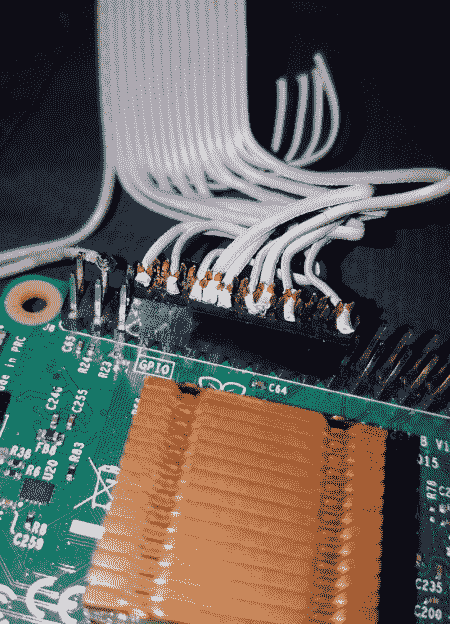

# 智能电源板因树莓派而复兴

> 原文：<https://hackaday.com/2018/07/06/smart-power-strip-revived-with-raspberry-pi/>

我们都支持从易贝购买残次品，这样可以给自己省几个钱:便宜地购买，修好它，享受领先普通消费者一步的回报。在 Hackaday Bunker 搜索“零件或不工作”类别几乎是官方的消遣。但是买了一个易贝发现只有几个星期就断气了？那很痛。

 这正是发生在【idaresiwins】身上的事，当时他在电子舱上买了这个看起来结实的“网络电源开关”。两周后，控制板烧坏了，他的“智能”电源板变得非常愚蠢。但是[添加了覆盆子酱之后，他又让它重新运转起来](https://imgur.com/a/U70YbZz)。不仅如此，考虑到这个设备现在包含的额外马力，它现在可以作为家庭实验室的基本服务器。

这种转换得益于这样一个事实，即原来的控制器是在一个独立于继电器的板上，并用一根小带状电缆连接。所有[idaresiwins]要做的就是找出电缆中的哪根电线连接到八个继电器中的每一个，并用 Pi 的 GPIO 引脚触发它们。一个有趣的细节是，他打开了带状电缆的一端，用它作为一种冲压块，轻松地将电线钩到 Pi 的引脚上。我们可能会建议用一些热熔胶来防止所有东西移动，但除此之外，这是一个很好的建议。

[idaresiwins]在网上找到了一些关于制作一个基于网络的 GPIO 接口的信息，他改编了这个接口来控制电源板上的插座。然后，他用塑料把 Pi 包起来以防短路，并把它塞进箱子里。请注意，他能够从中继板拉 5 VDC，并通过带状电缆将其传输到 Pi，因此他不需要费心在那里接入 USB 适配器。

通过互联网控制[交流设备是一个非常受欢迎的项目，我们甚至看到了一个](https://hackaday.com/2017/09/09/joe-activation-with-a-wifi-controlled-electrical-outlet/) [DIY 设备，看起来与这个产品](https://hackaday.com/2017/03/04/wifi-power-bar/)非常相似。他们中的大多数[现在都在使用 ESP8266](https://hackaday.com/2018/04/16/reprogramming-cheap-wifi-outlets/) ，但是随着 Pi 的板载，这个黑客更像是 powerwn 的超级版本[。](http://hackaday.com/2012/07/22/power-pwns-price-tag-is-as-dangerous-as-its-black-hat-uses/)