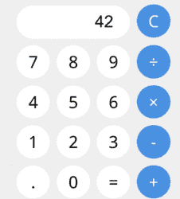

# 微型网站没有服务器

> 原文：<https://hackaday.com/2018/07/07/tiny-websites-have-no-server/>

现在网络服务的一个大趋势是所谓的无服务器计算，比如亚马逊的 Lambda 服务。这个想法是你没有一个专门的服务器来等待特定目的的请求。相反，您有一个服务器(比如 Amazon 的)监听大量请求，并且根据需要，您启动一个环境来处理该请求。从概念上来说，它允许你在没有专用服务器的情况下在“云中”运行一些 Javascript 或其他语言。 [https://itty.bitty.site](https://itty.bitty.site) 更进一步。该网站创建自含式网站，内容编码在 URL 本身中。

 大概最好的例子就是直接去网站点击“关于 itty bitty”该页面本身编码在它自己的 URL 中。如果你点击应用链接，你会看到一个计算器，显示这不仅仅是文本片段。虽然这确实依赖于 itty.bitty.site web 主机来提供解码框架，但解码完全是在您的浏览器中完成的，代码是[开源的](https://github.com/alcor/itty-bitty)。这意味着，如果你愿意，你可以把它放在你自己的服务器上。

起初，这似乎是一件新奇的事情，直到你开始思考它。一台联网的小型计算机可以很容易地用这些 URL 来创建网页。一台更大的计算机甚至可以托管 itty.bitty 服务器。然后是隐私问题。起初，我们认为像这样的页面很难审查，因为没有集中的内容服务器。但是你仍然需要解码框架。然而，这不会阻止一个老练的用户“重定向”到另一个——可能是私人的——解码网站并阅读页面，不管任何人对内容的反对。

这可能是所有案例中最令人信服的一个。你可以在一个 URL 中编码一些东西，然后任何有这个 URL 的人都可以阅读你的内容，即使有人关闭了你的服务器。itty bitty 服务器只是分发一些通用的 JavaScript。网站数据被存储为一个片段，有趣的是，这个片段不会被发送到服务器。

这意味着服务器甚至看不到你试图解码的内容。它只提供解码框架，您的浏览器在本地完成所有剩余的工作。我们很乐意看到有人分叉的项目，并添加简单的加密。目前，文本是压缩的和 base 64 编码的，但是任何有 URL 的人都可以解码它所说的。一个加密密钥将允许你以明文发送 URL，只有一些人可以解码，并且很难压制。

itty bitty 代码本身是一个应用程序，因为你可以通过右上角的编辑链接编辑大多数页面。如果你不喜欢就地编辑，该网站解释了如何使用通用的 HTML 文件或使用在线 HTML 编辑器，如果你喜欢的话。

有局限性。您可能无法在内部托管图形——您需要一个外部位置来指向图片。你也可以创建很长的网址——这意味着像 Twitter 这样的服务会把它们截掉。我们认为如果需要的话，你可以使用一个网址缩写器。还有一种方法可以把二维码印在里面。

我们可以看到这个[在 Raspberry Pi 项目中取代服务器](https://hackaday.com/2016/09/21/how-to-run-a-pagekite-server-to-expose-your-raspberry-pi/)。虽然这在技术上不是无服务器计算，但它确实提醒了我们如何[为助手](https://hackaday.com/2018/01/17/an-alexa-skill-among-other-things-in-a-few-minutes/)编写代码。

(编者注:在之前，我们实际上已经[见过这个了。代码就是数据，数据就是代码。)](https://hackaday.com/2017/05/13/javascript-art-is-in-the-url/)