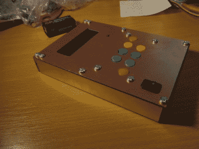
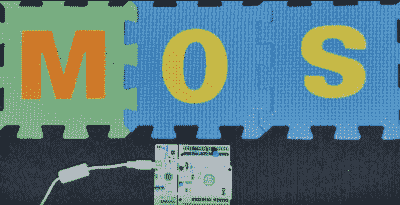
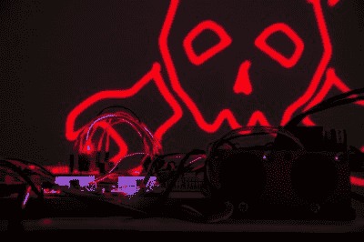

# 1 KB 挑战:获胜者是…

> 原文：<https://hackaday.com/2017/01/13/1-kb-challenge-and-the-winners-are/>

1 kB 挑战的截止日期来了又去。评委们已经完成了他们的工作，我们准备宣布获胜者。在你跳下来看谁赢了之前，我想花点时间对所有参与的人说声谢谢。我们有一些令人难以置信的参赛作品。说评判很难是一种轻描淡写的说法。甚至连树莓派之父埃本·厄普顿也加入了这场行动。他为经典的 BBC 微创造了一个新的[直升机游戏。在接下来的几周里，请留意关于获胜者和许多其他参赛作品的报道。](https://hackaday.io/project/19168-bbc-micro-50hz-helicopter-score-attack)

### 大奖

大奖由 [Brainf*cktor](https://hackaday.io/project/18445-brainfcktor) 的【Jaromir Sukuba】获得。[雅罗米尔]超越了这一次。他创造了一台可以用每个人都喜欢的深奥的编程语言编程的计算机。Brainf*cktor 在[Jaromir 的] PIC18F26K22 中使用 1019 字节的程序内存。你可以编写、执行和编辑程序。[Jaromir]他的液晶显示器出了点问题。字符表会使他超出 1 kB 的限制。没问题——[他设计了自己的压缩字符集](http://hackaday.com/2016/12/15/character-generation-in-144-bytes/)，包含在前面提到的 1019 字节中。所有聪明的软件都采用自制 PCB 的物理形式，以及由空白 PCB 材料制成的外壳。最棒的是，[Jaromir]解释了他的软件技巧，并为任何想要复制他的项目的人提供了完整的构建日志。所有这些努力都将得到来自 EMSL 的 Digi-Comp II 套件的奖励。

### 一等奖

一等奖由【杜米特鲁·斯塔玛】凭借[M0S–1024 字节的 cortexm 0 RTOS](https://hackaday.io/project/18664-m0s-cortexm0-rtos-in-1024-bytes)获得。操作系统是复杂的野兽。我们的许多读者都曾经摆弄过 Linux 内核。但是从头开始写一个实时 OS？那是一项艰巨的任务。[杜米特鲁]没有回避挑战。他为 ARM 处理器设计了一个实时操作系统(RTOS)，完全用 ARM thumb 汇编指令编写。这不是一个简单的高管。M0S 有丰富的特性，包括抢占式任务调度、互斥和进程间通信。[Dumitru]甚至用 malloc()和 free()的实现给了我们内存分配。使用 ST-Micro 的 NUCLEO-F072RB 板演示了操作系统。

[Dumitru]不只是丢下一个 GitHub 链接就跑了。他用七个项目日志和一个 37 分钟长的视频记录了 M0S。该视频使用电子白板绘图来清楚地解释操作系统的所有内部工作方式，以及如何使用它。

[Dumitru]是 V2 Maker Select 3D 打印机的新主人！

### 二等奖

二等奖由的【西里尔·金德鲁】获得。矢量激光器通常占用大量内存。你必须管理电流计、激光驱动器，并执行将一组向量转换为空间中绘制的线所需的所有魔法。该项目使用 912 字节的程序和初始化数据存储器来命令 MSP430 绘制图像。

为了证明奉承会让你无处不在，[西里尔]选择了 Hackaday 标志作为主题。不过，Jolly Wrencher 转换成矢量格式并不简单。为了得到一个大小在 1 kB 以内的图像，需要进行一些仔细的优化。[Cyrille]赢得了一个来自 EMSL 的球形表盘时钟套件。

### 三等奖

三等奖由马克·谢尔曼和 T2 获得。视频游戏已经存在了一段时间，但它们从来没有这么小。[马克]哄骗微型 Atmel ATtiny84 在只有 1024 字节程序内存的情况下玩蜈蚣。甚至 BOM 也很小，只有几个支持组件。控制由 Atari 2600 兼容操纵杆处理。视频是黑白 NTSC 制式，在周期精确的 CRT 上显示。[Mark]通过电子束产生视频，与 Atari 2600 的方式完全相同。

[Mark]将从 Blinkinlabs 带回家一套 Blinkytile 套件。

### 最后的想法

首先，我要感谢评委们。我们自己的[Jenny List]、[Gerrit Coetzee]、[Pedro Umbelino]、[Bil Herd]和[Brian Benchoff]与我一起努力评审这次比赛。我还要感谢我们的社区创造了一些令人惊叹的项目。竞赛可能已经结束，但是这些项目现在已经摆在那里，供其他人构建、享受和学习。

早在 2011 年[Jeri Ellsworth]和[Chris Gammell]参加 555 比赛时，我就想组织这个比赛。问题是创建一套对每个架构都相对公平的规则。我认为这次比赛的 133 个参赛作品证明了我们发现了一组非常公平的约束。可以肯定地说，这不会是 Hackaday 的最后一次 1 kB 挑战，所以如果你对未来的版本有想法，请在评论中分享！