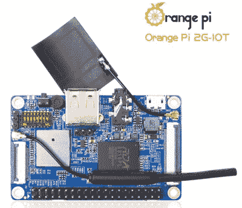

# 10 美元橙色 Pi 2G-IoT 发布，与 Pi Zero W 竞争

> 原文：<https://hackaday.com/2017/04/11/10-orange-pi-2g-iot-released-to-compete-with-pi-zero-w/>

Orange Pi 公司的一款新型单板电脑已经在全球速卖通上市销售。Orange Pi 2G-IoT 是为了与 Raspberry Pi Zero 竞争而设计的，如果规格有任何依据，他们做得很好。

如今，超小型单板电脑有很多选择，而且价格最低的产品越来越多。姑且称之为 20 美元以下的成本区间(平息运费的争论)。我们已经看到了 [C.H.I.P.](https://hackaday.com/2015/05/08/c-h-i-p-is-a-linux-trojan-horse-for-nine-bucks/) ，树莓 Pi 基金会[发布了 Pi Zero W](http://hackaday.com/2017/02/28/10-raspberry-pi-zero-w-the-w-means-wifi-bluetooth/) (对 Zero 系列的更新，包括 WiFi 和蓝牙)，已经可以使用的 Orange Pi Zero(这是周一的一个项目中的[)，现在又添加了一个不幸命名为 Orange Pi 2G-IoT 的列表。](https://hackaday.com/2017/04/10/pc-in-a-mouse/)

2g-IoT 配备了 ARM Cortex-A5 32 位处理器，主频 1GHz，256MB DDR2 内存。很高兴看到 500 MB 的板载 NAND 与 SD 卡插槽一起提供更大的存储空间。它还有一个 CSI 摄像头连接器、WiFi、蓝牙、FM 收音机和 GSM/GPRS，底部有一个 sim 卡插槽。它与 Raspberry Pi 几乎标准化的 GPIO 布局引脚兼容。

至少可以说，10 美元的价格令人印象深刻，尤其是增加了 GSM/GPRS 功能。会扼杀树莓派零 W 销量吗？我们认为不是。虽然 Orange Pi 的 T1 是很棒的小电脑，但它们没有像 Raspberry Pi 产品那样的社区支持，当你遇到问题时，在线支持会更少。前提是你能首先让它运行起来。橙皮的网站尚未更新，以反映新的版本。然而，如果你现在有兴趣为自己买一台，去你最喜欢的中国电子产品供应商那里吧。

[via [极客小玩意](http://www.geeky-gadgets.com/orange-pi-2g-iot-cellular-mini-pc-31-03-2017/)和 [CNX](http://www.cnx-software.com/2017/03/30/orange-pi-2g-iot-arm-linux-development-board-with-2ggsm-support-is-up-for-sale-for-9-90/)