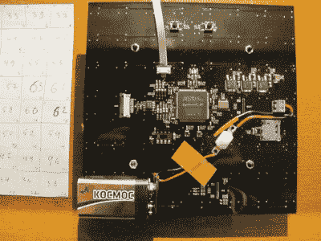
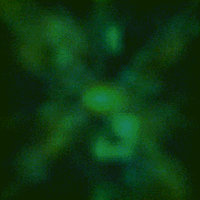

# 1024“像素”声音相机对待眼睛的实时音频

> 原文：<https://hackaday.com/2016/07/01/1024-pixel-sound-camera-treats-eyes-to-real-time-audio/>

几年前，【Artem】在一期*的《大众机械学》中了解了聚焦声音的方法。他推断，如果声音可以聚焦，它就可以聚焦到麦克风平面上。有足够多的麦克风，你就有了一个“声音摄像机”，每个麦克风只有一个像素。*

关于漫画的电影和电视节目现在是文化的高度，因此使用麦克风阵列产生图像的设备不是 FFT、信号处理和高速电子设计的有趣演示。这是一台*超胆侠*相机，这是我们见过的最棒的建造之一。

[Artem]的构建日志并不是一步一步地讲述如何制作一个声音摄像机。相反，他经历了构建这种麦克风阵列的整个过程，像所有令人惊叹的构建一样，第一步从未奏效。第一个原型[是基于一个平板扫描仪相机](http://www.ribbonfarm.com/2016/05/12/artem-vs-predator/)，简单地说就是一个在一个有针孔的不透光盒子里的平板扫描仪。这个想法是，通过来回扫描麦克风，使用针孔作为“透镜”，[Artem]可以检测声音来自哪里。他拿出扫描仪和信号发生器，开始实验。没用。盒子没有隔音，内室应该是无回声的，即使它能工作，这台相机也只能每分钟产生一两张图像。

8×8 microphone array (mics on opposite side) connected to Altera FPGA at the center

这个想法暂时被搁置在[Artem]的脑海中，在这个过程中，他了解了 FFT 以及巨型的[Duga 超视距雷达](https://en.wikipedia.org/wiki/Duga_radar)的实际工作原理。数学就是答案，通过使用 FFT 将麦克风信号从上下转换成不同的频率和强度，他可以建造这个相机。

不管怎样，这只是理论上的。实用性是一个障碍，为了建造这个巨大的声音摄像机，他需要几十个麦克风，几十个放大器，以及一个具有足够模拟引脚、DAC 和处理能力的控制器来理解所有这一切。

当[Artem]意识到有现成的器件是完美的麦克风摄像头像素时，这种复杂性就消失了。MEMS 麦克风，就像智能手机中的那种，将模拟声音转化为数字信号。将它输入一个足够快的微控制器，就可以对信号执行 FFT，并对下一个像素重复相同的过程。这就是答案，剩下唯一要做的事情就是用麦克风阵列搭建一块板。

【Artem】的摄像头麦克风由几个模块构成，每个模块由一个 8×8 的 MEMS 麦克风阵列组成，通过 FPGA 控制。这些单独的模块可以链接在一起，并且“大构建”是 32×32 阵列。在制造过程中出现了一些问题之后，这款主板实际上工作了。他从一个面板上录制了 64 个声道的音频。打开快速傅立叶变换图像，对着一个扬声器显示，是的，他确实做了一个声音摄像机。
结果是一部非常粗糙的电影，带有彩色斑点，但这就是只有 32×32 分辨率的相机的现实。现在声音摄像机工作正常，图像很粗糙，Artem 知道下一步该怎么走。一台便宜的个人电脑足够快来记录和处理所有的数据，但现在它是一个带宽的问题；每秒 30 个声音总共是 64 Mbps 的数据。这是可行的，但需要另一个 FPGA 实现。

这是声波视觉吗？是的，从技术上来说，这是可行的。没有，因为这个项目被搁置了，而且以任何电子爱好者的标准来看都很昂贵。尽管如此，它仍然是给我们的头版增色的最佳之一。

【感谢 zakqwy 的提示！]