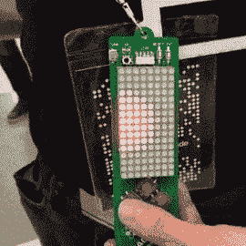
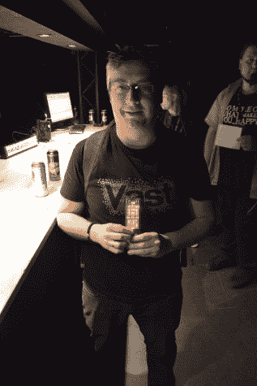
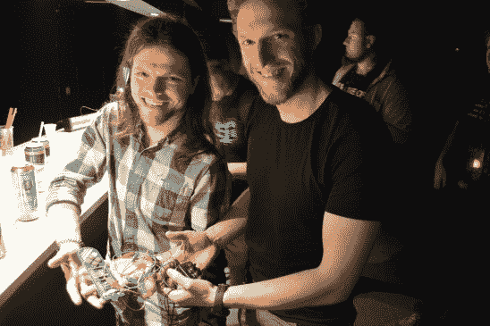
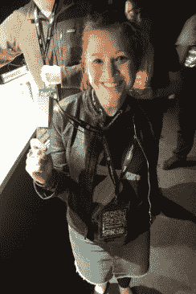
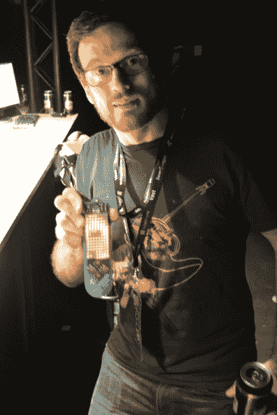
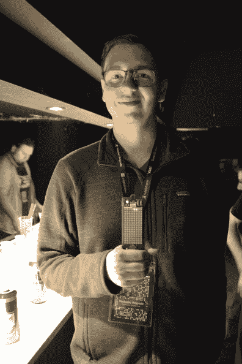
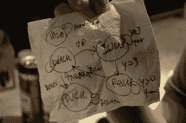
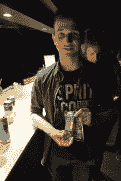
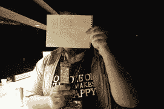

# 128 个发光二极管，5 个按钮，红外通信，几个小时:你能创造什么？

> 原文：<https://hackaday.com/2016/04/15/128-leds-5-buttons-ir-comm-and-a-few-hours-what-could-you-create/>

当第二支乐队演奏完最后一首安可曲时，在这位传奇 DJ 上台之前，一群硬件黑客爬上了三级台阶，眼睛闪闪发光，手里拿着发光的电子产品。让我感到惊讶和欣慰的是，最初让我在微控制器中摆弄一个字节的那股兴奋之情仍然存在，这一时刻——黑客家族的十字路口——激起了每个人心中炽热的冒险中心。

徽章黑客演示是一个受欢迎的。没有一个闪烁的像素太简单，没有一个半实现的想法不能打动每个人，因为它们证明了每个人的创造力、努力和勇气，他们站起来分享他们的创作。作为一个社区，我们怎么能不这样做呢？

午夜过后，我们才开始示威。我设法在没有 USB 网络摄像头作为自上而下摄像头的情况下参加了 Hackaday | Belgrade 会议。我也是几分钟前才排好人用相机记录的。请原谅我们的技术困难——我们首先尝试使用笔记本电脑网络摄像头投射到大屏幕上。当失败时，专注于徽章对我们的特设摄影师来说是困难的。这个视频是一个黑客，但我认为它值得看看过去的技术问题。

人群尽可能地聚集在舞台附近，当解释当天的诡计时，观众中充满了激情。休息之后，请和我一起观看每个演示的简要内容，并在视频中附上时间戳。

 [https://www.youtube.com/embed/qnHXH9T-8gY?version=3&rel=1&showsearch=0&showinfo=1&iv_load_policy=1&fs=1&hl=en-US&autohide=2&wmode=transparent](https://www.youtube.com/embed/qnHXH9T-8gY?version=3&rel=1&showsearch=0&showinfo=1&iv_load_policy=1&fs=1&hl=en-US&autohide=2&wmode=transparent)

[hack aday | Belgrade 徽章使用的平台](https://hackaday.io/project/9509-badge-for-hackaday-belgrade-conference)是 Voja Antonic 创造的。它是一个 8×16 LED 显示屏的单个 PCB，四个方向按钮和第五个用户按钮，以及一个带红外 LED 用于发射的红外接收器。PIC18LF25K50(由 Microchip 为此次活动捐赠)运行一个引导程序，允许使用 micro-USB 电缆对徽章进行编程。编程选项有很多，使用抽象的 C 代码来修补底层硬件，深入到由 Voja 的“内核”处理的内存映射电子设备，或者使用程序员运行自己的完全定制的代码来覆盖引导加载程序。我们看到了破解这些代码的每一个层次，以及定制的硬件破解。这些[代码的大部分已经发布到 Hackaday.io](https://hackaday.io/contest/10521-belgrade-badge-demoscene) 上。

**[00:34](https://www.youtube.com/watch?v=qnHXH9T-8gY&t=34s)**【Der Knopf】飞徽章:这是一个类似 Flappy Bird 的游戏的实现。这是一个在线条目，它是在没有硬件测试的情况下编写的。它运行有点快，但非常耐玩。

**[01:36](https://www.youtube.com/watch?v=qnHXH9T-8gY&t=96s) 他一直在关注徽章的开发，并在会议前几周开始为硬件编写自己的完全定制的代码。他在活动的前一天晚上会见了 Hackaday 的工作人员，并询问他是否可以获得一个早期徽章来编写他的代码。他没有让人失望。他的演示是[一种带有伽马校正的灰度](https://hackaday.io/project/10818-hackaday-belgrade-badge-greyscale-display)，它允许比基本的像素开/关更多的控制。基于这项工作，他继续实现了几个有趣的可视化。**

  Greyscale Badge by Mike Harrison  Maze Badge like Pacman

**[03:29](https://www.youtube.com/watch?v=qnHXH9T-8gY&t=3m29s) 有一个数字倒计时，像素从底部开始，但随着时间的推移速度会下降，直到它到达顶点，并开始向显示器的底部加速。**

**[04:14](https://www.youtube.com/watch?v=qnHXH9T-8gY&t=4m14s)** 【拉多万】构建了一个迷宫狩猎游戏，他将其比作“反向吃豆人”。这是因为敌人 AI 不是很聪明，所以你最终追逐它是为了证明玩家如果撞上它就会死。我相信迷宫本身是随机产生的，我希望我能知道更多！

**[05:07](https://www.youtube.com/watch?v=qnHXH9T-8gY&t=5m7s)** 【卢卡】和【尤里】介绍自己是“两个来自斯洛文尼亚的啤酒消费者”。他们是唯一两个成功破解该徽章硬件的人，干得好！他们移除了 LED 模块(插在徽章上)，为 MOSFET 行驱动器添加了一个下拉电阻，并添加了一个电容来过滤 DC，并用它来驱动一对耳机。chiptunes 音频黑客！这是他们第一次尝试音频合成，并提到他们花了几个小时但收效甚微——我自己也去过那里，我认为他们最终成功了真是太棒了。

  Hardware audio badge  Space Invaders

**[06:47](https://www.youtube.com/watch?v=qnHXH9T-8gY&t=6m47s) 太空入侵者，Galaxian，还有一个 Konami 的游戏叫凤凰。此外，她还添加了一些韩文字符。未来的计划包括添加来自旅鼠的“啪啪”动画。**

**[07:28](https://www.youtube.com/watch?v=qnHXH9T-8gY&t=7m28s)**【Jan】、【Benjamin】和【Erik】在这次参赛中组成了一个团队。他们利用徽章的红外通信功能[玩双人乒乓球](https://hackaday.io/project/10839-hackaday-badge-pong-multiplayer)。给视频一点时间来正确聚焦，你会清楚地看到每个徽章上的一个球拍和来回反弹的球，在它们之间形成空气间隙(如果有无线通信，你能把它称为空气间隙吗？不，但是和我一起去)。红外是面向前方的，所以我相信他们正把手指放在红外 LED 上，让它的光线射向邻居。令人印象深刻的实现。

**[09:14](https://www.youtube.com/watch?v=qnHXH9T-8gY&t=9m14s)** 【马特·埃文斯】制作[“代谢球”](https://hackaday.io/project/10832-hackaday-badge-metaballs)或“斑点”的复古 Amiga 演示。可视化是模拟电场强度的物理学。他提到他曾计划开发一个灰度库，但后来看到了上面的[迈克·哈里森的]实现。事实证明，将这些代码引入他的项目是一件棘手的事情，但我仍然发现[Matt]在单色上的可视化非常出色。

  Amiga Meatballs  Badge spams “YOLO” on IR comms

**[10:10](https://www.youtube.com/watch?v=qnHXH9T-8gY&t=10m10s)** 【尼克】进行了一次安全黑客攻击。Voja 的徽章固件包括通过红外接收定制信息的能力，但你必须知道徽章的序列号才能在传输的前序中使用。[Nick]编写了一个发送器应用程序，循环所有 3 位序列号，向受害者徽章发送“YOLO”消息。徽章不需要在消息末尾有终止字符。只要徽章在范围内，它的接收缓冲器将被“YOLO”填满，再加上下一个徽章序列号“YOLO”，等等。

**[11:00](https://www.youtube.com/watch?v=qnHXH9T-8gY&t=11m0s)** 【杰拉米亚斯】没有出席会议，但以代码形式发送了民主党。[戴夫达科]把它装到他的徽章上，给杰拉米亚斯演示。这是康威在徽章上运行的生命游戏。[执行](https://hackaday.io/project/10545-hackaday-belgrade-badge-firmware-hacking)包括速度调整和起动状态再生。但他也建立了一个编辑器，允许你设置一个自定义绘制状态。

**[12:45](https://www.youtube.com/watch?v=qnHXH9T-8gY&t=12m45s)** 【米歇尔·佩拉】和【米兰·马莱蒂奇】曾合作过一款双人游戏，但这款游戏只有一个徽章。这是一款受 Chrome 浏览器 T-Rex 迷你游戏启发的跑步游戏。玩家使用两个按钮跳跃或闪避，对手使用两个按钮发射高或低的障碍物供玩家躲避。这使用了 16×8 横向方向的徽章(就像首先演示的苍蝇徽章),当玩家被障碍物击中时，它显示“死亡”,我们都觉得非常有趣。

  Trex got complicated enough to diagram state machine  Snake the badge  “Flames” online entry  Chrome Trex Easter Egg Badge

**[14:19](https://www.youtube.com/watch?v=qnHXH9T-8gY&t=14m19s)**【NDB】提交了一份在线参赛作品，而【米兰·马莱蒂奇】留在舞台上展示它。[代码实现了一个火焰效果](https://hackaday.io/project/10721-hackaday-belgrade-badge-flames)来激活徽章，将粒子发送到上层模块。

**[14:43](https://www.youtube.com/watch?v=qnHXH9T-8gY&t=14m43s)**【Jan Koshier】为徽章制作游戏《蛇》。它从两个点开始，一个是蛇，另一个是水果。随着蛇吃水果，它变得越来越长。如果蛇撞到墙或自己的桌子，游戏结束。

**[16 点](https://www.youtube.com/watch?v=qnHXH9T-8gY&t=16m1s)** 投票开始。

**[18:00](https://www.youtube.com/watch?v=qnHXH9T-8gY&t=18m1s)** 【剧透警告】第三名授予了【迈克·哈里森】的灰度演示。第二名是[Luka]和[Yuri]的 chiptunes 构建。双人乒乓球比赛的第一名被三人组获得。奖品来自 [Hackaday 商店](http://store.hackaday.com/)。前三名获胜者获得了一个绿色的猎兔犬徽章，所有其他展示他们的徽章的人都获得了一个徽章。所有在线参赛作品都将获得一份[黑客日综合](http://store.hackaday.com/products/hackaday-omnibus-2015)。

再次感谢所有参与的人，感谢 demoparty 的观众，他们的兴奋和热情使它与众不同。我猜测的是名字的拼写，所以如果你想解决这个问题，或者计划上传你的代码并将其添加到[集合](https://hackaday.io/submissions/belgradeBadgeDemoscene/list)中，请[在 Hackaday.io](https://hackaday.io/mike) 上给我发消息。