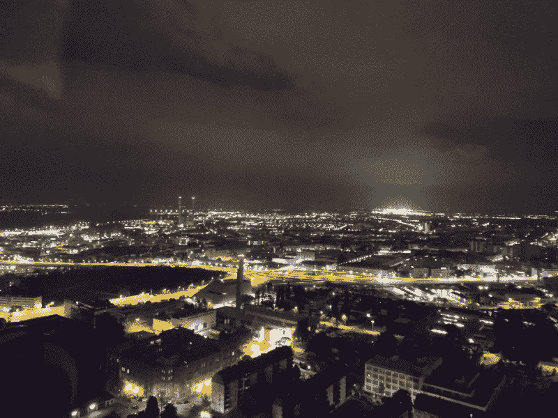

# 廉价的 1600 万像素户外安全摄像机

> 原文：<https://hackaday.com/2016/05/23/16-megapixel-outdoor-security-camera-on-the-cheap/>

寻找高品质的安全摄像头？尽管数码相机不断变得更好，更便宜，但安全摄像机似乎没有遵循同样的道路。那又怎样？最好自己做。

[donothingloop]正在寻找一款户外、支持网络的高分辨率摄像机。有些人可能想过使用树莓 Pi 相机模块，但老实说，这并不太好。相反，他找到了一对二手尼康 Coolpix L31 相机，他只花了 15 美元买了这两台相机。

现在尼康 Coolpix L31 并不完全是运动版，所以要让这款相机成为户外安全相机，它需要一个外壳。室外卤素工作灯外壳完全符合要求。它很坚固，已经内置了玻璃，这个项目的成本只有 12 美元，不会有任何损失！

为了控制摄像机，他仍然会使用 Raspberry Pi——这是在网络上获取类似摄像机馈送的最具成本效益的方式之一。他 3D 打印了一些适配器，并能够很好地将所有东西安装在灯罩内——看看它记录的图像质量！

对于一个 BOM 成本低于 60 美元的项目来说还不错！更多的安全摄像头技巧，请查看[Dann Albright 的] [家庭安全实验。](http://hackaday.com/2016/04/24/small-experiments-in-diy-home-security/)