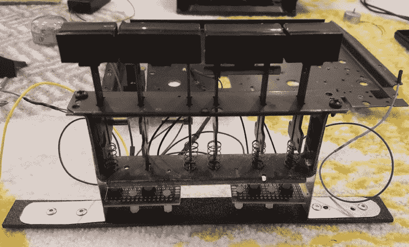

# 1960 年的控制台立体声获得树莓 Pi 触摸屏

> 原文：<https://hackaday.com/2018/05/10/1960s-console-stereo-gets-raspberry-pi-touch-screen/>

当他还是一个小小的黑客时，[WhiskeyDrinker]喜欢玩他祖父母的大型控制台立体声音响。一件实用家具的想法总是吸引着他，他决定当他长大并有自己的地方时，他也要有一套类似的音响。快进到现在，Craigslist 上的一则 Penncrest 立体声工作广告似乎是梦想成真。直到它不是。

The original physical controls are connected to the Pi’s GPIO

虽然很难相信，但有时我们在网上读到的东西并不是真的。“工作中的”Penncrest 无线电原来是一个哑弹。但意识到对他来说，橱柜的外观比历史准确性更重要，【WhiskeyDrinker】决定为它配备一个 [Raspberry Pi 驱动的触摸屏，看起来尽可能接近库存硬件](http://www.instructables.com/id/1960s-Volumio-Console-Stereo-Cabinet-Restomod/)。

最终的结果看起来确实像消费电子产品的某种替代时间轴:厚重的物理按钮和触摸屏完美和谐地共存。老式立体声发烧友可能会大叫犯规，但让他们去吧。[WhiskeyDrinker]在融合新旧方面做得非常出色，在有意义的地方尊重原始硬件和美学，在只有怀旧的地方清理门户。

一个 HiFiBerry DAC+ Pro 用于从树莓 Pi 中获取一些像样的音频，触摸屏接口由 [Volumio](https://volumio.org) 提供。[WhiskeyDrinker]提到它甚至有一个 GPIO 插件，他成功地使用它来处理物理按钮，使其与数字按钮配合良好。

更新旧的音频设备始终是围绕这些部分的敏感话题。有时他们走得太远，以至于最初的硬件几乎是事后的想法。在光谱的另一端是试图采用现代装备的项目[和模仿经典外观的项目](http://hackaday.com/2018/03/11/gramazon-gives-your-echo-dot-a-1920s-makeover/)[。无论如何，有一件事是清楚的:他们不再像以前那样制造它们了。](http://hackaday.com/2018/04/07/art-deco-radio-gets-fm-reception/)

 [https://www.youtube.com/embed/5p6EV5eoCIo?version=3&rel=1&showsearch=0&showinfo=1&iv_load_policy=1&fs=1&hl=en-US&autohide=2&wmode=transparent](https://www.youtube.com/embed/5p6EV5eoCIo?version=3&rel=1&showsearch=0&showinfo=1&iv_load_policy=1&fs=1&hl=en-US&autohide=2&wmode=transparent)

