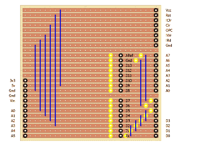

# 1MHz，2 块主板，4 位和一个自制 CPU

> 原文：<https://hackaday.com/2016/11/10/1mhz-2-boards-4-bits-and-a-homebrew-cpu/>

[Agp.cooper]看到了一个老式的 4Kx4 位 RAM 芯片，并决定它需要一个 CPU 设计来匹配。TTL 设计安装在两块板上，并配有一个功能性前面板。

这个定制的 CPU 项目有一些有趣的地方值得注意。首先，它足够小，你可以很容易地把它包起来。[Agp.cooper]很好地解释了他所考虑的指令集架构选择，以及他为什么选择最终的设计。

Testing adapter design connects Arduino to the CPU boards

另一个有趣的转折是测试。每块板都可以与一个 Arduino 配对，Arduino 将测试它的功能。这允许在尝试启动整个 CPU 之前测试设计的每个部分。

多氯联苯来自 EasyEDA T1，这是我们不久前关注的一项服务。这种产品的主板总成本约为 70 美元，但[Agp.cooper]提到，对于一次性项目来说，这个成本是合理的，但两周的周转期要求第一次就把它做好，以免你的项目在 respin 期间搁置。

顺便说一下，这是同一个设计者，他设计了 [Wierd CPU](https://hackaday.com/2016/08/06/weird-cpu/) ，并在构建日志中将其与他的 4 位作品进行了比较。

感谢[星鹰]的提示。