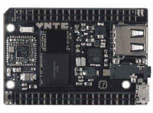
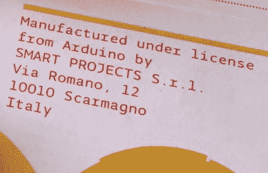
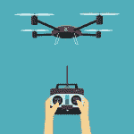
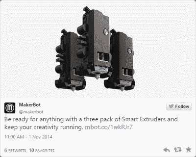
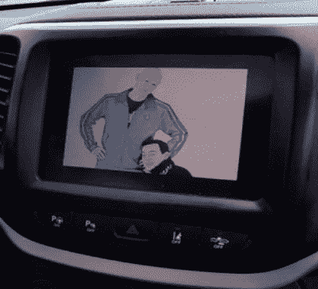

# 2015 年:随着硬件世界的转变

> 原文：<https://hackaday.com/2015/12/31/2015-as-the-hardware-world-turns/>

几个小时后，球会在时代广场落下。2015 年已经过去了，好消息是你可以很容易地把一个手写的“5”变成“6”。在接下来的几周里，请记住这一点。是时候回顾一下 2015 年发生的一切了。不过，这很无聊，通常最好把最离谱的东西放在 lede 里。因此，是时候预测未来 366 天将会发生什么了。它们依次是:

*   2016 年将是 Linux 桌面之年
*   无人驾驶汽车将被展示
*   石墨烯！和石墨烯有关！
*   你的公司会收到一份将“比特币”列为技能的简历
*   离核聚变发电只有九年了

尽管如此，今年发生了很多事情。微型 Linux 单板计算机变得非常便宜，Radio Shack 死了，Arduino 疯了。

### 九美元、八美元和五美元的电脑

C.H.I.P., a small single board computer available for $9.

如果 2014 年是 100 万台单板 Linux 计算机之年，那么 2015 年就是*极其便宜的*单板 Linux 计算机之年。这一趋势始于[的 C.H.I.P.](https://www.kickstarter.com/projects/1598272670/chip-the-worlds-first-9-computer/comments) ，一家 Kickstarter 公司从他们最初的 5 万美元目标中筹集了 2M 美元。这个想法很简单:以 9 美元的价格出售一台电脑，人们会情不自禁地掏出钱包。钱会被扔在屏幕上。VGA 或 HDMI 是否需要适配器板真的无关紧要。这些计算机在六个月内无法使用也没关系。果然是*便宜*，低毛利高销量*买买买*。

就在惠普准备把他们 9 美元的电脑发给支持者的时候，5 美元的 Raspberry Pi Zero 发布了。就在同一天，它在微型购物中心和网上零售商那里有售。树莓派基金会的一个绝妙妙招。惠普现在是一台 8 美元的电脑，配有 WiFi 和蓝牙，而个人电脑需要几个 USB 适配器。C.H.I.P .需要一个视频输出适配器，而 Pi Zero 配有 HDMI 库存。它们是用于不同用途的不同主板，但有一点是不变的:小型廉价单板计算机的竞争越来越激烈，这只会让消费者受益。

### Arduino 的喧嚣

2015 年将成为 Arduino 历史上最重要的一年。这是毫无疑问的。有趣的是，2015 年对 Arduino 的重要性不在于发布了任何重要的主板，也不在于任何新技术。这都是关于商标、两个 Arduinos 和一场激烈的竞争。

Official Arduinos from Arduino LLC were manufactured by Smart Products SRL, which became Arduino SRL

这一切都始于 2009 年，当时 Arduino LLC 由五个人创立。Arduino LLC 负责商标、设计、软件、社区和其他一切将 Arduino 推向顶峰的事务。Arduino 主板的生产由 Smart Projects SRL 公司(意大利版的有限责任公司)负责，该公司由 Arduino 的创始人之一 Gianluca Martino 领导。一年多前，SRL 智能项目公司更名为阿杜伊诺 SRL 公司，去年二月，[阿杜伊诺有限责任公司起诉阿杜伊诺 SRL](http://hackaday.com/2015/02/25/arduino-v-arduino/) 。从那以后事情变得更加混乱了。

在 2015 年的大部分时间里，实际上有两个 Arduino，SRL 告诉经销商[他们是真正的 Arduino](http://hackaday.com/2015/03/28/arduino-srl-to-distributors-were-the-real-arduino/) 。LLC 的反击是[在 IDE](http://hackaday.com/2015/04/06/arduino-ide-forked/) 中添加了一个关于非授权板的警告，而 SRL 只是通过提高 IDE 的次要版本号来规避。

当 LLC 在除美国之外的世界各地将自己重新命名为“Genuino”时，事情变得更加令人困惑。[每个人都在玩一些非常见不得人的游戏](http://hackaday.com/2015/05/22/arduino-vs-arduino-these-are-not-the-droids/)，表现得像个孩子。这并不是说这些行为不可理解；到目前为止，Arduino 商标是两家 Arduino 公司最有价值的资产。

什么时候会结束？不会很快，这是肯定的。该争议将在美国联邦法院解决，预期结果是 Arduino LLC 将在美国保留 Arduino 商标的使用权，而 SRL 将能够在除美国以外的任何地方使用该商标。这是一个关于背叛和爆米花的故事，当然也是 2016 年值得一看的。

### 现金统治着我周围的一切(美元钞票)

2015 年是公司有钱花的一年。很多钱。半导体工业因大量的合并和收购而受到震动。需要列表吗？

*   [Dialog 可能以 46 亿美元收购 Atmel】](http://hackaday.com/2015/09/22/mergers-and-acquisitions-dialog-buys-atmel/)
*   [恩智浦和飞思卡尔合并](https://hackaday.com/2015/03/02/nxp-freescale-merge/)，创建了一家价值 400 亿美元的公司
*   英特尔以 167 亿美元收购了 Altera
*   Avago 以 370 亿美元收购博通，这是有史以来最大的半导体交易
*   [以 24 亿美元半收购飞兆半导体](http://hackaday.com/2015/11/19/on-semiconductor-acquires-fairchild/)
*   [Microchip 收购 Micrel](https://www.microchip.com/pagehandler/en-us/aboutus/acquisitions/micrel-acquisition.html)
*   [点阵采集的硅图像](http://www.latticesemi.com/About/Newsroom/PressReleases/2015/201509LatticeAcquiresSiliconImage.aspx)
*   不断有传言称 TI 可能会收购 Maxim
*   西部数据以 190 亿美元收购了闪迪
*   对于化学公司来说，陶氏和杜邦合并，创造了一个市值 1300 亿美元的公司

这一切是怎么发生的？公司坐拥大量现金，利率很低，而且这种事情每十年左右就会发生一次。2016 年会发生什么？嗯，利率可能会上升，但半导体行业仍然有很多公司在玩。

### 无人机！

2012 年，国会告诉联邦航空局不要再干涉，为无人机、四轴飞行器和无人驾驶航空系统制定一些规则。法律要求联邦航空局在 2015 年 9 月 30 日前完成这项工作。当 11 月到来时，联邦航空局意识到他们没有做他们应该做的事情，并在不到一个月的时间里制定了一些规则。这些规定没有任何意义，模型航空学院告诉成员们[不要在联邦航空局的系统中注册](http://amablog.modelaircraft.org/amagov/2015/12/17/hold-off-on-registering-model-aircraft/)。结果会怎样呢？AMA 目前在联邦法院有一个案子，但那要到新年之后才会发生。无论哪种方式，你都不必在几周内注册成为无人机飞行员。

### 3D 打印是如此 2014 年…

Makerbot’s smart extruders perform so poorly they are sold in packs of three

Makerbot 死了。事实上，我知道这一点，但我要等到三月底才能把“Makerbot 已死”的帖子整合起来。[他们已经裁减了 36%的员工](http://hackaday.com/2015/10/09/makerbot-has-now-cut-36-of-staff-in-last-6-months/)，[有一个集体诉讼](http://hackaday.com/2015/07/12/3d-printering-the-makerbot-class-action-suit/)(只针对投资者)，一年多来，Stratasys 的股票已经从每股 80 多美元跌到了 30 美元以下。我们高兴地等待着它们的最终消亡。

除了 Makerbot 即将灭亡之外，3D 打印世界实际上没什么好说的。奇怪的金属和塑料细丝风靡一时，非常有趣:它们可以让你打印出具有铜、青铜和铁的重量和感觉的东西。一款主流的 [CoreXY](http://corexy.com/) 3D 打印机仍然不存在，但是(除了 Makerbot)，业务正在蓬勃发展。2015 年是 3D 打印的[幻灭期](https://en.wikipedia.org/wiki/Hype_cycle)的一年，我们期待着 2016 年的进步。

### 汽车黑客

直到 2015 年，所有汽车黑客都完全专注于车载网络。汽车中的 CAN 总线几乎控制一切，但直到今年，还没有办法将任何汽车变成联网遥控汽车。这是因为 OnStar、uConnect 和大多数新车提供的其他远程信息服务之间存在“鸿沟”。

Charlie Miller and Chris Valasek displayed on the center console of a Jeep

正如[查理·米勒]和[克里斯·瓦拉塞克]在一篇论文中所证明的，这个空气间隙并不真正存在。通过在吉普切诺基中桥接 WiFi 和 CAN 总线之间的空气间隙。一件事导致另一件事，《连线》杂志的作者[差一点就犯了交通肇事罪](http://www.wired.com/2015/07/hackers-remotely-kill-jeep-highway/)。

在[米勒]和[瓦拉塞克]发表他们的论文后，事情变得有些奇怪。虽然我们通常会期待公众对试图杀人的邪恶“黑客”的强烈抗议，国会对此事的听证会，以及学者们在钟楼上尖叫着必须做些什么，但令人瞩目的事情发生了:什么也没有。现在没有人试图保护你免受黑客接管你的车。黑客攻击自己的汽车在 DMCA 有豁免权，国会和媒体依靠汽车工业来确保一切安全。这是前所未有的。

汽车行业是如何做到这一点的？“邪恶黑客”接管汽车的问题在一个极端反动且技术不太娴熟的媒体的心目中是如何被忽视的？汽车现在是自动驾驶的。没有人能够遏制对(埃隆马斯克)英雄崇拜的认知失调，以及对设计糟糕的车载系统进行远程攻击的想法，所以每个人都只是顺其自然。2015 年是我们接受远程攻击汽车的一年，因为汽车自己驾驶实在是太酷了。另一方面，在排放测试中作弊会让汽车公司岌岌可危。

### 其他新闻条目和 2015 年的事件

对于硅来说，今年是重要的一年。第一批 5 纳米芯片正在路上，这意味着我们可能会在 2020 年至 2025 年之间的某个时候得到一台 5 纳米 CPU 的笔记本电脑。[第一批基于忆阻器的产品现在已经上市](http://hackaday.com/2015/11/03/building-memristors-for-neural-nets/)，尽管我们真的不知道我们会用它们做什么。新生婴儿的用处，或者类似的东西。

[无线电窝棚死了](http://hackaday.com/2015/02/05/ive-come-here-to-bury-radio-shack-not-praise-it/)。我们已经等这个消息等了十年了，但 Radio Shack 现在要么正式死亡，要么以 Sprint 手机商店的形式继续存在。

希斯基特回来了。2015 年是 Radio Shack 死亡，Heathkit 起死回生的一年。想想那个吧。希斯基特回归[的传言已经流传了几年](http://hackaday.com/2014/12/22/the-heathkit-mystery/)，就在几个月前，他们运送了十年来的第一件产品:[一套 AM 收音机套件](http://hackaday.com/2015/12/17/heathkits-triumphant-return/)

Hackaday 的母公司收购了 Tindie 现在我无法在 Tindie 狗的标志面前看到 cyberman。Hackaday.io 正在蓬勃发展。

2016 年 Hackaday 有什么计划？更多的一切。更多更好的内容、视频、活动和竞赛，成为互联网上最好的社区之一。有一些大的变化即将到来，他们都很棒。