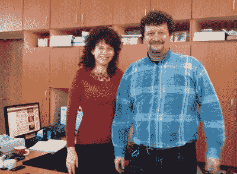
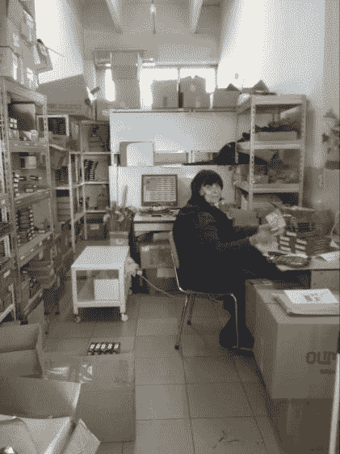
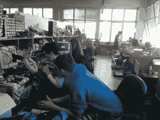
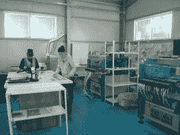
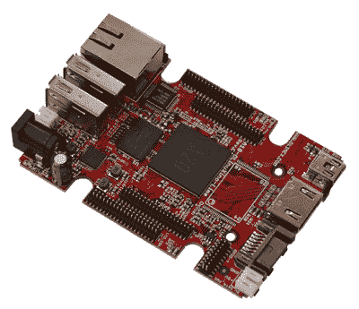
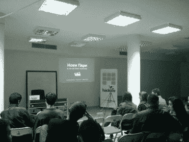
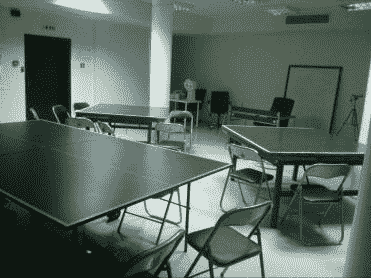
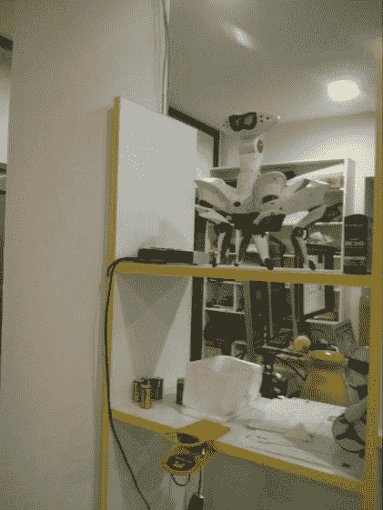
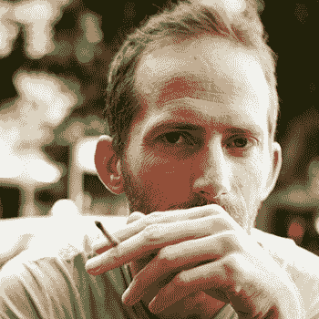

# 普罗夫迪夫 25 年的硬件制造经验

> 原文：<https://hackaday.com/2016/01/05/25-years-of-hardware-manufacturing-in-plovdiv/>

保加利亚的普罗夫迪夫拥有悠久的设计和创新历史，至少可以追溯到 6000 年前的色雷斯人、凯尔特人和罗马人。在过去的十年里，它也是开放硬件创新的重要中心——从前“苏联集团国家”复兴计算机硬件工业失去的荣耀。该地区有一家公司发展得很好，那就是一个 5000 平方米的微电子工厂，你可能以前听说过这个工厂。

Olimex 在印刷电路板、元件和完整电子产品的设计、原型制作和制造方面拥有超过 25 年的经验。在过去的十年里，它已经发展成为一个开放的硬件公司的光辉典范。我们最近有机会访问了 Olimex，并见到了其首席执行官 Tsvetan Usunov。

## 哲学

Mr. and Mrs. Usunov run Olimex as a family business

当我们的司机来接我们时，我们问道:“奥利梅克斯到底是谁？”并惊喜地得到回答:“我是奥利梅克斯”。这是一种与公司负责人会面的有趣方式，但它让我们快速了解了他的个人哲学。茨韦坦·乌苏诺夫一直想做他喜欢的事情:开发硬件。做生意从来不是他的主要目标。

茨韦坦有逆流而上、冒险的历史。1991 年，他给公司起的名字“Olimex”有着更深层次的含义，它反映了东欧和中欧共产主义崩溃摧毁了效率相当低的制造业后保加利亚的社会和政治变化。当共产主义的垮台暴露了中央计划经济和工业的所有弊病时，茨韦坦刚刚从普罗夫迪夫的技术大学毕业:

> 我所有的朋友都对在崩溃的经济中从事一些工程工作的前景不再抱有幻想，并决定开始各种进出口业务。保加利亚从一个生产计算机并在许多方面自给自足的国家，变成了一个严重依赖进口而不生产任何产品的国家，陷入了更加贫困的境地。我开始和大学里的朋友们开玩笑，在“买便宜卖贵”的经济环境下，他们纷纷放弃自己在微电子领域的专业知识，去当推销员，我把我的公司称为“全进出口公司”。邮局工作人员很难写下“Allimex”这个词，因为保加利亚语是一种语音语言，人们写下他们听到的声音，这导致了名称改为现在的“Olimex”。

## 制造业

  Entrance to the Olimex factory  Reflow Oven  Packing and Shipping Department  SMD Pick and Place  QA and Debugging  Visual inspection of boards before automation

Olimex 是一个热闹的硬件制造天堂，有取放机、回流焊炉和光学检测设备。该基础设施和 40 人的团队支持一个积极的本地和国际硬件开发人员网络，他们有兴趣构建和使用一种叫做 OLinuXino 的廉价开放的“迷你计算机”。但这家公司刚成立时非常不同。

Tsvetan 于 1991 年创立了 Olimex，为土耳其市场的公司开发和制造产品。他们需要一个可靠的制造商来生产厨房用具的板材。茨韦坦从一家开始倒闭的家具铰链厂购买了土地和建筑，用作他的工厂。2000 年初，当整个市场发生变化并转移到中国时，茨韦坦转变了他的企业对企业模式，以服务更多的利基客户。

他的新重点变成了开发板。传统上，这些产品只卖给硬件开发商，但当时开放硬件刚刚开始增长。许多新客户，从对硬件感兴趣的软件专业人士到工业设计师，再到普通发烧友，都会购买开发板。随着业务的增长，Olimex 的足迹也在扩大。

目前，Olimex 被许多领先公司认可为第三方硬件开发商，包括德州仪器、Maxim Integrated、Atmel、飞利浦半导体和 ST 微电子。Olimex 拥有超过 30，000 个活跃客户帐户，他们的 Linux DIY 计算机和主板用于各种物联网项目、ATM 取款机，甚至被汽车制造商使用。

## 开放式硬件

Tsvetan 的开放式硬件模型不仅仅意味着发布最终设计。他有兴趣从项目一开始就与同行进行持续的对话。这就形成了一个“参与和合作的设计”,并带来了更好的产品。

Olimex 保持了一个非常活跃的 GitHub 页面。这扩展到了 CAD 文件，这些文件在任何硬件版本发布之前的预制阶段就可以获得。茨韦坦提到，这在众筹圈子里被认为是一大禁忌，通常其他据称开放的硬件项目有时会选择“当第一批产品发货时，CAD 将可用”的政策。Olimex 直接受益于早期共享，因为社区成员有时会在投入生产之前发现可以修复的错误。

## 灵感来自树莓派的独特性

早在 2012 年，OSHW 就成为茨韦坦的一项任务，当时他想看看并使用新发布的 Raspberry Pi 计算机(RPi)。他描述了在法内尔经销商展台的场景，当时 RPI 基金会只展示了两块电路板，并承诺在 16 周内发货。这个嵌入式技术领域最大的事件让他感到失望:他是一个主板制造商，但实际上无法从 rpi 上找到 Broadcom 芯片，也无法重复最初的设计。

A20 OLinuXino LIME

他决定创造一种真正开源的 Linux 迷你电脑，这种电脑便宜、快速，最重要的是，可以在世界任何地方生产。结果是[称为“石灰”](https://www.olimex.com/Products/OLinuXino/A20/A20-OLinuXino-LIME/open-source-hardware)作为对 RPi 的响应。“水果”棋盘大战仍在继续。虽然 DIY Linux 板载计算机的想法始于挫折，但在如何平衡定价、可扩展性和设计以及让社区参与这一过程方面，构建它的各个步骤都是小而有用的经验:

> 我首先选择合适的处理器作为 RPi BGA 的替代品，RPi BGA 很难焊接，而且几乎不可能在公开市场上采购，我的首选是飞思卡尔 iMX233 TQFP 封装。这导致了几个运行 Arch 和 Debian Linux 内核 3.13 的 Micro、Nano、Mini 和 Maxi 板。从一开始就分享设计被证明是正确的想法，因为它涉及到来自进口程序严格的国家，特别是巴西和俄罗斯的人，他们印刷了电路板，测试了设计以发现问题，并参与了改进。他们的动机主要是进口电子产品和元件的困难，这使得 DIY、本地生产的电路板成为唯一的途径。

最初的主板规格适中，内存为 64 Mb，454 MHz，与 RPi 相比速度较慢。这导致下一个决定转向 Allwinner 的 A13 处理器，该处理器速度快 4 倍，并利用 Cortex A8 和 Micro WiFi。它仍然不是最快的处理器，但只有 176 个焊盘，这是一个很好的妥协。下一个挑战是创造比 RPi 更好的东西，特别是关注能源效率。这导致了 Allwinner A20 处理器，这是一个双核，1GHz 的芯片，他与 1GB 的内存配对。价格战 RPi 是通过将该委员会称为 OLinuXino Lime 而正式宣布的。

整个故事在去年 FOSDEM 会议上 Tsvetan 的一次演讲中被捕捉到，他解释了在 2012 年 2 月到 2014 年初之间，有 14 种不同的 OlinuXino 板，价格从 20 到 60 欧元不等。它帮助许多人学会了使用 Linux 的必要技能。

未来的计划是进一步优化 OlinuXino 的价格、速度和可用性。茨韦坦并不担心芯片的可用性，因为他与主要市场是平板电脑的中国公司 Allwinner 建立了良好的关系。

## 社区参与

  New Money meetup at hackafe  Ping Pong and Conference Room  Some of the projects under way

Olimex 已经做了很多工作来支持一个对设计和制造电子产品感兴趣的社区。他们有一个不断增长的开发者和设计师的在线社区，每周都有挑战，并有活跃的社交媒体。在当地，他们每月在保加利亚的普罗夫迪夫组织会议，人们来这里展示、讨论或合作各种硬件项目。他们举办了为期两个月的夏令营，任何人都可以在其中测试最新的电路板，并开始更严肃的 OSHW 项目。在 Olimex 还有一个名为 TuxCom 的年度免费开源软件(和硬件)[大会，面向移动、嵌入式和可穿戴设备。这是仿照 FOSDEM，欧洲主要的所有事情都公开的会议。](http://tuxcon.mobi)

Roman ruins of Plovdiv

普罗夫迪夫的开放式硬件活动通常在当地的 hackafe，Hackerspace 举行，距离保存完好的古罗马剧院和罗马体育场遗址仅几步之遥，两者完美地融合在一条热闹的步行大道上。

普罗夫迪夫正在成为开放硬件创新乃至制造业创新的世界领导者之一，这不应让我们感到惊讶。许多前共产主义国家有非常好的工程项目，也有繁荣的修补文化，部分原因是很难买到消费品，更容易与邻居和其他爱好者一起 DIY。OSHW 和创客文化根植于文化之中，在捷克共和国的 Polna 甚至有一个专门的修补博物馆，其座右铭是“修补匠在极权主义政权中取得的成就”。我们在那里看到的“解决方案”类似于目前的一些“创客项目”，如 DIY 卫星天线、抗偏头痛电子套件的有趣原型，以及用啤酒桶制成的扬声器。

Olimex 和 Tsvetan 的下一步是支持更多的教育并在当地发展社区，因为他们在国外的知名度似乎仍然高于国内。今年，他们通过 SMD PCB 组装研讨会支持 OpenFest，教孩子们如何制作二进制手表，但仍有许多工作要做。普罗夫迪夫的一大优势是附近的罗多皮山，它不仅美丽，而且作为俄耳甫斯的神奇诞生地具有重要的象征意义。根据奥维德的说法，这位来自希腊神话的传奇音乐家和诗人以他的歌曲而闻名，这些歌曲可以吸引“树木、野兽，甚至无知觉的岩石追随他”。在许多方面，这应该是“艺术”OSHW 运动及其嵌入式设备的目标，这些设备也试图赋予事物和周围世界声音和意义，并连接人类和机器的世界。

* * *

Denisa Kera

Yair Reshef

Denisa Kera (CZ，SG)是一位哲学家和设计师，探索原型作为本体不服从的工具。在她作为学者的日常工作中，她关注开放硬件如何支持开放和公民科学倡导，尤其是在全球南部。她是布拉格 Brmlab hackerspace 的成员。

Yair Reshef (IL)是一名艺术技术专家，从事稀有和定制的硬件和软件(电子、光学、机器人和其他珍品)的贸易、供应商和制造商。他目前在 Aviv 阿提尼公司工作，这是一款廉价的开发板。