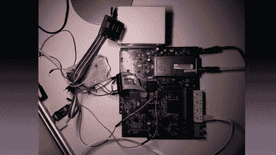

# 32C3:超越您的电缆调制解调器

> 原文：<https://hackaday.com/2015/12/29/32c3-beyond-your-cable-modem/>

Alexander Graf 在 32C3 上做了一个绝对搞笑的演讲，讲述了他在两家德国大型互联网服务提供商的电缆调制解调器中发现的安全漏洞。这个漏洞非常严重，导致几乎所有受影响的电缆调制解调器上都有远程根终端，原因很简单:例如，通过 TFTP 或 Telnet 发送到调制解调器的文件中有未加密的密码。

虽然(亚历山大)非常谨慎地指出，他已经向两家受影响的德国有线电视服务提供商披露了所有这些漏洞，但他特别称赞了其中一家在修补漏洞方面的快速反应。至于其他的？“他们最好快点。”他还提到，虽然他不确定，但他怀疑其他国家也存在类似的漏洞。哦亲爱的。

演讲中非常有趣的一点是[亚历山大]选择通知有线电视服务提供商的方式。他没有直接去找他们，也没有冒着坐牢的危险，而是去找了媒体，让他在媒体的联系人去和互联网服务提供商谈。这既保护了他免受潜在的初始压力，也给互联网服务提供商带来了一点额外的压力来修复漏洞——当故事登上头版时，他们真的希望领先于问题。

甚至有一根骨头是给你的铁杆硬件黑客的，他们认为所有这些软件安全的东西都是愚蠢的。为了首先获得调制解调器的固件，在演讲的第 42 分钟，[Alexander]简要展示了他如何从设备上取下闪存芯片，并使用 BeagleBone Black 将其读取到他的计算机中。没有 JTAG，什么都没有。只是把芯片撕下来，用传统的方法读取。

如果你有一个小时的时间，去看[亚历山大]的演讲。这是一个有趣的嬉戏，通过一些严重的漏洞。