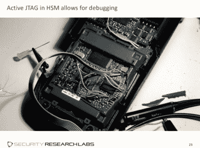

# 32C3:偷东西——破坏信用卡支付系统

> 原文：<https://hackaday.com/2015/12/30/32c3-shopshifting-breaking-credit-card-payment-systems/>

信用卡支付系统与我们的生活息息相关，正因为如此，这项技术的安全性非常重要。最好的安全研究调查广泛部署的系统，在坏人之前发现问题。最具娱乐性的安全演示最终会发现令人尴尬的不良做法，并一路开怀大笑。最重要的是现场演示。[Karsten Nohl]、[Fabian brunlein]和[dexter]在涵盖所有基地的第 32 届年度混沌通信大会(32C3)上就信用卡支付系统的安全性发表了演讲。

虽然信用卡系统本身已经被仔细检查过，但许多连接个人终端的供应商支付网络还没有被仔细检查过。这项研究的最终结果是，窃取信用卡 pin 码并远程将信用退款到不同的卡上是可能的——即使是从未进行过的购买。当然，研究人员演示了从他们自己身上偷钱，但是概念的证明是可靠的。他们如何打破两个独立的支付系统，部分是硬件黑客，部分是在互联网上查找资料，部分只是单纯的好奇。

第一种黑客欺骗某人在终端上输入他们的信用卡密码，然后登录到电脑上。有了条纹数据和密码，信用卡就完全暴露了。通常情况下，你不应该能够改变终端的这部分行为，但他们设法找出了终端的秘密密码，可以创建任意菜单，游戏就结束了。

这是可能的，因为终端逐字节检查密码的有效性。因此，您可以查找 CPU 多花几个周期来响应的时间，并确定您有一个正确的字节。重复八次，八字节的密码就被破解了。

第二次黑的更尴尬。有了[Fabian]在网上泄露的文件中找到的密码、终端的 ID 号(印在每张收据上)和一个可强行破解的端口地址，他们可以远程发起随机购买和退款。

 最后，这也是我们最喜欢的部分，[德克斯特]讲述了他是如何击败了号称安全的硬件安全机器(HSM)，它掌握着所有读卡器的“秘密”密码。巧妙的设计将密码存储在带有备用电池的 SRAM 中，在不断开电源的情况下很难打开盒子，导致比特逐渐消失。

在破坏了几台机器，看看它们是如何工作的之后，[威慑]找到了在屏蔽下楔入接地针的正确位置，秘密不再是秘密了。

这一切有什么教训吗？不要把密码存储在你要分发给成千上万商店的设备上。有人会在易贝买几个然后得到那些密码。使用[非对称加密](https://en.wikipedia.org/wiki/Asymmetric_encryption)，就像使用公钥加密方案一样，将意味着密钥根本不需要驻留在设备上，并将在相当早的时候挫败我们的演示者。