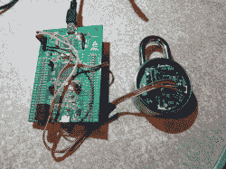

# 33C3:打破物联网锁

> 原文：<https://hackaday.com/2016/12/28/33c3-breaking-iot-locks/>

快进到演讲的最后，你会听到听众中有人问[Ray]“有没有什么蓝牙锁可以推荐的？”他会回答“不，不是真的。”(如果这算作黑客大会上关于三把物联网锁安全性的[讨论的剧透，你需要多出去走走。)](https://media.ccc.de/v/33c3-8019-lockpicking_in_the_iot)

用手机打开挂锁并不像听起来那么疯狂。互联网锁的承诺是，它们可以让人们一次性使用或有限地进入物理空间，就像给他们发电子邮件一样容易。不幸的是，它也打开了更多的攻击面。制锁从一项涉及巧妙的机械设计和冶金学的技能，发展到加密和安全协议。

 在这个有趣的演讲中，【雷】着眼于三把“物联网”锁。第一，一旦他打开了它，他就扔在机械的地面上——这是一个 100 美元的锁，就像你健身房储物柜上 4 美元的挂锁一样容易撬开。另一个是主锁，它有一个 2012 年漏洞的新版本，[Ray]向 Master 指出:如果你在锁的外面移动一块磁铁，它就会启动里面的马达，打开锁。第三个由 Kickstarter 公司 Noke 制造，至少在物理上是安全的，但却成为不安全的密钥交换协议的牺牲品。

在此过程中，您将获得一些关于如何快速轻松地[审计您自己的物联网设备](https://mitmproxy.org/)的建议。即使你喜欢你的钥匙由金属制成而不是由金属制成，这也是值得的。鉴于最近一些物联网安全讨论的大肆宣传，更令人耳目一新的一点是[Ray]对安全问题采取的细致入微的方法，因为它可以被其他人利用，而不是只被设备所有者“利用”的向量。我们喜欢将这些视为定制选项。