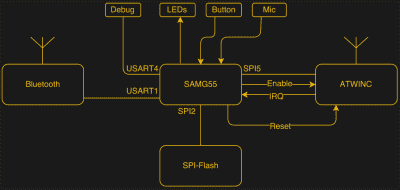
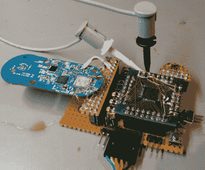

# 33C3: Hunz 解构了亚马逊破折号按钮

> 原文：<https://hackaday.com/2017/02/02/33c3-hunz-deconstructs-the-amazon-dash-button/>

亚马逊 Dash 按钮现在是第二个硬件版本，在第 33 届混沌通信大会的一次演讲中，[Hunz]不仅将其拆开，并说明了与第一个版本的差异，而且他还成功地对其进行了足够的逆向工程，以使他自己的代码运行。这开启了一大堆可能性，超越了我们所看到的简单的“拦截 IP 流量”式的黑客攻击。

 刚进入仪表板有点麻烦，所以买两个:一个用来分开，定位你下次要避开的部分。一旦你进去了，所有的东西都很小！0201 贴片零件很多。藏在一团塑料下面(丙酮！)是一个 Atmel ATSAMG55，一个 120 MHz 的 ARM Cortex-M4 与 FPU，以及一个强大的 CPU。还有一个 2.4 GHz 无线电，内置 IP 堆栈，可处理所有 WiFi，内置 TLS 支持。其他部分包括升压转换器、BTLE 芯片组、LED、麦克风和一些 SPI 闪光灯。

该设备最奇怪的部分是睡眠模式。用户按下按钮即可打开电压调节器，并使用 CPU 上的 GPIO 引脚保持该状态。一旦微控制器放开电源，所有电源关闭，直到再次按下按钮。睡觉时很难少用一点电。即便如此，微控制器会监控电池电压，并在电池电压变低时给家里打电话。

【Hunz】查看通信流，发现微控制器和 WiFi 无线电芯片之间通过 SPI 的 HTTP 数据，以及从那里发出的 TLS 加密的 HTTPS。因此，他焊接了一个 FPGA，让中间人攻击硬件，用这个 5 美元的小工具制作了一个漂亮的黑客开发工具包。

旧的 Dash 按钮启用了 SWD 调试和一个串行控制台，新的固件除了几个命令之外禁用了它，所以不容易转储。于是[Hunz]拆下 SPI flash，从外部读取。这给了他固件，减去引导加载程序和一些配置存储。接下来是一个伟大的技巧:他写了相同的固件到一个新的 SAMG55，固件工作了。然而，他闪存到的芯片已经运行了 SWD 调试，所以他能够在一个更友好的环境中工作，有开发者控制台和一切。(精彩！)

随着固件转储和系统运行版本的调试，他最终发现了[音频配置协议](http://www.blog.jay-greco.com/wp/?p=116)中的一个漏洞——该协议用于通过麦克风播放的音频文件来配置设备，就像一个老派调制解调器的更新版本。不幸的是，对于 Amazon 来说，音频协议中的输入没有进行长度检查。缓冲区溢出和完整的闪存转储随之发生。他用耳塞窃听按钮的视频很经典。

当然，亚马逊将很快修补这个漏洞，但如果按钮无法连接到他们的服务器，他们就无法做到这一点。[Hunz]说他不会再继续做下去了，但是这是他的 GitHub。开始吧！
