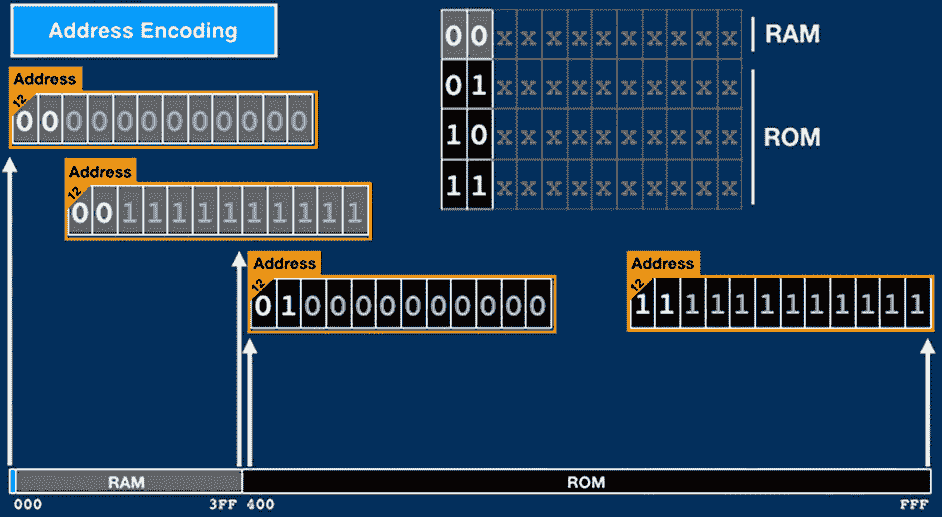

# 34C3:终极阿波罗制导计算机对话

> 原文：<https://hackaday.com/2017/12/28/34c3-ultimate-apollo-guidance-computer-talk/>

虽然它可能没有土星五号火箭本身那么令人兴奋，但阿波罗制导计算机(AGC)是整个阿波罗计划中最重要的发展之一。虽然与现代硬件相比并不引人注目，但当 AGC 在 20 世纪 60 年代开发出来时，它完全是革命性的。如果你试图把它们装进一个相对较小的、资源有限的太空舱，这两个问题都很大。AGC 不仅将人类送上月球并返回，而且它还重新定义了微型计算机的艺术状态，为 20 世纪 70 年代的桌面系统铺平了道路。

也就是说，AGC 的设计和操作在现代人看来完全是怪异的；它来自一个我们难以理解的时代。考虑到这一点，[迈克尔·斯泰尔]和[克里斯蒂安·赫斯曼]为 34 C3 制作了[“终极阿波罗制导计算机讲座”。](https://media.ccc.de/v/34c3-9064-the_ultimate_apollo_guidance_computer_talk)

这个长达一小时的演示不仅向观众介绍了 AGC 本身的各个方面，还介绍了它如何与土星五号火箭和整个月球任务相互作用。即使你不是一个足够的老式计算爱好者来欣赏核心绳内存的复杂性，这个演示也让你对人类最伟大的成就之一的细节有一个迷人的了解。

 虽然非常圆滑易懂的图形，【迈克尔】和【克里斯蒂安】却打破了 AGC 的外星世界。即使演示的这一部分你听不懂，只要听听观众的笑声或掌声就可以了:那是你正在看一些真正不寻常的东西的时候。

在本次演示中，特别值得注意的是对宇航员实际上如何与 AGC 交互的解释。AGC 的显示器和键盘(被称为 DSKY)可能看起来相当迟钝，甚至对那些曾经黑过 VT100 的人来说也是如此，但[Michael]和[Christian]解释了它并不像看起来那么复杂。将 DSKY 的输入和输出与我们在更现代的命令行界面上看到的进行比较，演示说明这实际上是一种非常直接的与计算机对话的方式。

还有一个从发射到着陆的阿波罗任务不同阶段的完整分解，解释了 AGC 在任何给定时间将做什么。DSKY 覆盖在阿波罗任务的实际镜头上，提供了一个独特的视角，让宇航员在标志性时刻，如阶段分离或月球着陆时，在他们的电脑上看到什么。

如果这个演示让你渴望更多阿波罗时代的计算机技术，我们已经介绍了很多项目让你忙起来。[从建造 DSKY](https://hackaday.com/2014/11/28/frans-new-project-the-dsky/) 的复制品到[悠闲地翻阅 AGC 源代码的印刷版本](https://hackaday.com/2016/07/05/don-eyles-walks-us-through-the-lunar-module-source-code/)。