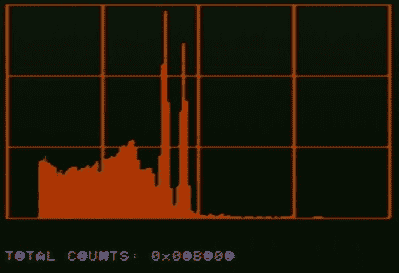

# 34C3:复古验证，用 6502 阻止核战争

> 原文：<https://hackaday.com/2018/01/10/34c3-vintage-verification-stop-nuclear-war-with-a-6502/>

我们的旅行更好的同事对圣诞节后在莱比锡举行的 34C3 活动进行了充分的报道，剩下的我们来挑选尸体，就好像这是曾经辉煌的圣诞火鸡的最后一点残余。网上有很多可以坐下来观看的演讲，当然还有那些与其他人擦肩而过的古怪的宝石。

谈到地球面临的风险，可能没有比核灾难更糟糕的了。各国紧张地盯着对方，每个国家都小心翼翼地保护着自己的核弹头储备。似乎不太可能找到一个 34C3 谈论 6502 微处理器的地方，但这就是[莫里茨·库 tt]和[阿历克斯·格拉泽]设法传递的东西。

监管任何和平条约都是一件棘手的事情，尤其是涉及核裁军的条约。这是一个信任的问题，因为事关重大，没有一方愿意透露除最基本信息之外的所有信息，也不相信一个国家机构从另一方制造的核查仪器。因此，视察员使用的仪器无法获得太多关于他们正在视察的东西的信息，只能储存一些类似于他们确实获得的数据的杂乱无章的东西，而且这些仪器的设计必须足够开放以供核查。当所讨论的硬件是现代高性能微处理器板时，这最后一点变得特别困难，如此复杂的对象可能很容易被试图利用该系统的核玩家破坏。

我们通过一些例子和它们突出的设计问题，详细介绍了核武器核查仪器的设计。像 ATtiny 微控制器负责模拟电路板的时序这样无关紧要的事情，却有了一种危险的可能性，因为很明显，它可能会利用受损的代码存储未经授权的信息，或者试图欺骗检查人员。他们向我们展示了他们使用红色火龙果 FPGA 板的第一个探测器模型，但指出这一点的复杂性使其无法验证。

The gamma ray energy spectrum of a cobalt-60 source as seen from an Apple II.

接下来是一个激进的想法，如果这个领域使用的技术太复杂，其完整性无法验证，那么什么技术存在于*可以*验证的水平？他们的回答让我们想到了 6502，这是一款已经连续生产了 40 多年的处理器，其内部结构已经被充分理解，以至于在公共领域成为了事实上的*。特别是，他们选定 Apple II 家用电脑作为 6502 平台，因为它的可用性和[史蒂夫·沃兹尼亚克]原始设计的可扩展性。所有各方都可以采购和检查相关仪器。*

 *如果你从来没有检查过核弹头验证装置，这个系统的细节就很吸引人。我们看到了用于测量入射辐射能量的闪烁检测器，以及仅使用运算放大器、ADI 公司 flash ADC 芯片和易于验证的 74 系列逻辑的定制 Apple II ADC 板。这不是故意的，但从复古计算的角度来看，除了蓝色 LED 指示灯之外的所有东西都很可能是在 20 世纪 80 年代为 Apple II 外设购买的。然后，他们通过研究如何通过非破坏性的方法来验证一个真正的 6502 系统来结束这次演讲。

核检查员不太可能带着苹果 II 出现在发射井，但这确实显示了他们在工作中面临的一些问题的解决方案，并可能为未来的仪器提供指示。你可以在他们的网站上读到更多关于他们工作的信息。*