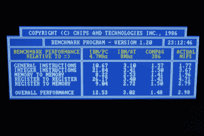

# 386 马力太大？试试 FPGA 中的 186！

> 原文：<https://hackaday.com/2017/11/03/386-too-much-try-a-186-in-an-fpga/>

通常，当我们听到“片上系统”这个词时，我们的脑海中会直接跳转到驱动我们周围的智能手机和嵌入式设备的基于 ARM 的现代处理器。来自左边领域的是 [[Jamie]的 80186 内核，它运行在英特尔 FPGAs 上。](https://www.jamieiles.com/80186/)

【杰米】通过几个老式电脑基准运行核心。

【杰米】在 Verilog 中实现了整套 80186 指令，还包括了一些未记录的指令。这种对细节的关注非常重要——现实世界中的零件并不总是符合纸上的原始规格，程序员可以依赖这一点。兼容性的关键是理解事物在真实世界中的表现，而不仅仅是在规格表上。

不满足于简单地模拟一个 CPU，一个完整的工作系统的所有必要的外围设备都已经融入到设计中。如果你想实际使用任何类型的人类输入设备，有 RAM，UART，以及 CGA 图形和 PS/2 控制器是必要的。

[Jamie]在 GPL 许可下发布了代码，可以在 GitHub 上获得。如果您想在逻辑层面上使用曾经的商用 CPU，这是一个很好的基础。如果您需要深入了解细节，还可以使用[开发指南](https://www.jamieiles.com/80186/development-guide.pdf)。这是一个很酷的项目，与[杰米]之前的作品形成了鲜明的对比—[旧的 32 位内核。](https://hackaday.com/2015/03/20/the-oldland-cpu-32-bit-fpga-core/)