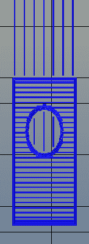
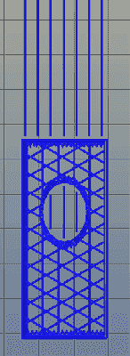

# 更好的 3D 打印对象的 3D 内部结构

> 原文：<https://hackaday.com/2016/06/10/3d-internal-structure-for-better-3d-printed-objects/>

Makerbot 陷入困境，3D Systems 和 Stratasys 的股票只是他们 2014 年辉煌的一个影子，但这是 3D 打印有史以来最好的一年。机器现在很好*和*便宜，有各种各样的热塑性细丝，打印有用的物体——而不仅仅是塑料小饰品——变得越来越普遍。

The standard rectilinear infill from Slic3r

3D 打印有一个领域没有取得太大进展，那就是软件堆栈。切片，将 3D 对象转化为打印机 Gcode 文件的过程，在过去几年中基本上是相同的。双重挤压还是一塌糊涂，自动化的床层平整还处于初级阶段。

分层的一个被严重忽视的方面是填充。显然，你不想打印完全实心的塑料饰品——只有外部表面很重要，100%填充的部分只是浪费塑料。不同的切片师想出了不同的方法来填充印刷品的内部，通常是正方形、三角形或六边形的网格。

虽然最流行的填充 3D 打印对象的方法可以增加打印的强度并支撑打印的顶层，但这不是一个理想的解决方案。从未考虑成品部件的所需强度，有时通过印刷品的侧面可以看到印刷伪像，并且填充网格的间距完全是任意的。您只能设置填充的百分比，并且告诉切片器制作间距为 10 毫米的内部支撑网格是不可能的。

[A 型机只是改变了这一切](https://www.typeamachines.com/blog/cura-type-a-1.5-public-beta-is-here)。随着 Cura Type A 公开测试版的发布，3D 打印零件的填充物也是 3D 的。填充物的尺寸是可预测的，为更坚固、更美观的零件打开了大门。

从 A 型出版社的文献和白皮书来看，这种新型的“填充物”不是；更确切地说，它是“内部结构”，在填充特征之间具有适当的尺寸。它不是一层一层堆叠在一起的正方形或三角形网格，而是一个真实的结构，填充物沿着 3D 打印对象的周边。

### 生成三维内嵌

Infill generated from Type A Machine’s Cura beta. Note the 3D structure of the infill.

现在，内嵌是通过指定百分比在切片器中生成的。百分之零填充意味着空心对象，而 100%填充是完全实心的部分。这两种边缘情况很简单，但其他任何情况都意味着切片器必须用细分形状(矩形、三角形或六边形)的网格中的细丝填充零件。对于目前的切片机，这种内部结构的尺寸实际上是随机的。打印 20%填充的对象可能意味着间距为 5 毫米或 2 毫米的正方形网格。告诉切片器用间隔 10 毫米的方格填充零件是不可能的。

Type A Machine 的最新 Cura 版本改变了这一切，允许设计师设置填充物行和列之间的精确距离。通过在绝对尺寸中定义填充，这允许使用更少的填充来制造更强的零件。

绝对尺寸只是 A 型机器最新发布的 Cura 的一个特征。更令人兴奋的是 3D 内部结构的开发。Type A Machine 的 Cura 不是将正方形、三角形或六边形层层堆叠，而是使用侧面翻转的立方体填充。虽然每个单独的填充物层看起来像一系列三角形和不规则的六边形，但当组装成打印的 3D 物体时，这种填充物形成了真正的 3D 结构。

与这种结构最接近的对比是石墨和金刚石之间的区别。这两种材料都是由同一种元素碳构成的。石墨的物理结构只是 1 个原子厚的石墨烯层，是一种相对较弱的材料。另一方面，钻石具有真正的三维结构，是人类已知的最坚硬的材料之一。虽然将 3D 结构添加到 3D 打印物体的填充物不会使物体更坚固，但它会大大减少分层，并更能抵抗所有三个维度的应力。

虽然 A 型机器在这里做了一些伟大的工作，但这确实意味着还有另一个版本的 Cura 要处理。除了[LulzBot edition](https://www.lulzbot.com/cura)和[original](https://github.com/Ultimaker/Cura)之外，Type A Machine 的 Cura 现在是将 3D 物体转化为打印部件的事实标准。拥有一个开源的解决方案是很好的，但是如此大规模的分叉开发肯定是不理想的。