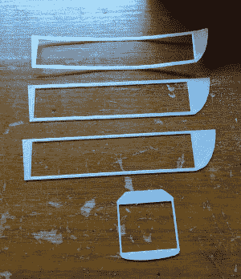

# 3D 打印仪表板 CB 支架已准备就绪

> 原文：<https://hackaday.com/2017/10/21/3d-printed-dashboard-cb-mount-is-convoy-ready/>

有些人可能会惊讶地听到，CB 无线电在 21 世纪仍然存在。从灾难应对到在没有可靠通信基础设施的地区开展行动，有很多原因导致人们仍在使用收音机，而不是智能手机。不幸的是，现代汽车内饰设计没有这样一个开明的观点。在一些汽车里，很难找到像样的杯架，更不用说挂麦克风的地方了。

当在他的斯巴鲁森林人(Subaru Forester)中遇到这个问题时，[Alex Loizou]做了任何现代黑客都会做的事情，[他 3D 打印了一个安装在仪表板上的底座](https://imgur.com/a/462gx)。不需要钻孔来连接他的无线电支架，它只是简单地替换了一个装饰性的装饰件，反正它什么也没做。显然，这种特殊的安装方式只能在与[Alex]相同的年份和品牌的车辆上使用，但这是 3D 打印如何适应现有硬件的一个很好的演示。

 当试图打印出与现有物体完全匹配的东西时，通常需要进行大量的反复试验。(亚历克斯)尝试了几次才得到合适的形状，而且他在 TinkerCAD 做设计的事实并没有让事情变得更容易。虽然我们很欣赏 TinkerCAD 提供了一个任何人都可以轻松使用的基于网络的 CAD 工具，但当你需要对模型进行细微调整时，使用像 OpenSCAD 这样的[参数化设计工具通常是首选。](https://hackaday.com/2013/12/11/3d-printering-making-a-thing-with-openscad/)

抛开软件限制不谈，[Alex]设法找到了一个支架，不仅可以固定他的 CB 麦克风，还可以固定他的手持发射机。同时尽可能地接近库存硬件。我们尤其喜欢他在最终版本中使用了更深的灯丝颜色，以更好地融入破折号的配色方案。

如果你对 CB 感兴趣，看看 2017 年[是什么让业余无线电保持活力](https://hackaday.com/2016/01/15/ham-radio-public-service-activities-rewarding-and-useful/)，如果你是一个渴望 CB 时代的业余无线电爱好者[，我们将为你报道](https://hackaday.com/2016/08/25/fine-business-good-buddy-amateur-radio-for-truckers/)。