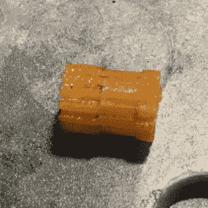

# 3D 打印齿轮服务 7 个月的苦役

> 原文：<https://hackaday.com/2017/10/20/3d-printed-gear-serves-seven-months-hard-labor/>

即使是最坚定的 3D 打印支持者也不得不承认，总的来说，3D 打印的最大优势不在于最终零件的生产，而在于原型制作。当然，你可以制作功能性的印刷品，这个网站的页面可以证明这一点；但很少有人会说，如果你打算将零件长期投入使用，那么你的设计最好不要用金属切割或注射成型。尤其是如果该部件要在工业环境中经受恶劣的环境。

虽然这是一个有效的建议，但它肯定不是这个问题的最终结论。仅仅因为一个零件是在桌面 3D 打印机上用塑料打印出来的，并不一定意味着它不能投入真正的服务，至少在得到合适的替换零件之前是如此。[bloomautomatic]最近的一个成功案例就是一个很好的例子，[当他的 MIG 焊机中的一个齿轮断裂时，他决定尝试用 PLA](https://imgur.com/gallery/qO68Q) 打印一个替换齿轮，同时等待尼龙齿轮发货给他。快进七个月，大约 80，000 次焊接之后，[bloomautomatic]报道说，现在是*最终*安装他订购的替换齿轮的时候了。

 在[bloomautomatic]发布的图片中，你可以看到印刷齿轮最终磨损到牙齿基本上与金属齿轮啮合的程度。对于那些想知道为什么齿轮一开始是塑料的人，[bloomautomatic]解释说，它是一个牺牲齿轮，在发生堵塞时，它会让路，而不是破坏整个变速箱。根据他安装替换齿轮时的[原始帖子，该零件在 Folgertech PLA 中打印在一台](https://imgur.com/gallery/2K65Q) [Monoprice Select Mini](https://hackaday.com/2016/06/13/review-monoprice-mp-select-mini-3d-printer/) 上。没有提到填充百分比，但对于这样一个小部分，大多数切片器可能会从基本上是固体开始。

虽然在焊机里熬过了七个月的曲折历程并不容易，但我们想知道，更坚韧的 PLA 配方、印刷后部件的处理、甚至是用不同材料铸造的部件，会不会把这个临时部件变成永久的替代品。