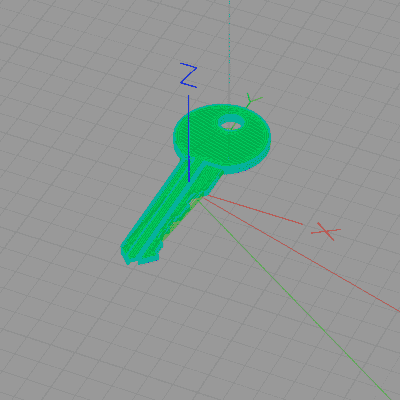

# 参数化 3D 打印的快速键

> 原文：<https://hackaday.com/2017/10/14/3d-printed-kwikset-keys-parametrically/>

好的 ol' Kwikset 标准锁于 1946 年推出，默默无闻地享受了几十年的安全保障。这项技术至今仍是一种普遍存在且相当低水平的安全技术。这是各种标准中最简单的一种(例如，大师、西勒奇等。)仅用五根针，针的值从 1(几乎不切)到 7(切得很深)。这种相对简单的设计使得 Kwikset 成为[Dave Pedu]测试他的 3D 打印钥匙的理想平台。

除了简单地复制现有的钥匙，【Dave】还在 OpenSCAD 中创建了一个参数化的空白钥匙；他只需输入 pin 设置，模型生成器就会创建打印文件。他在玻璃板上印刷 ABS，上面有一层丙酮，层高 0.15 毫米。[Dave]选择 Kwikset 的另一个原因是他的那把非常旧而且非常松——他认为一把更新、更紧的锁可能会直接弄坏钥匙。

所以，提醒一下:[不要在社交网站上发布你钥匙的照片](https://hackaday.com/2015/09/18/dear-tsa-this-is-why-you-shouldnt-post-pictures-of-your-keys-online/),因为在这一点上，从选择一张照片到把钥匙从打印床上拉下来的整个过程肯定是可能的。指望技术也救不了你；[蓝牙锁也好不到哪里去](https://hackaday.com/2016/08/08/the-terrible-security-of-bluetooth-locks/)。