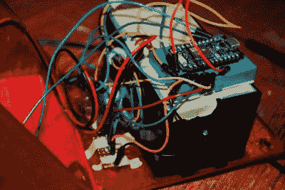

# 3D 打印迷你打印机让人们痴迷于清单

> 原文：<https://hackaday.com/2017/01/01/3d-printed-mini-printer-enables-obsession-with-lists/>

当你忙碌一天的时候，如果你不想每次都在手机上打开记事本或任何你使用的应用程序，一份列出你所有任务的硬拷贝会有所帮助；如果你想把它固定在一个地方来引用。此外，用一整张纸写一些东西是不切实际的，也是浪费。为此，[杰德·霍德森]设计了一款迷你打印机来满足你所有的列表需求。

[Hodson]设计并 3D 打印了外壳，提供了下载文件和组装说明。作为一种物联网设备，打印机使用光子板连接到互联网，其中 Microsoft Flow 用于 Adafruit 打印机和 Wunderlist 之间的联络，Wunderlist 是[Hodson]为该项目选择的列表应用程序。

 【霍德森】收录了他用于这台打印机的全部代码，以及一些详细的提示，以确保任何人构建自己的打印机最终都能正常工作。

如果你正在寻找一台迷你 3D 打印机，我们已经为你准备好了。