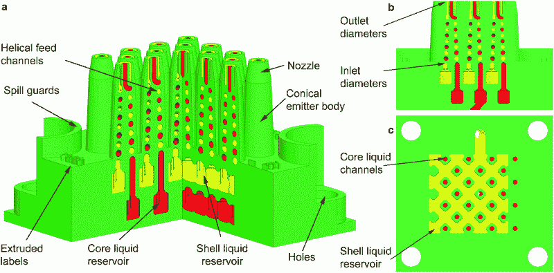
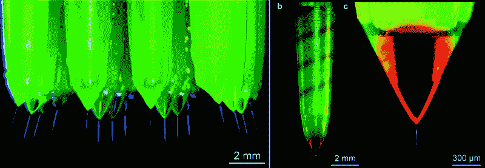

# 3D 打印喷嘴加速微球生产

> 原文：<https://hackaday.com/2016/10/13/3d-printed-nozzles-turbocharge-microsphere-production/>

麻省理工学院的研究人员已经使用 3D 打印打开了低成本、可扩展和一致的微囊化颗粒的大门，其时间和成本只是通常所需的一小部分。微胶囊化是将一种材料的颗粒(核心)包裹在另一种材料(外壳)中的过程，可应用于药物、自修复材料和染料太阳能电池等。但是这种方法的主要问题是速度慢，不能扩展，因此价格昂贵，并且仅限于高价值的应用。随着一些智能设计和立体平版印刷(SLA) 3D 打印，这种情况发生了变化。研究人员 3D 打印这些不仅仅是因为他们可以；他们正在打印阵列，因为这是制造它们的唯一方法。

微球的标准制造过程是同轴电喷雾，其中静电力和专用喷嘴用于在颗粒从孔中出现时将其封装。不幸的是，目前的方法处理量非常低，因为它们只有一个发射器，并且必须在低流速或一致的颗粒尺寸之间进行选择。

研究人员开发了一种使用 3D 打印阵列的方法，这种方法不仅可扩展，而且输出一致。需要 3D 打印来制造统一操作所需的复杂通道网络，所有这些都只是测试和开发此类设备所需的通常成本和制造时间的一小部分。

Streams of encapsulated microspheres – each about 25 micrometers in diameter – being emitted from an array of nozzles, illuminated for the picture. Electrostatic forces drive the liquid’s movement. On the right, red is used to show the helical channel of the “shell” liquid inside the nozzle.

没有提到使用了哪种 SLA 打印机，但详细报告称“这些设备是使用高分辨率 SLA 打印机(像素化 25 微米)制造的，层高等于 25 微米，x-y 和 z 方向的绝对公差分别等于 50 微米和 125 微米”，打印材料是不透明的绿色。这些规格听起来熟悉吗？