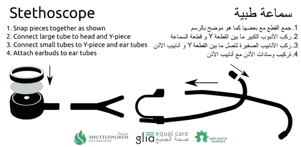

# 3D 打印听诊器让品位

> 原文：<https://hackaday.com/2018/03/17/3d-printed-stethoscope-makes-the-grade/>

虽然像 Hackaday Prize 这样的倡议没有充分说明这一点，但我们坚信开放设计可以改变世界。将技术放在人们手中是一件非常强大的事情，取决于你在生活中的位置或地位，这实际上意味着生与死的区别。因此，当我们看到不仅有一个研究团队[开发了一个 3D 可打印听诊器](https://github.com/GliaX/Stethoscope)，而且在 GitHub 上开源发布了所有内容时，可以说我们非常感兴趣。

 这款听诊器已经开发了好几年，但最近刚刚完成了一轮测试，在临床上验证了它相对于高端品牌型号的性能。这种 3D 打印听诊器不仅能工作，而且工作*良好*:测试显示其声学性能与医疗听诊器的黄金标准——利特曼心脏病 III 相媲美。这对于研究人员估计每个只需 3 美元就能制造出来的东西来说已经不错了。

所有的 3D 打印部件都是在 OpenSCAD 中设计的(此外还有一个名为 [CrystalSCAD](https://github.com/jglauche/CrystalScad) 的 Ruby 框架)，这意味着该设计可以通过完全免费和开源的工具进行评估、修改和编译成 STLs。这对资金不足的机构来说是一个巨大的优势，在许多方面也是衡量其他开源 3D 打印项目的基准。至于非印刷部分，有一个完整的材料清单，其中甚至包括你可以在哪里购买每一个项目的链接。

该项目的文档也很特别。它不仅详细说明了如何打印和组装听诊器，甚至还包括多种语言的说明，可以打印出来并与套件一起分发，以便最需要的人可以在现场组装。

从[低价超声波](https://hackaday.com/2016/04/12/a-developers-kit-for-medical-ultrasound/)到[真正个性化的假肢](https://hackaday.com/2015/04/03/hacklet-41-prosthetics-projects/),[开源医疗设备](https://hackaday.com/2018/01/30/making-the-case-for-open-source-medical-devices/)的未来看起来格外光明。

[感谢 Qes 的提示]