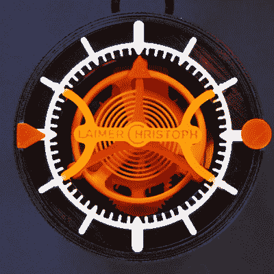

# 3D 打印陀飞轮时钟

> 原文：<https://hackaday.com/2016/01/11/3d-printed-tourbillon-clock/>

3D 打印时钟以前也做过，[但从来没有像这样的东西](https://www.youtube.com/watch?v=Go8woPGOggg)。这是一个带有陀飞轮的 3D 打印时钟，这是一种在 1800 年左右开发的驱动擒纵机构的创造性方法。这种钟不是钟摆，而是用一个由弹簧驱动的旋转笼。它通常出现在一些非常昂贵的现代手表中，但以前从未有过像这样的东西被 3D 打印出来。

 [Christoph Lamier]在 Autodesk Fusion 360 中设计了这款陀飞轮时钟，有 50 个可打印部件，以及少量的销钉、螺钉和垫圈。最精致的部分——游丝、锚、擒纵轮和一些齿轮被打印在 0.06 层的高度。其他一切都是以更正常的分辨率打印的，层高为 0.1 毫米。

因为几乎整个时钟都是 3D 打印的，这意味着弹簧也是 3D 打印的。如果不改变打印机上的一些设置，这种 2 米长的巨大螺旋打印塑料不可能被打印出来。有问题的设置是 Cura 的“梳理”或“避免交叉周界”设置。如果不禁用此设置，打印时间会增加 30%，移动打印头会导致塑料从弹簧上渗出。

有一个 26 分钟长的 3D 打印陀飞轮时钟运行视频，非常无聊。不过，它确实证明了这个钟是可以工作的。你可以看看下面更有趣的视频。

 [https://www.youtube.com/embed/Go8woPGOggg?version=3&rel=1&showsearch=0&showinfo=1&iv_load_policy=1&fs=1&hl=en-US&autohide=2&wmode=transparent](https://www.youtube.com/embed/Go8woPGOggg?version=3&rel=1&showsearch=0&showinfo=1&iv_load_policy=1&fs=1&hl=en-US&autohide=2&wmode=transparent) 
 [https://www.youtube.com/embed/s3p25T6YlQc?version=3&rel=1&showsearch=0&showinfo=1&iv_load_policy=1&fs=1&hl=en-US&autohide=2&wmode=transparent](https://www.youtube.com/embed/s3p25T6YlQc?version=3&rel=1&showsearch=0&showinfo=1&iv_load_policy=1&fs=1&hl=en-US&autohide=2&wmode=transparent)

感谢[lupusmachenicus]的提示。