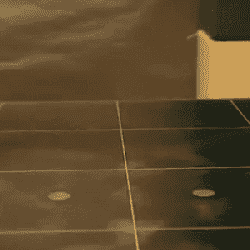

# 3D 打印机延时视频摆脱模糊

> 原文：<https://hackaday.com/2018/04/13/3d-printer-time-lapse-videos-ditch-the-blur/>

Example output of Octolapse with the print head absent from the images.

大多数 3D 打印的延时视频显示了一个稳定增长的打印，其他地方机器运动的疯狂模糊。这是因为图像是以固定的时间间隔捕获的，而不管机器的物理状态如何。但是如果图像是在一致的*机器位置*拍摄的呢？[前潜伏者]的 OctoPrint 的 [Octolapse 插件最近出了测试版，它确实做到了这一点，而且效果惊人。因为](https://github.com/FormerLurker/Octolapse) [OctoPrint](https://octoprint.org/) 知道 3D 打印机的打印头一直在哪里，所以插件可以使用这些信息来创建延时视频，打印头的位置是一致的，而不是疯狂的模糊，甚至打印头完全不在镜头中。

[FormerLurker]最初通过手工编辑 g 代码来创建稳定的时间间隔，这有很好的效果，但效率低且耗时。这个插件是他致力于自动化和增强过程的成果，也是他的第一个严肃的开源编程项目。我们之前已经报道过用 OctoPrint 升级 3D 打印机，OctoPrint 的插件功能意味着可以独立于核心系统添加功能，这本身在很大程度上仍然是创造者和维护者的个人努力。