# 3D 打印机工具:轻松设置挤出机步骤

> 原文：<https://hackaday.com/2016/01/27/3d-printer-tool-set-your-extruder-steps-with-ease/>

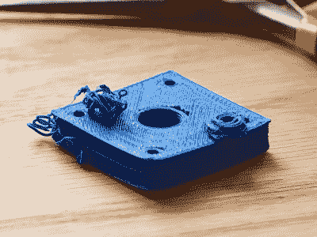

My printer has other issues that I’m still tuning out, but the warping in PLA and excessive surface roughness has all the signs of over extrusion.

我有一辆老款 Prusa i2，就像一辆旧车一样，在使用了许多小时后，最近得到了一些主要部件的更换。最近挤出机和挤出机马达都停了。挤出机因黄铜填充丝烧结到喷嘴内部而停止工作(务必冲洗挤出机中的外来丝)。马达因电线不断弯曲而熄火了。不管怎样，我更换了马达，发现自己有问题；新的发动机和 hotend(垃圾箱里的垃圾发动机，和一辆 E3D v6，非常棒)工作得更好，推出了太多的灯丝。

热端、驱动齿轮、挤出机机械、背压、电机和塑料类型一起工作，设置一次可以通过喷嘴挤出多少塑料。甚至塑料通过喷嘴的速度也会改变塑料所受的摩擦力。这些影响大多可以忽略不计。然而，打印机确实有一种你可以设定的每毫米塑料的基线步数。

目标是每毫米的步数与打印机推出的塑料量完全匹配。你说 10mm 的话，10mm 的长丝应该被挤出机吃掉。该设置是固件配置中的“每毫米步数”。这个数字应该接近完美。一旦它是，你可以调整它通过设置“挤压乘数”设置在大多数切片机时，你切换材料，或有环境差异进行补偿。

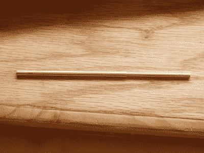

This little guy lets you tune the steps per mm exactly.

问题在于测量挤出的长丝。细丝从线轴上脱离，并通过一个不精确的挤压机组件中的不精确的喷嘴被拉出。最重要的是，灯丝扭曲弯曲。这使得用尺子或测径器进行测量变得困难。

我想出了一个小的测量装置，你可以用一些铜管、砂纸、锯子(或切管器)、电筒、焊料和一些卡尺来制作。首先，找两根管子。第一个 ID 必须与您使用的灯丝尺寸紧密匹配。第二根管子必须允许内部管子在其中紧密滑动。贴身是必不可少的。

### 构建灯丝校准工具

 [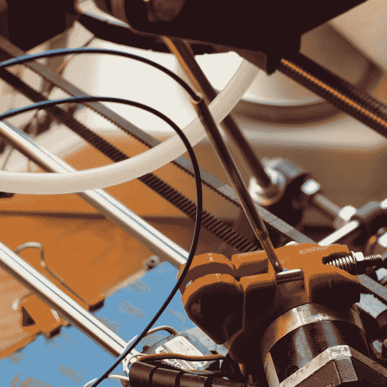](https://hackaday.com/2016/01/27/3d-printer-tool-set-your-extruder-steps-with-ease/thetoolinplace/) The measuring tool in position pressed against the extruder head. [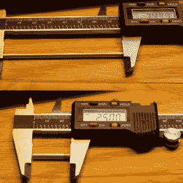](https://hackaday.com/2016/01/27/3d-printer-tool-set-your-extruder-steps-with-ease/small-tube/) 75mm and 25mm of small tube; 75mm of large [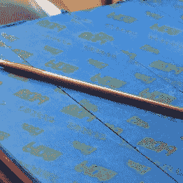](https://hackaday.com/2016/01/27/3d-printer-tool-set-your-extruder-steps-with-ease/kaptontape/) Use kapton tape to hold the inner tube during brazing [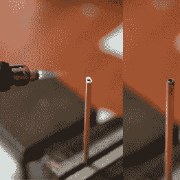](https://hackaday.com/2016/01/27/3d-printer-tool-set-your-extruder-steps-with-ease/brazing/) A little bit of solder and flux goes a long way.

从小管上切下 75 毫米和 25 毫米的部分。从大管上切下 75 毫米的部分。我建议切下比需要的更大的部分，然后锉平/打磨以获得精确的尺寸。这种工具不需要很高的精度，但是通过练习 19 世纪的装配技巧来提高低技术工具的精度是令人满意的。

接下来钎焊小管的 25 毫米部分和大管的 75 毫米部分。(如果你没有电筒或强力烙铁，强力胶对这部分也很有效。)我用另一个小管和一些 kapton 胶带来固定小管进行钎焊。这不需要太多的焊料，如果你做得太多，你可能会意外地将整个组件钎焊在一起。

钎焊完成后，用一些砂纸和 Scotch-Brite 敲打组件，将其抛光，并使其达到最终公差。对我来说，我希望它有 100 毫米长。

现在将 75 毫米的小管滑入 75 毫米和 25 毫米的组合管中。装置完成了。我有一个 [Fusion 360](http://a360.co/1njCRsD) 上测量工具的模型。

### 测量灯丝的步数

 [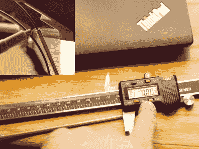](https://hackaday.com/2016/01/27/3d-printer-tool-set-your-extruder-steps-with-ease/mark-and-measure/) I couldn’t press zero on the caliper, hold the sliding joint still with my thumb, and hold the camera. So some imagination is required. My Chinese calipers are at their end, one day I will buy a nice Mitutoyo. [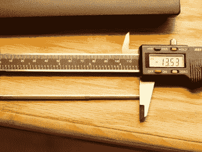](https://hackaday.com/2016/01/27/3d-printer-tool-set-your-extruder-steps-with-ease/final-length/) I tried to extrude 10mm and got 13.53mm out. My theory was correct.

我们的工具将使使用数字卡尺测量挤出机所用细丝的精确长度变得简单。这是因为测量从大管端到小管端的金属管非常适合卡尺，而测量柔性塑料线则不适合。

为了测量每毫米细丝的步数，折断半米并加热印刷机的挤压机。确保这是你最常使用的灯丝。对我来说，这是来自 UltiMachine 的蓝色 PLA。接下来，在细丝上滑动工具，直到小端接触到细丝进入挤压机组件的部分。

将工具延伸超过 10 毫米的任意距离。用记号笔仔细标记灯丝。然后，确保工具牢牢抵住挤出机，并刚好接触到标记线。握住滑动接头处的工具，将其从灯丝上取下。不要改变工具的长度。用卡尺测量工具的长度，并在卡尺上按零。

接下来，将工具滑回到细丝上，挤出 10-20 毫米的细丝。再一次，将大管滑动到你先前标记的线，然后(保持接头安全)将它从灯丝上拉下来，并再次测量工具。卡钳上显示的负长度是通过喷嘴挤出的长度。

一旦有了这个值，我们就可以进入下一步，即在打印机固件中调整每毫米的步数。

### 基于该测量调整每毫米的步数

打开你的固件，找到你设置每毫米步数的部分并记下来。取您期望分配的细丝长度，并除以实际挤出的细丝长度(卡尺上的数字)。将这个乘以你写下的每毫米步数。这将为您提供新的每毫米步数。用新计算的每毫米步数替换旧的每毫米步数，并上传固件。

在我的例子中，我要求打印机挤出 10 毫米的细丝，但使用我的新工具，我测量出实际挤出 13.53 毫米。我的打印机固件的每毫米步数设置为 285。这是我使用的等式:

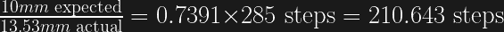

由此我知道我确实被过度挤压了(大约 26%！).我的新挤出机步骤设置需要 211 步。

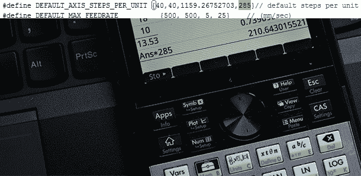

Replace the old steps per mm with the newly calculated one and reload your firmware.

只是为了确定，重复前面步骤中的测量，看看当你要求 10 毫米时是否得到 10 毫米。我不得不再重复一次这个过程来弥补，大概是因为在测量之前没有防止工具滑动，但是最后我得到了一个近乎完美的 1:1 的比例。

所以我们知道，尽管进行了仔细的测量，长丝的挤出量因许多因素而异，你不能用肉眼“分类”调整它。为什么要大费周章地制作这个工具并让它超级精确呢？在调优任何机器时，您都希望尽可能多地排除未知因素，然后再调优剩余的因素。最好的未知是那些你可以测量的。对于一个印刷商来说，首先要从机械开始。我确保所有的东西都上了油并且紧固。然后我用一个千分表来确保我每毫米的步数是准确的，我的床是水平的，我没有走步(通过来回做同样的动作 10 或 20 次，然后看看指示器上的位置是否相同)。接下来，我检查报告的酒店温度是否是实际温度。我使用廉价的 NIST 溯源热电偶温度计。

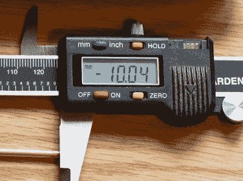

Definitely bragging here. Was repeatable to +-.05mm.

现在，我可以添加挤出机每毫米的步数。以前，人们会根据齿轮和步进器模糊地计算每毫米的预期步数，然后从那里开始调整。或者你可以拿一把尺子放在细丝上试一试。现在我已经设置好了，我知道这个值是正确的，我不需要改变它。我现在可以自由地调整我的切片器中的其他值，并获得更好的打印效果。

在这种情况下，知道我的每毫米步数是准确的，使我发现我在切片机 simplify3d 中设置的挤出宽度相差 0.08，我的新 E3D 喷嘴产生的挤出宽度比我预期的更准确。还有，令人尴尬的是，我的 x 轴滑轮坏了。有一次我调整了一下，修好了滑轮；我的照片看起来棒极了！

你怎么想呢?有没有一种更简单的方法不用工具就能测量出来？我很想在评论区听到它！

 [https://www.youtube.com/embed/xawUS7NGBUE?version=3&rel=1&showsearch=0&showinfo=1&iv_load_policy=1&fs=1&hl=en-US&autohide=2&wmode=transparent](https://www.youtube.com/embed/xawUS7NGBUE?version=3&rel=1&showsearch=0&showinfo=1&iv_load_policy=1&fs=1&hl=en-US&autohide=2&wmode=transparent)

