# 3D 打印:芳纶和碳纤维浸渍 ABS

> 原文：<https://hackaday.com/2016/09/15/3d-printering-aramid-carbon-fiber-infused-abs-filaments-by-nanovia-review/>

上周，我们看了一个注入碳的 PETG 灯丝。本周，我想向大家展示两种复合材料，它们基于 3D 打印中更常见的热塑性塑料:ABS。在许多其他工程塑料中，法国公司 [Nanovia](http://www.nanovia-technologies.com/) 生产类似凯夫拉尔的芳纶纤维和碳纤维 ABS 3D 打印细丝。这些材料承诺更坚韧的零件，更少*翘曲*，同时像普通 ABS 一样容易印刷。让我们检查一下！

[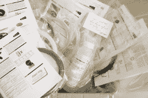](https://hackaday.com/wp-content/uploads/2016/09/nanovia-sample-pack-card.jpg) 有幸从 Nanovia 无穷无尽的高度奇异的细丝清单中获得一大包样品(感谢雅克！)，我在碳纤维 ABS 和两种颜色的芳纶纤维长丝上进行了一些测试。这些细丝配有[详细的数据表](http://www.nanovia-technologies.com/scripts/files/56571aa03e2674.22208527/carbon-fibers-composites-nanovia-eng.pdf)，包括精确的打印参数，这使得使用它们成为一种很好的体验——将工作表中的值扔进切片机，立即获得很好的结果。

## 芳纶纤维 ABS

这种材料的确切纤维含量似乎是一个专有的商业秘密，但我被告知它超过 5%。根据[数据表](http://www.nanovia-technologies.com/scripts/files/56e679e8a01873.28802591/abs-af-aramide-ft-1-1.pdf)，一克细丝包含 500 万根直径约 10 米、平均长度 215 米的细小芳纶纤维——所以基本上是灰尘。考虑到复合材料的密度为 1.08 克/厘米 ³ ，一点数学和有根据的猜测让我相信体积比纤维含量必须在 9 %的范围内(13 %质量)。这是一个相当大的数量，应该对材料的性能有明显的影响。

普通 ABS 已经因其韧性而受到重视，但在 3D 打印中，也因其易翘曲而闻名。其大约 70m/(m·K)的高热膨胀系数难辞其咎。芳族聚酰胺具有-2.5 米/(米·K)范围内的轻微负热膨胀系数，这有助于在印刷芳族聚酰胺纤维化合物时防止*翘曲*问题。与碳纤维相比，芳族聚酰胺纤维起到隔热材料的作用。它们也不会产生有害的磨损，这使得这种材料成为无法配备硬化钢喷嘴的打印机的绝佳替代品。

### 打印质量

为了全面了解材料的表面光洁度、悬垂性和桥接能力，打印一个[基准](https://www.youmagine.com/designs/3dbenchy-the-jolly-3d-printing-torture-test)是一个不错的选择。我在 255°C 的温度下为每种颜色打印了一张，层高为 0.2 毫米，结果非常漂亮，如下图所示:

 [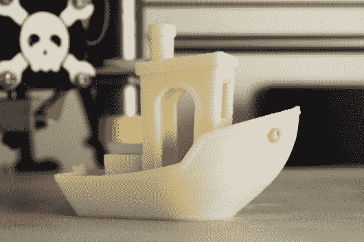](https://hackaday.com/2016/09/15/3d-printering-aramid-carbon-fiber-infused-abs-filaments-by-nanovia-review/nanovia-benchy-aramid-light/)  [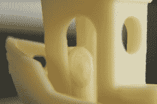](https://hackaday.com/2016/09/15/3d-printering-aramid-carbon-fiber-infused-abs-filaments-by-nanovia-review/nanovia-benchy-cabin-aramid-light/)  [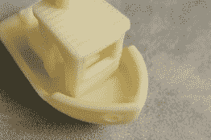](https://hackaday.com/2016/09/15/3d-printering-aramid-carbon-fiber-infused-abs-filaments-by-nanovia-review/nanovia-benchy-deck-aramid-light/) 

基本上，芳纶纤维 ABS 打印就像普通 ABS 一样。Benchy 的船舱窗户上的桥和突出部分工作良好，船头的突出部分也是如此。所有的细节都表现得很好，有趣的未着色、天然黄色芳纶混合材料的半哑光表面并不像人们预期的纤维灌注材料那样粗糙。在颜色较深的芳纶混纺中，材料的纤维特性变得更加明显:

 [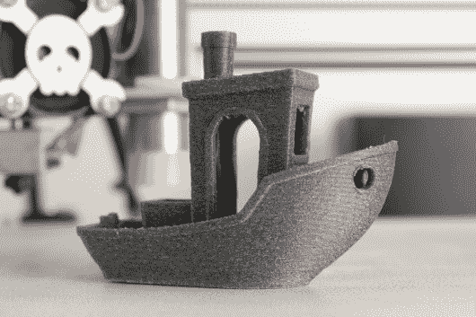](https://hackaday.com/2016/09/15/3d-printering-aramid-carbon-fiber-infused-abs-filaments-by-nanovia-review/nanovia-benchy-aramid-dark/)  [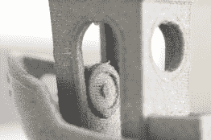](https://hackaday.com/2016/09/15/3d-printering-aramid-carbon-fiber-infused-abs-filaments-by-nanovia-review/nanovia-benchy-cabin-aramid-dark/)  [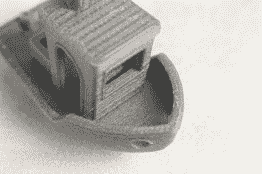](https://hackaday.com/2016/09/15/3d-printering-aramid-carbon-fiber-infused-abs-filaments-by-nanovia-review/nanovia-benchy-deck-aramid-dark/) 

## 碳纤维 ABS

根据[数据表](http://www.nanovia-technologies.com/scripts/files/56e679e8958e78.01608847/abs-cf-ft-1-1.pdf)中的注释，我推断该灯丝的体积比纤维含量为 5 %(质量百分比为 10 %)。就像芳纶纤维一样，碳纤维降低了复合材料的热膨胀系数，使其成为低翘曲材料。碳纤维非常耐磨，因此在打印碳纤维复合材料时，建议使用硬化钢喷嘴。尽管这种细丝应该是抗静电的，但值得一提的是，这种材料的导电性不足以印刷电子产品。然而，它确实导热。

### 打印质量

碳纤维 ABS 也必须在 255°C 和 0.2 毫米层高的条件下接受同样的[基准](https://www.youmagine.com/designs/3dbenchy-the-jolly-3d-printing-torture-test)测试，其结果与芳纶浸渍的同类产品几乎完全相同。表面光洁度比芳纶稍粗糙，但非常一致。

 [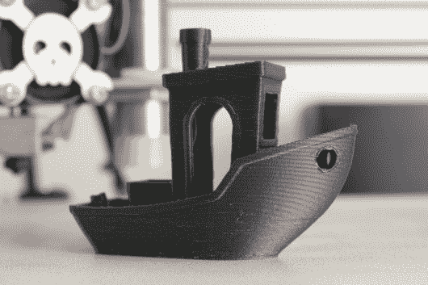](https://hackaday.com/2016/09/15/3d-printering-aramid-carbon-fiber-infused-abs-filaments-by-nanovia-review/nanovia-benchy-carbon/)    [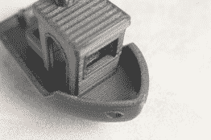](https://hackaday.com/2016/09/15/3d-printering-aramid-carbon-fiber-infused-abs-filaments-by-nanovia-review/nanovia-benchy-deck-carbon/) 

## 弹性

虽然芳纶和碳纤维丝生产的零件明显比普通 ABS 更坚硬，但它们也明显比我上周测试的 PETG XT-CF20 的零件更柔韧。从数据表上看，乍看之下，他们的房产没有一处特别突出。

|  | 纳米纤维
芳纶纤维
ABS | 纳米纤维
碳纤维
ABS | ColorFabb
XT-CF20
PETG | 普通
ABS
(典型) |
| --- | --- | --- | --- | --- |
| **弯曲模量**
T3ISO 178/ASTM D790 | 2.3 GPa
打印样本 | 2.7 GPa
打印样本 | 6.2 GPa
成型试样 | 1.9–2.3 GPa
成型样品 |
| **拉伸模量**
T3ISO 527/ASTM D638 | 2.4 GPa
打印样本 | 2.7 GPa
打印样本 | 不适用的 | 1.9–2.5 GPa
成型样品 |
| **断裂伸长率**
T3ISO 527/ASTM D638 | 7.5 %
打印标本 | 10 %
打印标本 | 7.5 %
模压试样 | 8–9%
成型试样 |
| **玻璃化转变温度。** | 101 摄氏度
(213.8 华氏度) | 101 摄氏度
(213.8 华氏度) | 80 摄氏度
(176 华氏度) | <105 °C
(221 F) |

再看一看(和一些电子邮件)，对于 3D 打印工程塑料制造商来说，不仅要通过无情的标准化测试程序测试他们的材料，还要用 3D 打印样本实际运行这些测试，这是尽职调查。

Nanovia actually 3D prints their test specimen ([image source](http://www.nanovia-technologies.com/scripts/files/56571aa03e2674.22208527/carbon-fibers-composites-nanovia-eng.pdf))

Nanovia 恰好做到了这一点，在他们关于 3D 打印材料中碳纤维影响的[论文中有大量关于这些测试如何进行的信息](http://www.nanovia-technologies.com/scripts/files/56571aa03e2674.22208527/carbon-fibers-composites-nanovia-eng.pdf)。该论文建议拉伸模量比非注入长丝增加 35 %,无论哪种方式，一旦材料从喷嘴出来，了解材料的性质是很好的。

然而，由于大多数灯丝制造商只是简单地从他们的树脂供应商(当然，他们使用注射成型样品)那里复制技术数据表的测试值，因此很难将这些值与常规的非注入式灯丝进行独立比较。

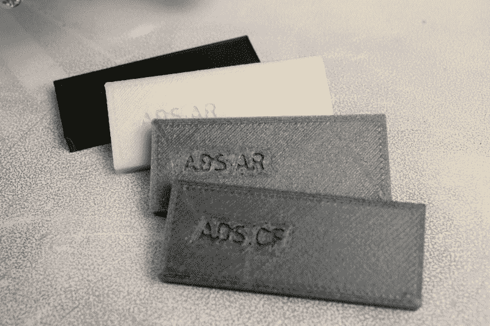

The little sample spools were just enough to squeeze out these 50 x 20 x 5 mm testing blocks.

打破东西是普通人的 ISO 527，所以我打印了一些测试块，只是为了把它们分成两半。结果如下所示，至少让你对纤维含量如何改变材料在压力下的行为有所了解。这些小测试砖以 70 毫米/秒的速度在 270 摄氏度的温度下打印，并由一丝不苟的专业人员使用实验室级别的老虎钳和标准的力量弯曲成 90 度。

[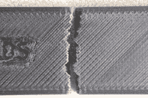](https://hackaday.com/2016/09/15/3d-printering-aramid-carbon-fiber-infused-abs-filaments-by-nanovia-review/nanovia-fraction-top-smartabs/)

Plain ABS

[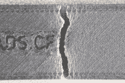](https://hackaday.com/2016/09/15/3d-printering-aramid-carbon-fiber-infused-abs-filaments-by-nanovia-review/nanovia-fraction-top-carbon/)

Carbon-infused ABS

[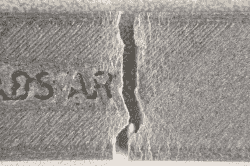](https://hackaday.com/2016/09/15/3d-printering-aramid-carbon-fiber-infused-abs-filaments-by-nanovia-review/nanovia-fraction-top-aramid-dark/)

Aramid-infused ABS (dark)

[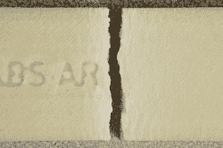](https://hackaday.com/2016/09/15/3d-printering-aramid-carbon-fiber-infused-abs-filaments-by-nanovia-review/nanovia-fraction-top-aramid-light/)

Aramid-infused ABS (light)

虽然常规的 ABS 清楚地显示了断裂是如何将刀具轨迹之间的接头撕裂开的，但是注入材料中的断裂发生得明显更均匀，表明铺设的材料股之间的正确结合。此外，大的应力发白区表明复合材料在整个块体上更有效地分布应力。下面你可以看到骨折的横截面。我将很高兴在评论中听到你对这些结论的补充——并随时揭穿它们。

[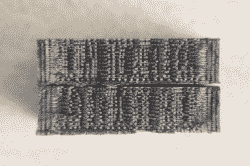](https://hackaday.com/2016/09/15/3d-printering-aramid-carbon-fiber-infused-abs-filaments-by-nanovia-review/nanovia-fraction-front-smartabs/)

Plain ABS

[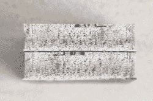](https://hackaday.com/2016/09/15/3d-printering-aramid-carbon-fiber-infused-abs-filaments-by-nanovia-review/nanovia-fraction-front-carbon/)

Carbon-infused ABS

Aramid-infused ABS (light)

Aramid-infused ABS (dark)

## 结论

我喜欢这些细丝。这两种材料都具有出色的、不折不扣的打印质量，即使在推荐的打印速度上限(70 毫米/秒)下也能产生坚韧的零件。由于我只有样品包中每种细丝的大约 20 克，所以我不能做太多实验，只能完全依赖数据手册中的打印参数。我没有失望，这篇文章中展示的演示打印出来的第一个例子很棒。一份完整的数据手册，包括调整良好的打印参数和实际的 3D 打印相关的机械性能，当然是我希望看到更多细丝出现的东西。

就弹性而言，这两种材料的数据表都不会因为注塑试样的不切实际的值而让你大吃一惊，但它们异常坚韧。纤维含量的一个主要好处是复合材料减少了翘曲的趋势，允许您打印更大的结构，具有更高的形状保真度。如果你和我一样喜欢使用 ABS，但有时遇到哪怕是最轻微的翘曲都无法忍受的应用，这是值得考虑的。或者，如果你——像橡树岭国家实验室一样——着手打印迄今为止世界上最大的固体 3D 打印物体,它也是由注入碳纤维的 ABS 打印的。我把这种材料归入生产性工作的范畴:它是一种坚韧的材料，只是在合理的生产量下提供了很好的结果。

我希望你喜欢看另一种特殊的灯丝。盒子里还有很多东西，如聚四氟乙烯、玻璃纤维长丝等，请继续关注我进一步的 3D 打印冒险。得到了一个伟大的灯丝熔化热提示或你最喜欢的(或最讨厌的)灯丝经验分享？把它们写在评论里吧！

* * *

### **测试条件**

**打印机:**Prusa i3 Einstein Rework([Proosha IIIo](https://github.com/makertum/Proosha_IIIo)、[photo](http://hackaday.com/2016/07/06/build-a-3d-printer-workhorse/))**Hotend:**E3Dv6 w/0.4mm 淬火钢喷嘴、E3D PT100 热电偶套件、窄导管、轴流喷嘴风扇、超大功率 jolly 扳手风扇护罩**驱动系统:** GT-2 带 20T 滑轮的皮带传动，用于 XY，M5 螺纹杆用于 Z w/万向联轴器，0.9 1.7 A 万泰步进器 IGUS RJ4JP-01-08 XY 上的干润滑衬套，用于 Z 的 LM8LUU 线性轴承**电子设备:** Ramps 1.4，Arduino Mega 2560，12 V / 500 W ATX 电源**构建板:** Makertum MK1 500W AC 加热床，Vishay NTCLE203E3 热敏电阻，夹在顶部的 PEI 印刷板，用于自动床调平的电容式距离开关**固件:** Marlin-RC7