# 3D 打印:非平面层 FDM

> 原文：<https://hackaday.com/2016/07/27/3d-printering-non-planar-layer-fdm/>

非平面层熔融沉积成型(FDM)是任何形式的*熔融沉积成型*，其中 3D 打印层不平坦或厚度不均匀。例如，如果您在 3D 打印机上使用网床调平，您已经在使用非平面层 FDM。但是为什么要停止补偿弯曲的构建板呢？非平面层 FDM 有更多的应用，有相当多的项目在那里探索的可能性。在这篇文章中，我们将看看这个戏法给我们带来了什么。

## 光滑弯曲的表面

非平面层 FDM 允许平滑、弯曲的表面，否则将显示离散层的典型阶梯。通常，我严重依赖砂纸和喷雾填充剂来将我的 3D 打印品升级到*A 级*，我对直接从机器中出来的非平面测试打印品的平滑程度感到非常惊讶:

  Diagonal view (30 mm cube) [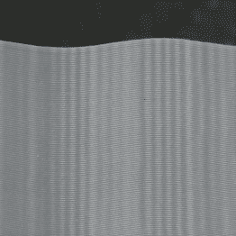](https://hackaday.com/2016/07/27/3d-printering-non-planar-layer-fdm/non-planar-layer-fdm__mg_0440/) Side view (0.2 mm layer height) [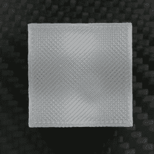](https://hackaday.com/2016/07/27/3d-printering-non-planar-layer-fdm/non-planar-layer-fdm__mg_0446/) Top view

虽然在打印功能性的机械零件时，不连续的层并不总是一个问题，但在某些应用中，这可能会非常方便。缺少离散层使模型看起来很漂亮，不需要进一步平滑，这在设计应用中可能是有帮助的。光滑的表面也可能有助于 3D 打印空气动力学模型，如标题照片中的飞机机翼:

 [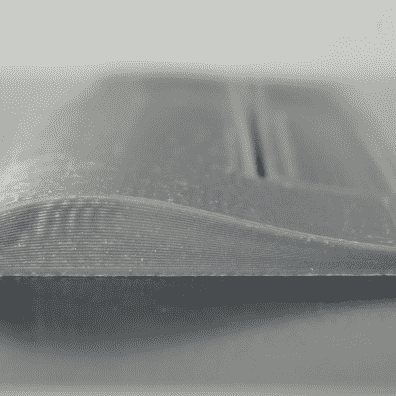](https://hackaday.com/2016/07/27/3d-printering-non-planar-layer-fdm/non-planar-layer-fdm__mg_0449/) Printed wing, body end [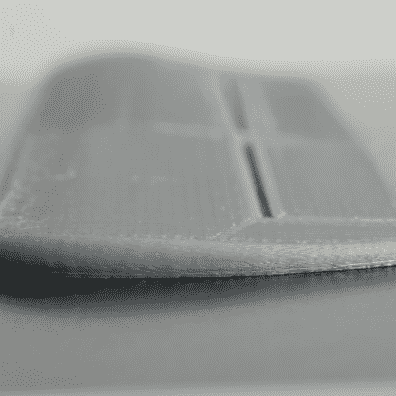](https://hackaday.com/2016/07/27/3d-printering-non-planar-layer-fdm/non-planar-layer-fdm__mg_0450/) Printed wing, tip end

## 强化零件

非平面印刷零件似乎比它们的平面对应物更坚固。你可能对此持怀疑态度——尽管层与层之间接触面的不同方向可能会产生更均匀的抗拉应力。平面印刷 FDM 零件沿构建方向轴的抗拉应力通常不如沿其他两个维度的抗拉应力，这会导致分层。互锁的非平面层可以将张力分布为张力和剪切力的复合，后者是 FDM 印刷部件的特殊强度。该图显示了剪切分量 F [S] 如何随着位移的增加而增加:

[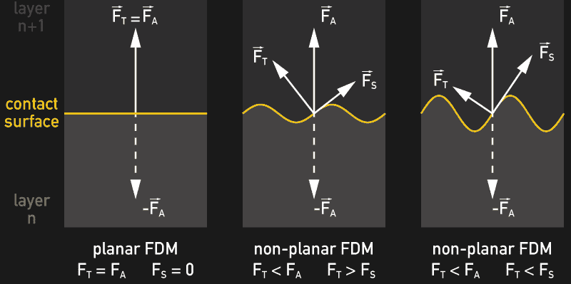](https://hackaday.com/wp-content/uploads/2016/07/non-planar-layer-fdm_graphics-022.png)

Force distribution between layers of planar and non-planar FDM — F[A]: attacking force — F[T]: tensile component of F[A] — F[S]: shearing component of F[A]

通过在移位的层之间添加过渡并补偿可变的层高度，也可以只处理 3D 打印部件的某些部分，而完全不接触其他部分。下面的示例打印具有平坦的顶部和底部，只有中间的层被逐渐替换。

 [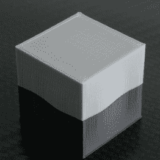](https://hackaday.com/2016/07/27/3d-printering-non-planar-layer-fdm/non-planar-layer-fdm__mg_0426/) Diagonal view (30 mm cube) [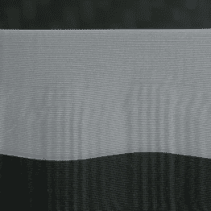](https://hackaday.com/2016/07/27/3d-printering-non-planar-layer-fdm/non-planar-layer-fdm__mg_0439/) Side view (0.2 mm layer height)  Top view

上面例子中的轻微波动可能不会完全耗尽效果。不幸的是，我的打印机目前没有非常尖的喷嘴，这限制了它打印陡峭曲线的能力。为了更容易发现位移，我改变了中间打印的材料颜色。任何强化效果肯定只会与单独实施一样好，并且最终:在通过测量验证这一点之前，我宁愿不要过多强调非平面层 FDM 的这一理论论点。

## 结构化表面

就像树桩揭示了树木的年轮一样，3D 打印物体也通过沿着外壳的典型波纹结构显示了它们形成过程的迹象。以平面方式打印的对象通常也在其顶层显示填充的刀具轨迹和周界。非平面层允许您向印刷品的平顶表面添加额外的纹理，这在自定义设计应用程序中可能特别有趣。下面的立方体是用 2D 正弦位移模式打印出来的。

 [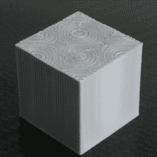](https://hackaday.com/2016/07/27/3d-printering-non-planar-layer-fdm/non-planar-layer-fdm__mg_0423/) Diagonal view (30 mm cube) [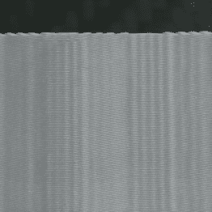](https://hackaday.com/2016/07/27/3d-printering-non-planar-layer-fdm/non-planar-layer-fdm__mg_0437/) Side view (0.2 mm layer height)  Top view

这些纹理出现类似于提到的树木年轮。非平面印刷物体的平顶层代表通过位移图案的横截面，这本身导致有趣的图案。这取决于个人的应用和品味，如果这些图案的创作是可取的，但我碰巧发现它们很漂亮。

## 亲自动手

理想情况下，非平面 3D 打印是使用有点尖的喷嘴来完成的，因为扁平的喷嘴往往会钻入之前打印的材料中，并容易与填充结构纠缠在一起。一般来说，尖喷嘴允许更陡的打印角度，尽管你总是需要确保喷嘴或打印头的其他部分不会挡道。尤其是风扇支架或管道容易与印刷品的部件发生碰撞。在这篇文章中，我使用 E3Dv6 hotend 和 nozzle 作为例子，尽管可能有更好的解决方案。特别是，Merlin hotend 的特点是有一个非常细而尖的喷嘴，唯一可能碍事的是加热块。

 [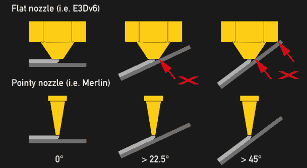](https://hackaday.com/2016/07/27/3d-printering-non-planar-layer-fdm/non-planar-layer-fdm_graphics-01/) Comparison of flat and pointy nozzles at different angles.  Merlin hotend ([image source](http://reprap.org/wiki/File:MERLIN_ASSEMBLED.png))

非平面刀具轨迹需要在 Z 轴上做很多动作，现在是时候给它的机械添加一些新鲜油脂了。根据 Z 轴的移动速度，您也可以在固件中重新调整其最大速度和加加速度设置。

使用上周的 [G 代码后处理文章的模板代码，我编写了一个小脚本，让您使用 Slic3r 动态生成非平面 g 代码。你可以从](http://hackaday.com/2016/07/20/3d-printering-g-code-post-processing-with-perl/)[的 GitHub 库](https://github.com/makertum/non-planar-layer-fdm)获得该脚本，其中也包含了如何使用它的详细说明。它还附带了几个例子:前三个例子是我在这篇文章的插图中使用的立方体，以及相同的正弦位移函数。第四个例子是标题图中的飞机机翼模型。机翼是基于一个平面设计，已被取代，以获得空气动力学形状。

  3D model in Slic3r [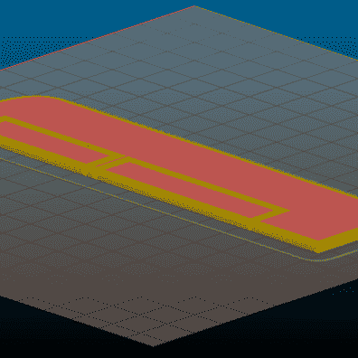](https://hackaday.com/2016/07/27/3d-printering-non-planar-layer-fdm/non-planar-layer-fdm_3d-model_sliced/) G-code in Slic3r

在从 Slic3r 导出这个相当不起眼的设计的 g 代码后，它也推动它通过位移的后处理脚本，机翼呈现出它的最终形状。由于这种方法允许薄壳，所以它非常轻。不过，飞行当然不安全，纯粹是为了说明这项技术:

  Displaced G-code in Repetier, top layers removed [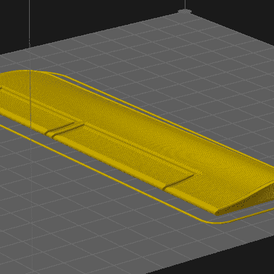](https://hackaday.com/2016/07/27/3d-printering-non-planar-layer-fdm/non-planar-layer-fdm_warped_full/) Displaced G-code in Repetier, complete

我用 0.4 毫米 E3Dv6 喷嘴在 Prusa i3 上打印了上面的 g 代码。尽管这个喷嘴不是很尖，但机翼的效果相当好。由于次优的喷嘴几何形状，顶部具有浅而规则的凹槽。

 [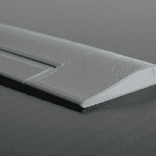](https://hackaday.com/2016/07/27/3d-printering-non-planar-layer-fdm/non-planar-layer-fdm__mg_0453/) Printed wing, body end  Printed wing, tip end [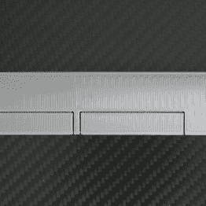](https://hackaday.com/2016/07/27/3d-printering-non-planar-layer-fdm/non-planar-layer-fdm__mg_0456/) Printed wing, top view

我希望你喜欢这次离轨 3D 打印的小小旅行。[查看脚本](https://github.com/makertum/non-planar-layer-fdm)并在评论中与我们分享您的成果、观点和想法！