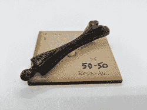

# 3D 打印:使用 UV 树脂进行打印平滑测试

> 原文：<https://hackaday.com/2018/03/08/3d-printering-print-smoothing-tests-with-uv-resin/>

平滑基于细丝的 3D 打印的层线是一个普遍的愿望，有各种各样的方法来做到这一点。除了良好的旧砂光，另一种方法是应用某种液体涂料，填补不规则，创造一个光滑的表面。甚至有一款产品专门用于这一目的:Smooth-on 的 XTC 3D。然而，我碰巧从 SLA 打印机上获得了糖浆般厚的 UV 树脂，于是我想看看是否可以通过刷上树脂，然后固化它来平滑 3D 打印。我看不出它有任何不可行的理由，甚至可能带来自身的优势。细丝打印机和树脂打印机通常没有任何联系，但是因为我可以接触到这两种打印机，所以我决定稍微跨越一下。

我测试的紫外线固化树脂是来自 Formlabs 打印机的透明标准树脂。其他的 UV 树脂从我的理解来看应该也差不多，但是我没有测试过。

### 当前平滑方法

[XTC-3D](https://www.smooth-on.com/product-line/xtc-3d/) by Smooth-On; a clear coating for smoothing 3D prints.

有几种方法可以平滑打印，包括:

*   打磨，通常使用 Bondo 等填充物
*   用溶剂平滑(例如 ABS 的丙酮蒸汽浴)
*   XTC-3D(一种硬化的填隙液体保形涂层)
*   用填充底漆喷涂(对平滑层线不是很好，但无论如何包括在内。)

这些方法各不相同。砂磨通常与 Bondo 等间隙填充材料结合使用，操作简单，控制性强，效果可靠。缺点是既费时又乱。

用丙酮蒸汽平滑 ABS 印刷看起来很神奇，但结果很大程度上取决于正确应用该过程，错误通常无法补救。此外，[明火和丙酮不能混合](https://hackaday.com/2016/08/16/fail-of-the-week-how-not-to-smooth-a-3d-print/)(或者说它们太容易混合，这是不希望的。)

XTC-3D 是一种稀薄的双组分液体，混合后涂在模特身上，形成一层薄薄的涂层。根据制造商的说法，一批的工作时间约为 10 分钟，固化时间为 4 小时。如果一个人有时间和耐心来混合和应用多种涂层，结果应该是非常好的。

根据我的经验，用填充底漆喷涂只适用于消除划痕和其他微小的表面瑕疵。我从来没有观察到它对去除像层线这样的东西有任何真正的效果。

### 为什么要用 UV 树脂呢？

从表面上看，使用 UV 树脂似乎并没有比 XTC-3D 提供更多。它们都是专业产品，都需要特殊的处理和应用，并且都可以通过应用一层或多层硬化的胶粘物来平滑 3D 打印。但是对于那些可能已经接触到 UV 树脂的人来说，它确实提供了几个潜在的好处:

1.  不需要混合。UV 树脂可以原样使用。
2.  浪费少；只使用需要的东西。(对于 XTC-3D，一批中未使用的部分是垃圾，还有容器和刷子。)
3.  无限期工作时间。当暴露在紫外线下时，树脂会固化，但在正常的工作台照明下，过早固化不是问题。
4.  可以通过用异丙醇稀释树脂来改变粘度。
5.  如果有 SLA 或 DLP 打印机，就没有必要购买单独的产品。只需使用旧容器中的残渣或建造平台，或从新鲜供应中撇取一些。一点点就够了。

当然，这些都不重要，除非 UV 树脂能够以有效可靠的方式平滑 3D 打印。我做了一些工作来了解它的表现如何，什么影响结果，以及涉及到哪些其他实际问题。

### 使用 UV 树脂

The clear resin glows under UV lighting, which can help with making sure it’s going where intended.

戴上手套，确保保护您的工作表面不被溅出，并避免用于工作打印机的任何潜在树脂污染。如果您将一些树脂用于 3D 打印平滑，请不要将其放回打印机的储槽或容器中。

未固化的树脂可用异丙醇清理；它也可用于在应用前稀释浆状树脂。我测试了几种不同的树脂和酒精比例来衡量结果。简而言之，就像颜料一样，有可能稀释太多而变得无用。树脂的应用是用廉价和不起眼的硬毛刷。

固化树脂是通过紫外线，理想的是 405 纳米的情况下，我用的 Formlabs 树脂。我制作了一个紫外线固化箱，但我发现最简单的方法是将涂层物体直接放在室外阳光下。大多数窗户会阻挡紫外线，所以户外是最好的。

### 测试对象和混合物

选择了三个相同的骨状废印作为测试对象。它们都是用 0.8 毫米的喷嘴和 0.30 毫米的层高打印的。它们看起来有点像拓扑图，所以它们是很好的试验品。此外，还使用了两个小头骨。头骨模型由 Makerbot 制作，从 [Thingiverse](https://www.thingiverse.com/thing:622390) 下载。

我用了三种不同的混合物:

1.  100% UV 树脂，直接从容器中取出。它有类似玉米糖浆的粘性。
2.  50%–50%的 UV 树脂与异丙醇的混合物(按体积计)。粘度类似枫糖浆。
3.  25%-75%的 UV 树脂与异丙醇的混合物(按体积计)。粘度类似于罐装油漆。

One of three identical uncoated junk bin prints used for test objects. They have very exaggerated layer lines.

Three different ratios of UV resin to isopropyl alcohol for the three identical test objects.

Uncoated skull for testing. Sprayed with primer to highlight layer lines.

树脂混合物在紫外光下都会发光，所以我用这种效果来观察混合物是如何在模型中流动和沉淀的。我用一个小型手持紫外 LED 灯来观察沉积的树脂。当以这种方式使用时，它对树脂的固化没有直接影响，但我仍然让紫外线远离刷子和未使用的树脂。

### 结果

Applied resin glowing under UV lighting, showing how the resin has pooled into the areas between layer lines.

我在每个物体上总共涂了两层，每涂完一层都拍了照。第二遍涂完后，我喷了一层浅灰色底漆来突出表面纹理。

用异丙醇以 50∶50 的比例稀释的树脂流动得更好，并且仍然很好地汇集在各层之间，但是总的来说沉积的树脂更少。这意味着平滑效果不如使用纯树脂明显。固化似乎也需要更长的时间。

与醇的比例为 25∶75 的树脂非常薄，具有非常小的平滑效果。使用起来有点误导，因为使用它似乎可以很好地覆盖测试对象，但随着酒精蒸发，混合物的大部分体积都消失了，只留下少量树脂固化，相对于最初使用的体积。

Straight resin, one coat.

50:50 Resin to alcohol mixture, one coat.

25-75 Resin to alcohol mixture, one coat.

Straight resin, two coats.

50-50 Resin to alcohol mixture, two coats.

25-75 Resin to alcohol mixture, two coats.

在观察结果之后，对头骨的两个相当典型的印刷品(0.4 mm 喷嘴，0.1 mm 层高)进行涂覆，以感受使用 UV 树脂进行平滑的实际结果。只有上表面被涂覆，因此与周围未涂覆区域的对比很明显。

一层未稀释的树脂足以明显(但不是完全)平滑大多数区域，但第二层覆盖了更精细的细节，如头骨的牙齿。两层最薄的混合物(树脂与酒精的比例为 25:75)对测试对象的平滑效果非常小，对颅骨几乎没有平滑效果。

Top: test object before any treatment. Bottom: same object after two coats of pure resin, then a light coat of primer.

All three test objects, after two coats each, then a coat of primer for visibility.

Two skulls after two coats, followed by a coat of primer. Left: two coats of 1:3 resin to alcohol mixture. Right: two coats of undiluted resin. Face only was coated.

最好的结果可能来自于多层稍微稀释的树脂涂层，或者纯树脂之后是另外的稍微稀释的树脂涂层。打磨(我没有执行)可能也有一席之地。

### 经验教训

Skull on solar turntable, home-made cure box.

树脂固化最容易在阳光直射下完成，尽管也可以使用自制的固化箱。太阳能显示转盘对于旋转小物体以获得均匀曝光非常有用。室外固化包括简单地将涂有树脂的物体放在阳光下，直到它不再发粘。在测试期间，我不得不在冬天的阳光下工作，两三个小时似乎足够了。

未稀释的树脂提供了积极但有用的平滑。第二层涂层对于小细节来说过于激进。

至于用酒精稀释树脂，我测试的 Formlabs clear 树脂的体积比为 50:50 的混合物(产生的混合物大约与枫糖浆或奶油沙司一样稠)是我认为最薄的一般用途。树脂混合物越稀，混合物中含有的树脂越少。此外，它在低区域聚集的越多，在高区域停留的就越少。因为 3D 打印在模型的高点和低点都有均匀分布的层线，所以太薄和太容易流动的涂层不会均匀地粘附，层线仍然可见。

最好的结果需要一些尝试和错误。令人高兴的是，3D 打印测试对象并不难获得，涂上树脂然后将对象放在阳光下一段时间并不是一个特别麻烦的过程。

### 后续步骤

根据我获得的结果，以下是我下一次尝试的改进方法:

*   对于一般用途来说，未稀释的树脂可能有点太厚，最好保留给特别脏的地方。
*   一般情况下，树脂与酒精的比例大约为 3:1 可能更好。
*   用手持紫外线发射器(和适当的眼睛保护)对一些区域进行局部固化可能是一种有用的技术。
*   打磨很麻烦，也有点脏，但在用树脂涂层之前用砂纸打磨一点点图案可能是值得的，只是为了去除模型上最高和最差的地方的边缘。打磨过的 PLA 看起来很糟糕，但是一旦涂上树脂就没关系了。

### 值得吗？

使用 UV 树脂确实有一些优点。与 XTC-3D 相比，按需使用减少了浪费。此外，不需要混合，粘度可以根据需要改变，固化可以像在阳光直射下一样简单。另一方面，最终结果并不比其他方法好多少。这只是到达那里的不同方式。

如果有机会接触 UV 树脂，绝对值得一试。一点点就够了，树脂很贵，所以过期的树脂，剩菜，或者从打印机上撇去一些就是解决办法。通过一些实验，只要树脂可用，用 UV 树脂平滑印刷品可以有效且容易地完成。