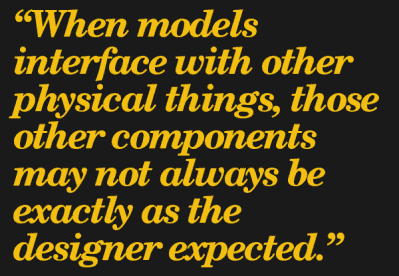
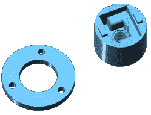
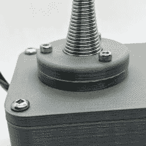
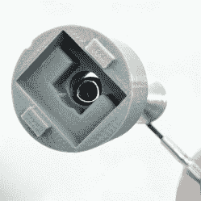
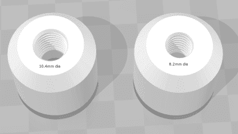
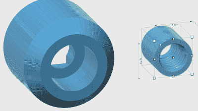

# 3D 打印:当 STL 文件不太正确时

> 原文：<https://hackaday.com/2018/05/16/3d-printering-when-an-stl-file-is-not-quite-right/>

STL 文件无处不在。当有东西要 3D 打印时，它可能会是 STL。只要模型本身是好的，这一点也不麻烦。但是迟早会有一个模型在某些方面不太正确，项目进展突然遇到阻碍。

[](https://hackaday.com/wp-content/uploads/2018/04/as-expected-quote.png) 当模型与其他物理事物交互时，那些其他组件可能并不总是与设计者预期的完全一样。在设计阶段注意这种潜在的不一致有助于防止问题，但这并不总是可以避免的。这是一个问题，因为 STL 文件将实体模型表示为一个完整的单元；它实际上并不打算回滚到 CAD 程序进行额外的设计更改。

STL 文件可以编辑，但就像从头开始重新建模一个组件一样，对于那些没有生活和呼吸这种东西的人来说，这可能是一个棘手的过程。我将描述一些与 STLs 相关的常见问题，这些问题可能会阻碍新项目的进展，以及处理这些问题的方法。由于 3D 打印变得越来越普遍，即使我们中最不了解 CAD 的人也能获得基本工具。

### 与其他硬件的接口是问题点

STL 文件可能不太正确的最常见原因是机械连接，其中某些部分不完全符合设计者的预期，因此与其接口的 3D 模型不再适合。

我最近在构建自己版本的项目 TWANG 时遇到了这个问题！这是一个令人愉快的一维地牢爬虫,在 LED 灯带上播放，带有 3D 打印外壳和组件外壳。操纵杆是一个弹簧门挡，宽底座由扣环固定，顶部有一个包含 MPU-6050 加速度计和陀螺仪的旋钮。我用【巴特德林】的[这个混音](https://www.thingiverse.com/thing:2770292)制作了我的，但是发现我的硬件和设计师的版本不太匹配。

[](https://hackaday.com/wp-content/uploads/2018/04/fixed-parts-e1525197690185.png)

Left: extra spacer modeled from scratch to make a retainer fit. Right: knob with resized threaded section.

STL 不太正确的方式是相当典型的例子。按照严重性递增的顺序，它们是:

*   我使用的 Arduino 板版本的安装孔位置略有不同。外壳仍然适合主板，但是安装孔不匹配。处理这个小问题不需要改变印刷模型。
*   弹簧门挡功能相同，但形状不同。我的底座都比 STL 设计的要早。这意味着挡圈在弹簧上的位置太高了。这是通过增加一个额外的 4 毫米垫片作为一个单独的一块固定。我从头开始建模这个简单的对象来解决这个问题。
*   我的弹簧门挡的顶部也比设计师的版本窄。操纵杆旋钮有很好的螺纹来配合门挡，但对我来说太大了。我通过缩小螺纹部分来解决这个问题，同时保持其余部分(容纳 MPU-6050 板)不变。

[](https://hackaday.com/2018/05/16/3d-printering-when-an-stl-file-is-not-quite-right/extra-4mm-on-retainer/)

Adding 4mm to the height of the retainer ring was a simple fix to the problem of the spring flaring out earlier than the one the STL was designed for.

[](https://hackaday.com/2018/05/16/3d-printering-when-an-stl-file-is-not-quite-right/makersdate2017-9-23ver6lenskan03actlar02e-y-17/)

The STL for the knob was designed for a spring that was considerably thicker, which required a different fix.

### 调整 STL 的基本方法

如果一个 STL 因为一个物理接口问题而不正确，通常只有一件事是真的有问题。要么是某些东西不太合适，要么是太大或太小，模型不能按原样使用。不可能在 STL 文件上执行通常的 CAD 功能来解决这样的问题，但是使用 STL 仍然有一些事情是很容易做到的，即使对于新手来说也是如此:

*   将模型切割成单独的小块
*   一个或多个轴上的缩放块
*   将较小的模型合并成较大的模型
*   有些不太简单(但仍然可以实现)的操作是从另一个模型中减去一个模型的形状，或者只保留两个模型之间的相交区域。

当问题不能被简单地忽略或通过一点工具工作来修复时，这些选项可以提供一种变通方法。

### 示例:仅调整模型的一部分

[](https://hackaday.com/wp-content/uploads/2018/04/before-and-after-in-3d-builder.png)

Before and after. Left: the original model made for a spring with a larger diameter. Right: after cutting out, resizing, and then merging the threaded area back in.

为了处理我的弹簧和螺纹孔不匹配的问题，我首先将模型切开以隔离螺纹部分。然后我只在 x 和 y 方向调整了螺纹部分的大小，z(高度)保持不变。弹簧的螺距很好，只是我的弹簧的直径比设计者预期的要小。在螺纹部分被正确缩放后，我将所有的部分合并在一起。

我用 Autodesk 的 123D 设计(现已停产)切割出一个包含螺纹部分的中心圆柱体，但也可以通过几个直切口切割出一个方形部分，使用的工具与用于将模型切割成小块以适应较小的打印床的工具相同。

为了确定我需要缩放螺纹部分的量，我测量了(太大的)STL，发现它在模型上最窄的螺纹部分之间为 10.4 mm。然后，我测量了我的实际弹簧，发现我需要将尺寸缩小到 8.2 毫米。

```
(diameter needed) / (diameter of source) = scale factor
8.2 / 10.4 = 0.79
```

[](https://hackaday.com/wp-content/uploads/2018/04/screenshot-2018-04-05-13-10-32.png) 切除部分每边 15.3 毫米，按 0.79 的比例缩小到 12.1 毫米。由此产生的螺纹区域直径从原来的 10.4 毫米变成 8.2 毫米，这将适合我的弹簧。在这一点上，将有可能 3D 打印仅调整大小的小部分，以便物理测试适合度。

调整螺纹部分的大小后，只剩下一个问题:切除的部分现在变小了，当它重新插入到原始模型中时会留下一个间隙。解决这个问题的一个方法是，模拟一个比需要的稍大的小空心圆柱体来填充空隙，并将所有三个模型合并在一起。另一种选择是简单地将新的、更小的螺纹插件像适配器一样放入原始模型中，并将模型合并在一起。无论哪种方式，重叠都被消除，新模型只有更小的螺纹部分。

### 有用的软件工具

不同的工具擅长不同的事情，虽然大多数程序都有一些需要适应的接口，但这里有一些用于操作 STL 文件的有用且可访问的选项:

*   Meshmixer 可以做很多事情，但特别是使捏和推 STL 模型的区域变得非常容易，就好像它们是由粘土制成的一样。其他强大的功能就有点难用了。
*   Tinkercad 是一个基于网络的 cad 工具，它有一个可访问的接口，可以导入 STL 文件，并像对待任何其他对象一样对待它们，只要它们不是太复杂。
*   [搅拌机](https://www.blender.org/)允许高级操作；Blender 可以做的事情之一是选择模型上的点，然后只移动特定轴上的那些点。它类似于面上的推/拉，是调整 STL 的强大工具，但像大多数 CAD 程序一样，在弄清楚事情之前只是四处点击是不实际的。[教程](https://www.blender.org/support/tutorials/)可用。
*   微软的 3D Builder(包含在 Windows 10 中)正在大力推动对常见操作的有用性。它有一个直观的测量工具，能够执行许多功能，如拆分、合并、缩放，甚至相交和相减模型。
*   Raise3D 的 [ideaMaker 软件](https://www.raise3d.com/pages/ideamaker)旨在为他们的 3D 打印机系列提供一体化的控制和切片软件，但它可以在没有打印机的情况下使用。我提到它是因为它包含了一套易于使用的工具，用于分割、合并、缩放和修复 STL 文件，同时还拥有一个可访问的接口。正交视图模式有助于精确对齐和移动模型。
*   OpenSCAD 能够导入 STL 文件，但它也不是典型的 CAD 系统；我们在过去讨论过[什么是 OpenSCAD 以及如何使用它](https://hackaday.com/2013/12/11/3d-printering-making-a-thing-with-openscad/)。

### 有益的设计实践

通过 STL 共享模型不会很快消失，但它有助于注意到事情最终可能不太适合某人。

正如人们现在通常将模型设计为更容易 3D 打印的独立部件一样，尝试允许超出设计师控制的变化的设计决策也很有帮助。如果安装孔位置改变，模型还会有用吗？用户可以只用有限的工具集进行修复或调整吗？是否有可能使接口部件模块化以便于调整？

### 你的方法是什么？

不得不回去调整 STL 文件可能会在项目中造成意想不到的延迟，但这肯定比需要做大量手工返工要好。对于那些熟悉建模的人来说，从头开始重新创建零件的 3D 模型总是可能的，但是您有自己的技巧或方法来解决 STL 文件的常见错误吗？你最喜欢用什么方法让它合身？请在评论中告诉我们！