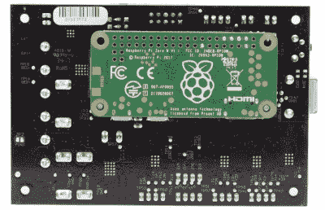
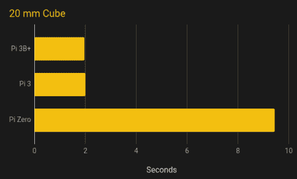
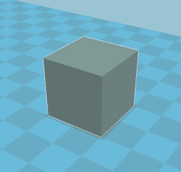
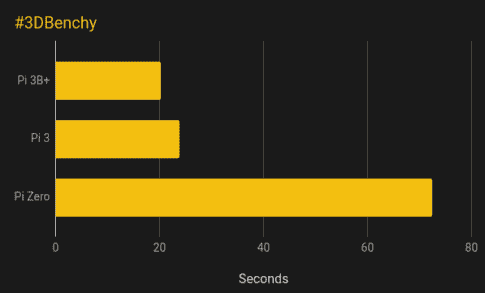
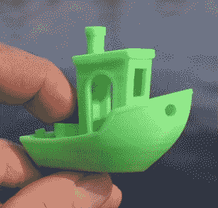
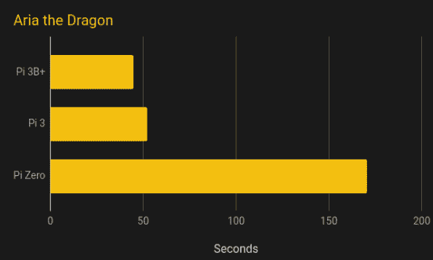
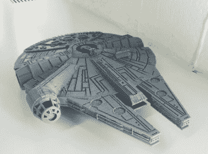

# 3D 打印:Octoprint 中哪个树莓 Pi 最擅长切片？

> 原文：<https://hackaday.com/2018/05/03/3d-printering-which-raspberry-pi-is-best-at-slicing-in-octoprint/>

OctoPrint 可以说是远程 3D 打印机控制和监控的终极工具。无论你只是想有一种方法将 g 代码发送到你的打印机，而不需要它物理连接到你的计算机，或者你想能够在工作时从你的手机监控打印，OctoPrint 是你正在寻找的。核心软件本身非常棒，围绕 OctoPrint 插件开发涌现的社区在将基本功能扩展到一些令人印象深刻的新领域方面做了令人难以置信的工作。

RAMBo 3D controller with Pi Zero Integration

但所有这些都是在软件方面；你还需要在某些东西上运行 OctoPrint。从技术上来说，OctoPrint 可以运行在你工作间里的任何东西上。它是跨平台的，除了一个免费的 USB 端口来连接打印机之外，不需要任何其他东西，人们已经在从废弃的 Windows 桌面到廉价的 Android 智能手机的所有东西上运行它。但对许多人来说，OctoPrint 的真正“家”是树莓派。

正如我之前所报道的，[树莓 Pi 确实为 OctoPrint](http://hackaday.com/2018/01/03/upgrading-a-3d-printer-with-octoprint/) 提供了一个出色的平台。鉴于 Pi 的小尺寸和低能耗要求，它很容易集成到您的打印机中。新的 Prusa i3 MK3 甚至在控制板上包括一个标题，您可以在那里插入一个树莓 Pi Zero。

尽管 Raspberry Pi 能够实时控制 3D 打印机，但它是否适合切片 STL 文件一直存在争议。即使是在台式计算机上，获取一个 STL 文件并将其处理成原始的 g 代码文件来控制打印机的运动有时也是一件费时费力的事情。

为了量化 Raspberry Pi 上的切片性能，我认为在 Pi Zero、曾经流行的 Pi 3 和最新的 Pi 3 b+之间进行面对面的切片比较会很有趣。

## 检查法

在这个测试中，我使用了 OctoPi 的最新夜间版本，这是为树莓 Pi 预先构建的 OctoPrint 图像；因为稳定版目前不支持 Raspberry Pi 3 B+OctoPi 安装在三星 32GB Evo Plus Class 10 微型 SDHC 卡上，该卡在不同的 Pi 之间切换，以便不引入额外的变量，如 SD 性能或软件配置。

对于 Cura 切片轮廓，我使用 0.4 mm 喷嘴、0.2 mm 层高和 40 mm/s 的打印速度设置了一台通用打印机。选择了五个几何复杂度逐渐增加的 3D 模型。STL 在每个型号的 Raspberry Pi 上切片，OctoPrint 的内置切片计时器用于确定该过程需要多长时间。

换句话说，每个切片之间的唯一区别是 Raspberry Pi 硬件本身。在这个实验中记录的时间仅仅基于每个模型 Pi 的处理能力。

## 20 毫米立方体

我们将从 20 毫米的立方体开始。我在 OpenSCAD 中生成了这个 STL，它是最简单的模型。像这样的立方体经常在 3D 打印机的早期校准中使用，所以用它作为我们切片比较的起点似乎是合适的。

    

即使在这么早的时候，我们就可以看到 Pi 零点落后于它的兄弟姐妹们有多远。虽然 Zero 花了近 10 秒的时间来切割立方体并不是一个很长的等待时间，但考虑到这是一个多么简单的任务，这是一个令人不安的迹象。

## #3DBenchy

不管你喜不喜欢，Benchy 已经成为 3D 打印机事实上的测试。虽然看似简单的模型，它实际上集成了一些具有挑战性的印刷设计元素，如悬垂和低坡度表面。因此，这是 3D 打印“日常驱动力”的更真实的表现。

    

圆周率 3 和 3 B+仍然非常相似，但越来越明显的是，零是战斗超过其重量。也就是说，还是没花*长*时间就切片了#3DBenchy。虽然在这次测试中，Zero 比 3 B+慢了近四倍，但 72 秒很难说是永恒的，对许多用户来说可能已经“足够好”了。

## 龙之咏叹调

“龙之咏叹调”是 Louise Driggers 创建的 Thingiverse 上非常受欢迎的模型。这是一个相当复杂的模型，它将我们从对普通读者来说可能更常见的功利型印刷品中带出来，并坚定地进入艺术领域。

    

3 和 3 B+之间的差距继续扩大，对于零来说情况只会变得更糟。在将近 3 分钟时，Aria 的切片时间开始变得令人讨厌。

## 千禧年马尔康

这个模型看起来可疑地像某部迪士尼电影系列中的一大块垃圾，但创作者 Andrew Askedall [承诺相似之处纯属巧合](https://www.thingiverse.com/thing:919475)。Malcon 以不支持打印而闻名(假设你有一台打印机来完成这项任务)，在 Thingiverse 上有近 650 个“品牌”。

    

希望你带了午餐。这个模型在 Pi Zero 上 10 多分钟的切片时间已经超过了大多数人会放弃的时间点。

## 月亮灯

梁赞创造了这个华丽的“月亮灯”，它包含了如此多的表面细节，以至于 STL 本身的重量接近 50 MB。当从内部照亮时，这张照片显示了无数的小陨石坑，这些陨石坑是根据月球的真实图像模拟的。如果这还不能让你的朋友相信他们需要一台 3D 打印机，那就没什么可以了。

    

不幸的是，这标志着圆周率为零之路的终结。在将 CPU 和 RAM 的使用限制到最大值几分钟后，OctoPrint 弹出一条错误消息，提示切片失败。经过仔细检查，看起来系统耗尽了交换分区上的空间，Cura 开始跳水。理论上，如果你给 Zero 一个更大的交换分区(默认情况下 OctoPi 只分配 100 MB)，它可能会慢慢通过，但我不推荐这样做。这个模型对于低收入人群来说太复杂了。

## 卸载切片

最初，我打算将我的主计算机将这些模型切片的时间与 Raspberry Pi 进行比较，但很快就发现这毫无意义。即使是月亮灯在我的桌面上也只需要几秒钟，更简单的模型切片如此之快，就像是瞬间完成的一样。现代台式机或笔记本电脑处理器和树莓派中使用的相对较小的 ARM 芯片之间根本没有竞争。

这就是为什么你应该*真的*在电脑上把你的模型切片，然后通过网络把生成的 g 代码发送给 OctoPrint。这就是预期的工作流程，而且它确实比强迫 Pi 去完成一项它显然不适合的任务有意义得多。如果这个测试的结果显示了什么的话，那就是无论你买哪个型号，在 Pi 上切片都是一个耗时的过程。

## 结论

明确的说，OctoPrint 的*可用性*无论运行在哪个 Pi 上都是非常好的。如果你在你的计算机上切片你的 STLs，OctoPrint 只需要处理 g 代码文件，你得到哪个 Pi 并不重要。当 OctoPrint UI 第一次出现时，Zero 有点慢，但除此之外，我注意到实际上没有什么不同。

但是如果你真的想用圆周率来切片，那就忘了零吧。它只是不具备切割复杂模型的能力。另一方面，如果你已经在你的 Raspberry Pi 3 上使用 OctoPrint，我会说坚持使用你现有的。它和 3 B+之间的性能差异真的不值得升级。