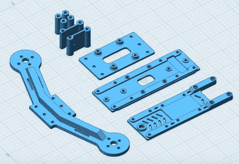

# 3D 打印更好的四轴飞行器框架

> 原文：<https://hackaday.com/2018/01/15/3d-printing-a-better-quadcopter-frame/>

在你愤怒地按下“发表评论”按钮之前，我们要说:如果你想建造一架像样的四轴飞行器，就买一架商用框架。它们通常是建筑中较便宜的部分之一，就其强度而言，它们非常轻，并且替换部件很容易获得。虽然你可能会认为 PLA/ABS 细丝的成本已经足够低，打印它会比购买便宜，但你无法在 3D 打印机上制作出比商业市场上可用的更好的四轴飞行器框架。

The frame features a surprisingly low part count.

话虽如此，[帕韦·斯彼哈尔斯基]最近展示了他的 [3D 打印 FPV 赛车四轴飞行器框架](https://www.youtube.com/watch?v=bWlVo0wZvyk)，并取得了一些令人惊讶的结果。框架最终变得异常坚硬，虽然重量有点高，但实际上比他预期的要轻。如果你想以绝对最低的花费建造一个四人组[，他的设计也许值得一试](https://www.thingiverse.com/thing:2686018)。

当然，[pawez]并不是第一个想到打印四边框的人。但是他确实给了他的设计一些额外的考虑，试图克服他在现有 3D 打印设计中注意到的一些缺点。首先，他的设计不是将四个独立的臂安装在一个中央底盘上，而是将臂一直延伸到电机之间的厚支架上。中央底盘也很厚，增加了框架的整体刚度。

这里的关键是[pawez]用 2 mm 厚的壁打印了所有部件。虽然这自然意味着更长的打印时间和更大的总重量，但为了确保框架在第一次接触地面时不会折断，这可能更值得。

除了打印出来的零件，组装这个框架只需要大约一打 M3 螺母和螺栓。总的来说，硬件和塑料之间的总成本不到 5 美元。在下面的视频中,[ pawez]通过它的步伐做了一些杂技动作，在我们看来这 5 美元花得值。

如果你想在 3D 打印的四轴飞行器零件上全力以赴，你可以将这个框架与[一些打印的螺旋桨](https://hackaday.com/2015/10/21/3d-printed-quadcopter-props/)配对。甚至可能是一个[印刷的相机万向节，当你在的时候](https://hackaday.com/2013/06/18/brushless-gimbal-3d-printed-and-bolted-to-quadcopter/)。

 [https://www.youtube.com/embed/bWlVo0wZvyk?version=3&rel=1&showsearch=0&showinfo=1&iv_load_policy=1&fs=1&hl=en-US&autohide=2&wmode=transparent](https://www.youtube.com/embed/bWlVo0wZvyk?version=3&rel=1&showsearch=0&showinfo=1&iv_load_policy=1&fs=1&hl=en-US&autohide=2&wmode=transparent)

