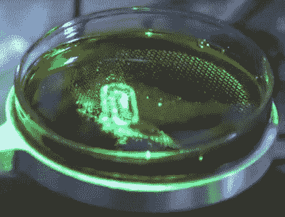

# 使用全息图的 3D 打印实际上是 3D 打印

> 原文：<https://hackaday.com/2017/02/24/3d-printing-using-holograms-is-actually-printing-in-3d/>

现在是 2260 年，你正被从你的星际飞船传送到下面的星球。作为当今 3D 打印机的后代，传送器打印出你，在移动到下一层之前，慢慢地制作一层，从地面开始。过去的你希望在你做完之前不会有东西溢出来。但是如果你可以同时打印你身体里的每一个原子呢？如果这些传送器是 Daqri 的全息 3D 打印技术的后代，那么这就是将要发生的事情。

Daqri 的工艺类似于 SLA(立体光刻)和 SLA/DLP(数字光处理)。在 SLA 中，激光束照射到树脂池上，在光束点硬化树脂。激光扫描树脂表面，画出一层。加入更多的树脂，然后绘制下一层。在 SLA/DLP 中，整个层的光一次投射到表面上。虽然这两种方法都涉及立体平版印刷术，但缩写 SLA 本身通常用于指代激光方法。

Holograhically 3D printing a paperclip

然而，Daqri 的工艺使用[他们自己制造的全息芯片](https://medium.com/@DAQRI/the-future-of-holography-is-software-defined-light-35c995fee26c#.3xigw9bzr)将所有层的光同时投射到材料中，这是一种光激活单体。他们的芯片是一个包含可调晶体网格的硅片。这些晶体控制向下反射到单体中的光的大小和相位，从而创建出干涉图案的 3D 体积。该过程的简要描述称，激光用于将光线照射到晶体上，因此可能仍有一些扫描在进行。然而，在视频中，所有被打印的对象似乎同时被照亮，因此扫描可能非常快，类似于灯光秀中的激光似乎在建筑物的侧面绘制了一个 2D 形状，尽管它实际上只是一个快速移动的点。还有一种可能性是，光束的点足够大，可以一次封装所有的芯片。你可以在下面的视频中看到它的演示。

在视频中，Daqri 打印了一个小回形针，小尺寸的原因很可能是由于他们的芯片尺寸。但是如果规模扩大，那么加热可能会成为一个问题。持续的“硬化”被称为[聚合](https://en.wikipedia.org/wiki/Polymerization)，包括从单体形成长而缠结的聚合物，并且是放热的，这意味着它放出热量。如果你和我们一样，曾经使用过树脂，那么你可能已经注意到固化大体积的树脂会比固化小体积的树脂产生更多的热量。这种热量足以熔化物体并使其变形。

没有消息说这个过程什么时候会离开实验室，出现在我们的车间里，但是对于未来的《星际迷航》运输机来说，这是朝着正确方向迈出的一步。同时，对于 SLA/DLP 3D 打印机，看看[开源的 RooBee One](http://hackaday.com/2017/01/01/roobee-one-an-open-source-sladlp-3d-printer/) 。

[//player.ooyala.com/static/v4/stable/4.10.6/skin-plugin/iframe.html?ec=U3NGtzOTE6U0zZ8nx4H_gD1NH781nKcq&pbid=9935c14646034dc285185d1bbb784519&pcode=FvbGkyOtJVFD33j_Rd0xPLSo0Jiv](//player.ooyala.com/static/v4/stable/4.10.6/skin-plugin/iframe.html?ec=U3NGtzOTE6U0zZ8nx4H_gD1NH781nKcq&pbid=9935c14646034dc285185d1bbb784519&pcode=FvbGkyOtJVFD33j_Rd0xPLSo0Jiv)

我们感谢 Sascho 向我们透露了这个消息。