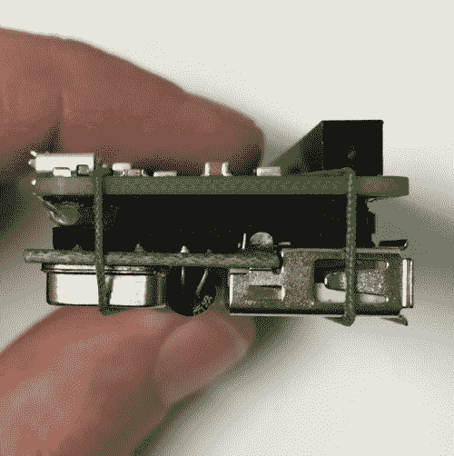
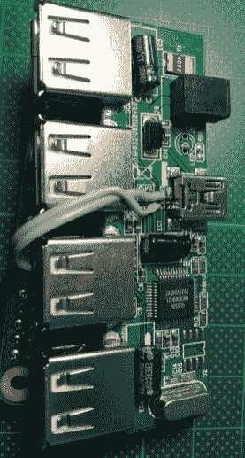

# 4 端口 USB，树莓派零背负式黑客

> 原文：<https://hackaday.com/2015/12/03/4-port-usb-raspberry-pi-zero-piggy-back-hack/>

[弗雷德里克]决定他的新 Zero [需要一个 USB 集线器](http://frederickvandenbosch.be/?p=1343)。他注意到手边有一个和 Zero 一样大小的 USB 集线器。正如任何优秀的黑客都会做的那样，他把它从盒子里取出来，背到零上。既然我们刚刚看到另一个 [Zero hack 增加了一个 WiFi](http://hackaday.com/2015/11/28/first-raspberry-pi-zero-hack-piggy-back-wifi/) 加密狗，那么这种搭载是怎么回事？是水里的什么东西吗？不，可能只是一个与迷你零的自然契合。

  Foam and elastic bands make a next arrangement  Tricky wiring to the hub’s USB

Zero 背面的 USB 和电源焊盘是可用的，并且大小适合接受直接的焊接线连接，这当然有所帮助。集线器上的 USB 连接有点复杂。导线焊接到 mini-B 连接器的表面贴装引脚上。但是[弗雷德里克]也设法做到了。

这种黑客的一个很好的优势是，几根焊接的跳线让 Zero 从集线器的壁式电源中获取功率，消除了与 Pi 一起工作所需的一根电缆。使用热胶来消除电线上的应力是一个不错的选择。为了防止电路板短路，他在它们之间放了一块泡沫，并用松紧带将它们绑在一起。简单易行。