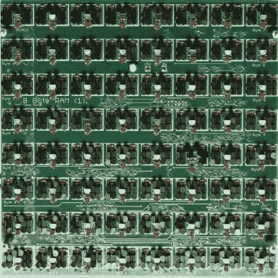

# 42300 晶体管巨型处理器完成

> 原文：<https://hackaday.com/2016/07/06/42300-transistor-megaprocessor-is-complete/>

结果是，答案不是 42，而是 42.3 千。这就是这个巨大的计算机器所在的 30 米的房间里分布的分立晶体管的数量。【詹姆斯·纽曼的】【T2 的】巨型处理器，一个微处理器的放大版，是一个我们[一直怀着敬畏之心关注的项目](http://hackaday.com/?s=megaprocessor)，因为它在过去几年里已经成形。

[詹姆斯]非常详细地记录了他的工作，并通过这样做，带我们踏上了微处理器内部工作的旅程。他的不朽机器现在已经完成，它是处理器——以及几乎所有包含处理器的东西——如何工作的最终答案。

8 bytes of Megaprocessor RAM (ca. 200 x 200 mm)

大约 42，300 个晶体管中的每一个都被手工焊接到一个巨大的 PCB 上，这看起来更像是交互式电路图，而不是实际的电路板。这些数量惊人的分立晶体管组成了数千个逻辑门，最终形成了巨型处理器的寄存器、算术逻辑单元、顺序控制以及 256 字节的 RAM。每个逻辑门通过 LED 显示当前的 IO 状态，这也将 RAM 变成了一面巨大的 LED 墙，你可以在上面玩俄罗斯方块。尽管它很复杂，但这个巨型处理器几乎是自文档化的。[James]将所有的 PCB 安装在大框架上，加起来就是一个 10 米长、2 米高的“计算显示器”。详细的图表显示了功能块之间以及房间内的信息流。全速运行时，它的时钟频率约为 8 kHz，但要跟踪单个指令的执行，您可以将其调低至 1 Hz，甚至停止处理器来研究其状态。

[James]并不总是确定该构建最终需要多少晶体管，因为很难预测在疯狂发生之前一个人可以焊接多少个 8 字节 RAM 单元-每个单元由 766 个晶体管和 64 个 led 组成。这并不容易，T2 也不便宜，但是这个想法困扰了詹姆斯十多年，看到它完成真是太棒了。请欣赏[James]带您参观机器的视频:

 [https://www.youtube.com/embed/z71h9XZbAWY?version=3&rel=1&showsearch=0&showinfo=1&iv_load_policy=1&fs=1&hl=en-US&autohide=2&wmode=transparent](https://www.youtube.com/embed/z71h9XZbAWY?version=3&rel=1&showsearch=0&showinfo=1&iv_load_policy=1&fs=1&hl=en-US&autohide=2&wmode=transparent)

似乎构建独立的处理器现在非常流行。就在几个月前，我们仔细观察了用单个晶体管忠实再现的[6502 处理器。](http://hackaday.com/2016/05/24/how-the-dis-integrated-6502-came-to-be/)