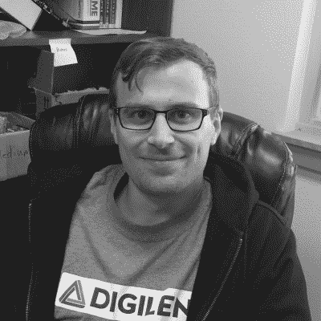
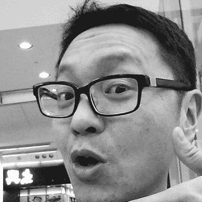
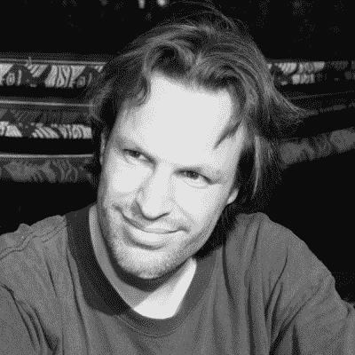

# 5 个你不想错过的超级扬声器

> 原文：<https://hackaday.com/2016/09/21/5-more-supercon-speakers-you-dont-want-to-miss/>

今天上午，我很高兴地宣布，Hackaday 超级大会又有五位确定的演讲者。终极硬件大会将在几周后举行:11 月 5 日和 6 日在加州帕萨迪纳举行。

[现在就买票](http://www.eventbrite.com/e/hackaday-superconference-2016-tickets-27343845177?aff=921announce)！

Avidan Ross

Sam Bobrowicz

Akiba

Matt Berggren

Sprite_TM

*   [Avidan Ross](https://twitter.com/avidanross) 是 Root Ventures 的创始合伙人。在 2013 年创办该公司之前，他为食品网络的厨房设计工业机器人，是他投资工业互联网的 CIM 集团的首席技术官，并在 Excite@Home 担任嵌入式网络应用程序开发人员。工作之余，Avidan 花时间烹饪、吹玻璃，并写一本关于世界各地咖啡的新书。他拥有哥伦比亚大学的计算机科学学士学位，在那里他专注于网络协议。
*   Sam Bobrowicz 从西雅图塔科马地区搬到了华盛顿州的普尔曼。他在华盛顿州立大学学习计算神经科学，后来被 FPGAs 的强大功能吸引住了，并为 Digilent 工作。现在，他是 Digilent 的应用经理，专门从事 Xilinx Zynq 开发。闲暇时，他喜欢玩滑板和背包旅行。Sam 坚信任何人都可以学习和使用 FPGA 技术，并继续制作和创建内容，帮助用户进入这一技术领域。
*   Akiba 总部位于日本，活跃于国际硬件黑客社区。他专门从事产品设计和制造，并教授如何在深圳的工厂生态系统中导航。不在深圳的时候，他会花时间在 [Hackerfarm](http://www.hackerfarm.jp/) ，这是他和几个朋友在日本农村创建的一个专注于农业和环境技术的黑客空间。他经营自己的公司 [FreakLabs](http://www.freaklabs.org/) ，是麻省理工学院媒体实验室的研究附属机构，也是联合国、国际原子能机构、谷歌和其他各种组织的设计顾问。
*   马特·博格伦是一名硬件工程师、程序员和产品开发人员。他在 FPGA 和嵌入式系统设计方面拥有丰富的经验，在成为 Supplyframe 的高级产品总监之前，他曾在 Altium 工作过一段时间。Matt 现在正在运用他作为 Autodesk Circuits、Eagle 和 Tinkercad 总监的丰富经验。
*   又名耶鲁安·多姆伯格的 Sprite_TM 一直对硬件和软件结合的地方发生的任何事情感兴趣。他是一个令人难以置信的熟练的硬件黑客，能够快速逆向工程电路和代码，尽管几乎任何级别的混淆。他在自己著名的网站上分享了这件不可思议的作品:【spritesmods.com[。2015 年，Sprite 加入 Espressif——ESP8266 的创造者——以低成本开发高性能无线芯片；他是软件工程经理，领导着](http://spritesmods.com)[最近发布的 ESP32 芯片](http://hackaday.com/2016/09/15/esp32-hands-on-awesome-promise/)背后的团队。雪碧以令人难以置信的硬件对话而闻名。很值得你花时间去看看他的[2015 hack aday super co](http://hackaday.com/2015/11/24/building-the-infinite-matrix-of-tamagotchis/)演讲。Sprite_TM 在 2014 Hackaday 颁奖典礼和许多其他会议上做了同样令人惊叹的演示。

这些演讲者加入了我们上周宣布的五位演讲者之列:克里斯塔尔·戈登、本·克拉斯诺、鲁兹·里瓦斯、肯·舍里夫和艾伦·耶茨。这份十人确认发言名单还远未完成。我们还有大约 20 个额外的演讲者和研讨会要宣布。一旦我们完成了所有的提案，并与受邀的演讲者确认后，我们将很快发布更多内容，包括演讲标题和描述。

开发一个产品需要投入很多。从一个想法的第一次闪现，到工作台上的粗略原型，与制造商合作(或将您的商店变成装配线)，并通过固件和软件来支持设备。SuperCon 是一个聚集众多人的地方，这些人的集体知识和经验涵盖了一切。如果你热爱硬件，就不能错过这个。

现在知道所有演讲者是谁可能还为时过早，但拿到你的票也不算早。他们会卖光的，不要错过这些早到的票。

[https://player.vimeo.com/video/182073231](https://player.vimeo.com/video/182073231)

在活动页面上找到更多 SuperCon 海报和传单[。](https://hackaday.io/event/12753-2016-hackaday-superconference)